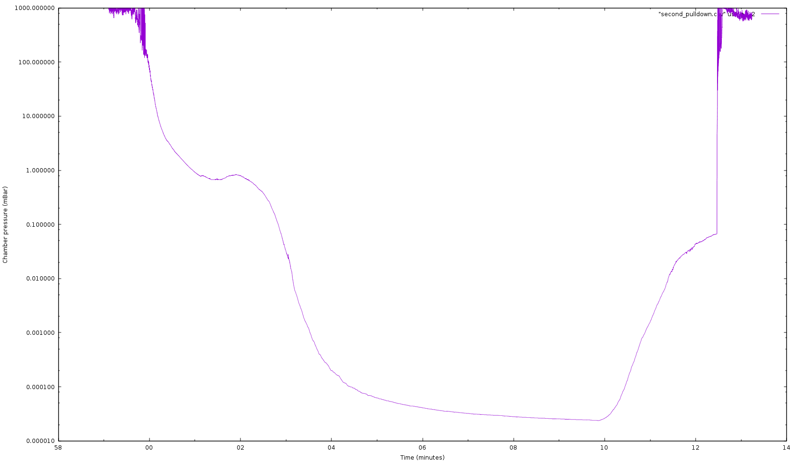

```
    _                       __        _  __   __  
   (_)____   ____   ____   / /____   (_)/ /_ / /_ 
  / // __ \ / __ \ / __ \ / // __ \ / // __// __ \
 / // /_/ // / / // /_/ // // /_/ // // /_ / / / /
/_/ \____//_/ /_/ \____//_/ \____//_/ \__//_/ /_/ 
```                                        

# Ionolith




Hardware, firmware, software, and documentation for ion printers.

This was an extremely speculative project to attempt to scale up physical vapor deposition beyond all reasonable limits, and develop into a commercializable device. I got as far as building a high vacuum chamber, testing a few "bowtie" crucible designs, etc.

Spinoffs:

- nyion GPU-accelerated Particle-In-Cell program
- Silicon carbide kiln 
- BPG-400 gauge
- 


This whole project was far beyond my capabilities, suffers from a lack of basic physical modelling in the beam region, and so there is little basis to expect this to work.

At the time the project was suspended, it looked something like this:

The ultimate goal was to produce an ultra high current (somewhere around 100 A of ionized aluminum accelerated to 100 to 1000 eV) heavy ion beam deposition system, aiming to 3D print large parts at cubic centimeters per hour and with arbitrary combinations of alloys and crystalline structure. 

  - Heavy ions like Al move slowly, meaning space charge effects are huge and, due to so-called "beam rigidity", magnetic focusing is useless.
  - However, this was developed under the (as yet untested assumption) that it would be possible to use a sort of active space-charge neutralization, actively injecting and confining electrons into metal-ion "packets" in the beam, to neutralize the beam space charge (something like [Gotoh 2012]).
  - Spreading the beam current over 512 or 1024 individually-controlled emitters in a 0.25 m^2 area seemed like it might alleviate deposition surface roughness issues, because of the wide range of angles of incidence.(See [Yang and Zhou, 1999, 2001])
  - Feedstock would be vaporized in "bowtie" structure - perhaps graphite-loaded magnesium oxide, perhaps coated in aluminum nitride, and with layers of ceramic multi-layer insulation to mitigate heat loss. Basic testing on a graphite bowtie was done.
  - Design goal of <$2000 cost, ideally run from a single 1500w outlet, with integrated diffusion pump.
  - Acceleration voltages over ~5000 V would pose huge X-ray and general power consumption (dozens of kilowatts in the beam!) and deposition power density (build platform overheating) issues.

Things that are here:

  - Because electrons are so fast compared to ions, to resolve both over long durations without resorting to slow-electron simulations, Particle in Cell DSMC sims must solve grids very rapidly and efficiently. A test implementation of a very fast (19 ms / update cycle) block structured mesh (probably now superseded by WarpX / AMReX) is here. This ran entirely on the GPU memory via native CUDA.
  Ultimately, a little more knowledge of Vlasov equations or even basic matrix algebra would probably have been better.
  * This specific form of the block-structured mesh data structure seems perfect for geometric multigrid electrostatic solvers because the hierarchical geometry of the mesh corresponds well to multigrid requirements; depth- and breadth- traversals are easy to code; ghost cells can be handled separately; and updates "at the edges" of a block are handled seamlessly.


```
Gotoh Y, Tsuji H, Taguchi S, Ikeda K, Kitagawa T, Ishikawa J, et al. Neutralization of space charge on high-current low-energy ion beam by low-energy electrons supplied from silicon based field emitter arrays. AIP Conference Proceedings, vol. 1496, 2012, p. 368–71.
Zhou XW, Wadley HNG. Hyperthermal vapor deposition of copper: reflection and resputtering effects. Surface Science 1999;431:58–73. https://doi.org/10.1016/S0039-6028(99)00336-2.
Yang YG, Zhou XW, Johnson RA, Wadley HNG. Monte Carlo simulation of hyperthermal physical vapor deposition. Acta Materialia 2001;49:3321–32. https://doi.org/10.1016/S1359-6454(01)00139-2.
```

