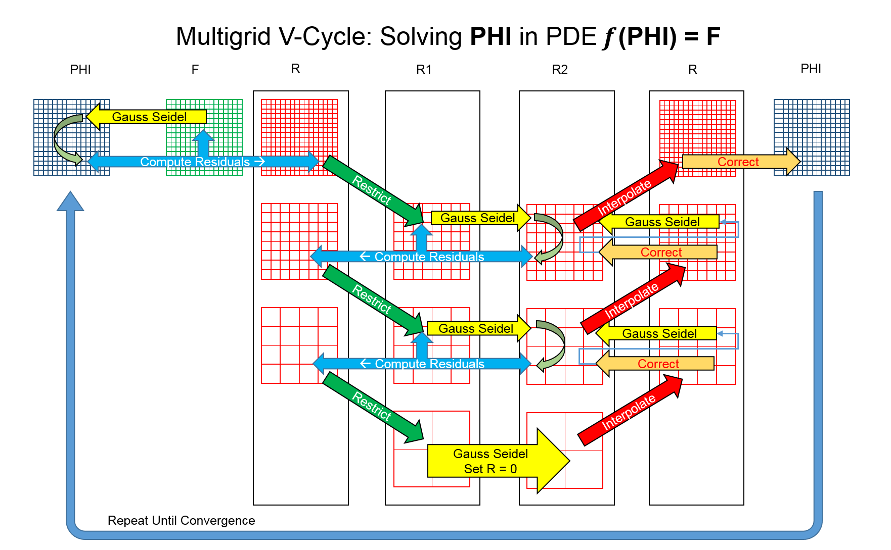
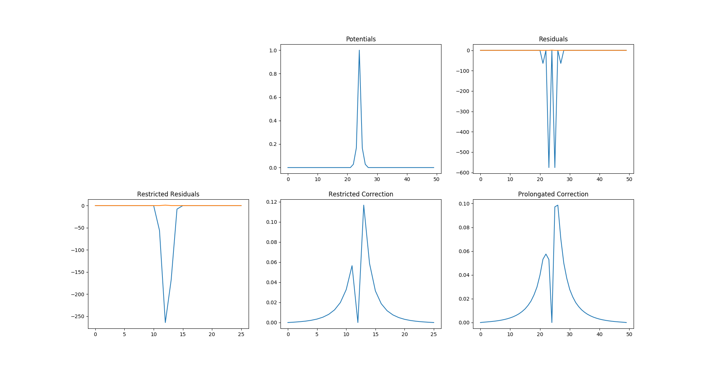

# Mk3

Log starts at gauge.

Need to drill 8.80mm or 11/32 holes in some aluminum and weld with brazing rod.

### Brazing aluminum

Aluminum brazing rod: seems like pre-heating is important. Someone on youtube uses a barbecue to great effect.

Purchased some Benzomatic AL-3 aluminum soldering rods from Canadian Tire. Encountered some difficulty in attaining the required temperature. Melted my jacket in the process.

Tried preheating with an electric stovetop element. The element itself got to nearly 500c, but the aluminum only got to around 300c - below the ~400c required for the AL-3 rods.

Tried oxy-acetalyne, not sufficiently warm. 

Tried a 100,000 btu/hr flamethrower: sufficiently warm.

Many voids were found in the final braze - it was not in any way airtight. This may be due to the fact that it was not clamped properly. Re-brazed several times.

Standard table salt is apparently effective as a flux. AvE recommends using a glass rod to remove dross.

Electrochemical weld cleaning

Looks like I put a bit too much heat on the feedthroughs - porosity

Seemed like one of the crush gaskets didn't fully seal on one of the spark plug feedthroughs - but in fact the brazing was porous.

# Mk3-5

Using a scrap piece of aluminum from an old boat engine mount. Had a few holes, but I could work them into the design.

Milled on 6040.

| Tool size | XY feed   | Z feed | RPM   | Z step | Stepover |
| --------- | --------- | ------ | ----- | ------ | -------- |
| 1/8"      | 7 mm/s    | 1 mm/s | 13000 | 1 mm   | 50%      |
| 0.25"     | 11.6 mm/s | 1 mm/s | 13000 | 1 mm   | 50%      |
|           |           |        |       |        |          |

Vaporized an entire bottle of WD-40 as coolant. This permeated into the MDF spoilboard, gradually reducing the clamping force until the part broke loose. Part was salvageable.

Used an entire pack of 180-grit trying to knock down some of the rack-rash. My friend Arnold tried to flycut  the thing, but there was excessive chatter.

Used an oscillating palm sander with some 320-grit silicon carbide. Took it to a pleasant dull finish.

Cleaned 5 times with water and then isopropyl.

THIS THING looks BAMF.


Spun up a few more times, achieved a base vacuum level of around 0.8 millibar (660 micron) - still not great, but I shut everything down prematurely as heating was excessive.

Set up a liquid cooling system for the turbo.

Purchased some nichrome wire from DashVapes. Needed a driver's license, amusingly.

Quite nervous around this thing right now; the clamping force on the turbo is almost surely insufficient. If it crashes, it will send high-energy shrapnel in all directions, including through my torso. I *like* my torso the way it is, thank you very much.


I raised the input voltage to the turbopump controller to 56v, which worked admirably. The turbo audibly spun up significantly.

Unfortunately, upon re-cycling the chamber, the controller exploded from the excess voltage, presumably spikes due to high startup current. I am unsure as to the cause; the mosfet drivers were clearly blown, but the mosfets themselves were also shorted. The drivers have headroom to 85v, and the mosfets are good to 100v - I can't imagine that switching noise got that high.


Holy crap! The high-side mosfet gate trace and 2 ohm gate resistor blew! That's an incredible failure mode.

Found out why the mosfet gate oxide blew in the first place: the gate was swinging across the entire 50v. Tried increasing the charge pump cap to 0.22 uf , but the driver blew up immediately.

Simplified everything to one channel, same problem. Swapped mosfets, drivers, added an external boostrap diode. Voltage across the diode 


I am an ABSOLUTE NINCOMPOOP.  A complete and total kneebiter.

So I tried to determine what caused the tragic loss of my gate oxide. Lo and behold, it seemed that the mosfet gate was swinging the full 48v input, plus 12v from the charge pump.

This is super strange for several reasons: one, the circuit was functioning normally, where the gate should have been destroyed in microseconds; 
and two, the block diagram of the MIC4604 driver doesn't reveal a failure mode that could possibly cause this issue.

Cue several hours of anti-Hippocratic probing and prodding that James A. Garfield would have blushed at, and wanton swapping of $40 in drivers

until I realised 

it's a *charge pump*, you total f***ing idiot. It's *not ground referenced*.


Floating the board's supply and connecting the scope ground to the drain of the MOSFET revealed a perfect 12v square wave.

<hr>

Spun the pump up again: noise is causing the driver Arduino to reset, which sucks. However, I was able to spin it all the way up; the current visibly dropped from 8a to ~4. The liquid cooling water warmed up quite pleasantly. Capacitors on the driver board warmed up slightly. Only achieved a base vacuum of around 0.7 mBar.

The pump occasionally spins down rapidly when latchup occurs: the energy is being dumped into the mosfets and TVS diode.


Tried using solder to seal up the 

Need to cast some crush gaskets.

Wood seems to be an effective mold for solder. Aluminum coated with aquadag or graphite also works.

caulk also works? Huh.

<https://www.youtube.com/watch?v=92OLGmu3hws>

Tried casting lead-free solder in sand: failed miserably, sand melted.

Made a little aluminum mold for a gasket: failed miserably, surface tension of solder was too high. 

Tried O-rings to seal, failed miserably, couldn't get below 400 mbar.

Ah, but pure 1101 aluminum wire works perfectly!

Mm, not quite - they were prone to cracking. 

Soldered some copper wires into rings - worked slightly better, but still not perfectly.

Ordered in some copper crush washers (#97725A250) from McMaster. These worked well, though a large amount of torque was required to seat them, and I'm not sure how the aluminum threads are holding up. A substantial amount of black residue was deposited onto the surface of the spark plugs from the last attempts. I am unsure of its composition.


Got everything cleaned and polished, washers seated, spark plugs attached - then the second roughing pump coupler exploded. 

Designed in openscad, 3D-printing some new ones now.

Printed, installed. Worked fine, except there was a large amount of vibration - might split it into a spider coupling.

Pumped down. Copper sealing rings worked perfectly. It wasn't worth the time to try to make my own.

Hit 5x10^-4 mBar. 


Two days later, hit 2.37x10^-5 millibar, even with a few things in the chamber. 


Some discussion on the Vacuum Hackers discord led me to believe that the pump was almost definitely going to fly away, what with the minimal clamping force provided. 

Printed out a 122mm bolt circle, disassembled everything, drilled three holes into the table, and re-assembled everything. The pump is now very rigidly affixed via the M6 bolt pattern on the bottom. 

Planning on swapping out the buna-n gaskets for viton. Very expensive, but whatever.

Planning on using a few CER-4 standoffs from digikey for the bowtie. These are made of STEATITE C220, with a maximum temperature of 1700c.

Milling graphite; used MeshCAM to generate the features. Went quite well, most broke but one survived. needed G64P.001 to prevent linuxcnc from rounding corners.

Assembled the bowtie module - I'm not actually sure why I'm doing all this, but it went really well in any case.

<hr>

#### E-beam test 1:

4.7 milliamps of e-beam current was drawn with a white-hot 0.1mm tungsten hairpin and a nickel flag at 20v bias. Initial tests with 100v bias were unsuccessful; however, it is believed that this was due to reversed polarity.  

Pressures were stable at 1x10^-5 mbar. 

Some tungsten was deposited on surfaces on the chamber; it is assumed that this is due to the unregulated temperature of the filament. As expected, the emission peaked at a certain input power and did not increase further with additional current. The current was increased regardless, and the filament vaporized in a satisfactory manner.

An aluminum baffle was used to prevent debris ingress into the pump.

The pump was accidentally dumped to atmosphere while at operating speed; this does not appear to have caused any damage.

It was expected that beam alignment could be performed manually, by viewing the ion trail left by the electron beam; however, the thermionic cathode produced too much light for this to be possible.

<hr>

A precise reading of the bowtie temperature is now required in order to set the vapor pressure. The resistance of the graphite is an excellent indicator, but the temperature forms a gradient between the center and the mounting points. This gradient has been simulated via ElmerFEM, but ultimately depends on the ceramic interface thermal conductivity etc. 

The temperature could also be inferred backwards from the beam current, or by measuring light output. 

A thermistor could be used to determine the mount temperature in-situ for a series of power levels, but the thermal mass of a thermistor is likely greater than that of the mount.

Some thermocouple wire was cut to 

<hr>

The precise secondary electron energy was at this point unknown. A crude momentum analysis showed a beam deflection angle of some 20 degrees - but this effect is significantly affected by secondary electron energy. 

It was decided that a SPARTA simulation would be used to determine the beam deflection; however, DSMC VSS and VHS parameters are required for an accurate picture, and can only be found in 

**(Bird94)** G. A. Bird, Molecular Gas Dynamics and the Direct Simulation of Gas Flows, Clarendon Press, Oxford (1994).

A copy of Bird94 was not available online (save for a few pages on Google Books), and a hard copy would cost more than this entire vacuum system. Substituting 

<hr>

#### E-beam test 2

A tungsten filament was produced by wrapping 5 0.1mm tungsten wires around each other. The filament was visually aligned with the bowtie.

This filament consumed a whopping 44 watts - while emitting the same 4 milliamps of beam current. Certainly a far cry from the 17w/A figure described in the literature.

As with the last test, this filament saturated the high-voltage power supply. A 31v bias was used instead.

The base pressure attained was significantly higher (2x10^-5 millibar) than in the previous test; this was attributed to the increased clutter within the chamber. Some flux had also splattered.

The charge on the bowtie was measured to determine focusing. Very curiously, the charge increased when the e-beam was activated, but dropped rapidly. This may be an artifact of the relative nature of the measurement, or a symptom of a greater electron-deflection problem.

<hr>

#### ElmerFEM simulations of bowtie prototype 1

The .sif files had been overwritten somehow - reverting to a previous commit fixed the problem.

ElmerFEM requires a .step input. This was meshed with Max h. 0.025 and Min h. 0.001. The enthalpy heat flux was set to zero. Convergence was not well behaved.

The simulation potential was set to 20v, and an ideal temperature of approximately 2000 K was attained. The bowtie drew approximately 100w.

#### Bowtie test 1, 2 and 3

The chamber was pumped down and 10 A was applied across the bowtie. The bowtie glowed a dim red,  not nearly sufficient for deposition. The resistance of the entire assembly was only approximately 0.33 ohms, a significant discrepancy from the predicted 4 ohms. Clearly the graphite resistivity value set in the Elmer sim was incorrect.

The "300-1200v" HV e-beam bias power supply was supplied with 12v, and output 2 kilovolts. A replacement NCH6100HV was purchased. 

The bowtie was connected to the 20v-45A supply, and 20a was briefly supplied. Aluminum was readily deposited, and no degradation of the bowtie nozzle was found. The deposited coating was quite easily wiped off the witness microscope slide.

One of the bowtie connection wires melted. 

#### IBSimu simulations of entire column 

A 3 by 3 by 6 mm 3D simulation was created. Unfortunately, an accurate measurement of space charge requires about 10 grid points across the beam - a mesh of 0.00003mm. This is not reasonable to compute in a short period of time. 

However, human factors were encountered - that is, the designer was filled with abject boredom. An automatic solution is required.

#### Beam solver, trial 5

After the modest successes over the previous week, more effort was put into an automatic beam solver.

This was based on the following premise:

1. I am too stupid to design a lens of this sort.
2. I know something about software.
3. Software can design a lens of this sort.

QED.

A mesh of 50x50 pixels over the entire beam would seem to be reasonable. 

- 3d "Slice" solver 
  - analytic function for slices was not found
- 3d Analytic concentric infinitesimal ring space charge solver, with automatic beam envelope
  - poorly implemented in Python, unusably slow
  - horrific write-only blob of vectors and linear algebra
  - There is precedent for this beam slicing technique, likely quite valuable if correctly implemented
- Brief diversion: an attempt to use TRACE-3D and TRANSPORT to fit the beam
  - miserable failure
  - what 
  - what even
- 2d simplified analytic concentric ring space charge solver, predefined beam envelope, rings also used for electrode field
  - Almost usable
  - on the order of a few seconds per iteration in Python
- 2d Laplace + Jacobi relaxation solver for electrode e-field, cylindrical beam scharge using analytic equation from @ Kalvas
  - Simple array operations in Python: 1-2 seconds
  - Numpy convolution: ~0.15 seconds
  - Pretty diagnostics with matplotlib
  - Random search ineffective, genetic algorithm considered with DEAP 
  - An attempt was made at adding charge incrementally to obtain a specified gradient - successful for a single point, but not beyond
- Wonderfully fast C++ Laplace solver
  - 24 ms per iteration!
  - aww yis

The search space of possible lens arrangements spans a triple-digit exponent of combinations, so an exhaustive search is clearly not possible. However, seeding the system with some common extraction and focusing arrangements (Pierce, Wehnelt, Einzel, etc) greatly reduces the complexity of the problem.


#### Low-voltage, high-current electron gun, Peter W. Erdman and Edward C. Zipf 

and

#### Design of Low Voltage Electron Guns, J. AROL SIMPSON AND C. E. KUYATT

This is the breakthrough I've been hoping for. An e-beam gun capable of ~1-3 mA at 100 eV.

Moreover, simulations (and, indeed, basic Child-Langmuir expressions) have shown that a comparatively high extraction voltage is required to form a reasonable beam. I previously dismissed this technique; my malformed intuition 

> There is a general technique which can be used to circumvent these limits on unipotential guns. The technique is to multistage the gun; i.e., utilize a higher voltage to overcome the space charge in front of the cathode and then decelerate to the required final energy. 
>
> This technique seems to have first been arrived at on empirical grounds.
>
> Once the advantages of multiple staging are recognized,
> the problem of low voltage gun design breaks easily into
> two parts: the extraction stage and the deceleration stage.
> These designs can be done almost independently and can
> make use of time-proven electron optical elements. 

Amazing.

I still haven't been able to fully wrap my head around the energy dynamics of these devices. 

Let's draw a diagram.

```
E-beam:

~0.2 eV Emission 														  /\
----------------							100 eV Exit    			  'o  |
				\						--------------              -----   
				  \					  /  								Hapless victim
				  	\			 ___/   									Tree
				  	  \--------/
			~500 eV Extraction	   Focussing, Deceleration

```

That seems quite sensible. If one were to roll a ball down this mount improbable, an observer by the tree would only be struck with 100 eV. 

Intuition still rejects this, however. Consider the following: if the second half of the electron gun vanishes, the thoughtful vacuum scientist will have at hand only a 500 eV beam and a shocked expression. If a small plate is surreptitiously inserted centrally, will it not be heated by 0.003 mA * 500 eV = 1.5 W ?  

But then intuition is but a manifestation of a poorly adapted primate, and can only guide one so far in matters of science. I am missing something critical.

In any case, I then simulated this arrangement with IBSimu. Worked admirably - some minor tweaking required, but nothing serious.


#### Erdman-Zipf gun construction

A 1/4" end mill was used to drill the central features - a slight discrepancy from Erdman and Zipf's design, but simulations did not show any effect.

As the mini-lathe used did not have an adjustable tool post, a parting tool holder was ground down to fit. 

Machining from a 1/2" stock of copper was attempted; however, the lathe in question (or, more likely, the technique of the machinist) was not capable of machining to any reasonable surface. One particularly aggressive parting operation even caused the fuse to blow. 

The copper was exchanged for 360 free-machining brass, and the parts were turned to within ~0.3 mm tolerances. Mill-turning using the CNC would be ideal for rapid prototyping and iteration.

The zinc content of the brass was quite worrying, especially since the extractor will sit ~0.2 mm away from a tungsten wire at some 2000 K. Nickel was therefore electroplated onto the electrodes. The solution drew between 0.05 and 0.1a. 

Discussion on Vacuum Hackers indicated that outgassing would be excessive. This idea was abandoned.

12L14 was found to machine quite well on this lathe; however, lead outgassing may be a concern.

Brief diversion to ceramics: On a whim, tried pressing alumina with crude graphite dies. Not effective. Applying small amount of pure alumina to graphite also not effective. Mixed some gelatine and alumina in some random ratio, and applied to tungsten on a whim. Heated with propane torch. The gel-cast bakeoff was very clear and visible - really amazing. 

The 12L14 die corroded almost immediately. This effect has been referenced previously as one of the main shortcomings of leaded 

After ~6 months and likely several thousand tests, I can say the following with uncharacteristic confidence:

Al2O3 is a BASTARD. It lures you hither with tales of insulating properties, of wonderous high temperatures

There is aluminum dust everywhere

#### The hunt

A search was carried out in an attempt to find an insulating coating or electrodeposition technique that could be used for a few purposes:

- as insulator for electrostatic lens elements, required immediately
- to decrease bowtie emissivity (and, potentially, reactivity) without switching to EDM tungsten

Anodized aluminum could be used - many vacuum tubes have cathodes insulated by aluminum oxide. However, this is slow.

Water glass may also be an option

Things I know how to do:

- electroplate with copper
- electroplate with nickel


- Can nickel be passivated?

- Some nitride? Nickel nitride?

- Silica coating graphite seems to exist

- Iron/steel passivation or pickling could be used

- Anodization of aluminum with mere vinegar has been mentioned once or twice. 

- Graphite can be copper plated.
- Copper can be "calorized" - a layer of alumina is applied, which then reacts to form copper aluminate and a coating of alumina. Promising method. Little can be found in the literature about this.

<http://tallmantechnologies.ca/iron-making.php>

> Calorizing is a pack diffusion process where the copper tuyere is placed in a sealed retort containing aluminum powder. The casting is heated and aluminum is diffused into the surface, creating a copper aluminide inner layer and an aluminum oxide outer layer.
>
> Calorizing creates a protective layer on the copper tuyere that preventing liquid iron drips from penetrating the surface. The calorizing process is performed at the final stage of production after the tuyere is finished machined and hardfacing alloys are applied. Calorizing eliminates the need to use refractory materials on the top surface of the tuyere.

- io9 on twitter (thanks!) informed me of the the field-assisted sintering technique, which greatly reduces alumina sintering temperature requirements. 

US4418097A

> The present invention comprises a process for reducing high temperature oxidation of graphite electrodes by coating the electrodes with a siloxane fluid.

> Dimethylpolysiloxane, having 100 centistokes viscosity, was sprayed on a graphite electrode while the electrode was at ambient temperature. The electrode was then heated to 1400° F. for eight hours. Weight loss was 6.8%.

Oh wait! That's silicone oil - PMDS!

A bootstrap paradox is found here. All of these techniques will be trivial when the ion printer is functional, but it can't be built without one.

#### SiC Graphite / SiO2

A small sample of graphite was accidentally dropped into a test tube containing a small quantity of ECO-702 silicone fluid. This coupon was then heated with a propane torch. The fluid burst into flames, and produced a bluish deposit on the graphite which immediately flaked off. An inert atmosphere may be required.

One face of the graphite was cleaned, then heated cherry-red and dropped into the siloxane. Some momentary bubbling was observed. The sample appeared to change texture somewhat, and emerged perfectly clean. The sample was still conductive.

Promising method, however. 

Silicon Carbide has an emissivity close to that of graphite, so this technique will be useless for decreasing power consumption.

See @ blocher1957carbide for a comprehensive treatment of this treatment.

#### Alumina Cataphoresis

<https://www.thevalvepage.com/valvetek/heater/heater.htm>

> Cataphoresis or electrophoresis is defined as "the migration of coloidal particles under the influence of an electrical potential". Cataphoresis, as applied to heater coatings, is the process by which positively charged alumina particles are deposited on a negatively charged tungsten heater wire. The alumina used in the suspension consists of very fine particles, usually in the one-to-five micron size range. An increased number of ionised groups on the alumina surface results when the particles are surface charged by the addition of small amounts of selected soluble inorganic salts, such as aluminum nitrate.

> After the heater is coated, it is sintered at 1600C for a short time in a hydrogen-atmosphere furnace.

This process was attempted with graphite at 20v, no effect. Experiment was repeated at 500v, no effect. Solution was very dilute - agitation likely required. See @ lazic2004influence for parameters.

#### Bowtie temperature measurement

Precise print speed measurement (that is, atoms deposited per second) is essential to the accuracy of this concept. 

There exist some thermocouples A program called LPUWS was found. <https://lpuws.scot.sk/> The endoscope from the PnP machine was removed and connected to a pocket spectrometer; however, the resolution was inadequate. A source of a reference calibration spectrum is unknown. A laser or LED of a specified wavelength may be effective.

The bowtie temperature would be useful to determine the vapor pressure (and thus atoms emitted) of the deposition species. On second thought, the pressure in the nozzle depends on a choked-flow parameter, since the external pressure is essentially zero. Relying on temperature to determine print speed.

However, there are many options for print speed feedback. Trace light emissions from ionization, e-beam current attenuation, etc.

#### Aluminum anodizing

<http://www.observationsblog.com/sciencetechnologyexperiments/anodizing-and-dying-aluminum-without-battery-acid>

"Hard" or "type 3" anodization appears to be desirable for high-voltage applications. 

See @ mielke1987 for the breakdown voltages of various thicknesses - >2500v appears to be difficult to achieve.

Bath is generally refrigerated.

<https://www.precisioncoating.com/hardcoat-anodizing-type-iii/>

> "Sanford Low Voltage" process
>
> High voltage rectification normally requires > 30 Amps per square foot current density.
>
>  Dielectric barrier usually > 1000 < 2000 Volt DC.
>
> Hard coat applications require up to 75 V at 24–40 asf. 

A suitable boost converter was purchased.

#### 

The Steacie Library at York U has a shelf (QC 702 onward) with plasma physics books. 

"The Physics and Technology of Ion Sources" was particularly helpful.

#### 

It may pay to re-evaluate the reasoning behind the use of wire stock. Intuition says granular jamming will be a concern, but perhaps some sort of ultrasonic vibratory system could be used to prevent sticktion.

#### Emissivity difficulty

It was discovered that the emissivity of tungsten varies significantly with temperature, starting from 0.05 at 250 K to approximately 0.16 at 1500 K. With 2048 bowties, the 

An aluminum reflector could be used - however, thermal heating is a little counterintuitive. For instance, an isolated, completely enclosed object will eventually reach precisely the same temperature as its surroundings. Some simulations are in order to determine what reflector arrangement will be effective.

<http://web.mit.edu/16.unified/www/FALL/thermodynamics/notes/node134.html>

<http://hedhme.com/content_map/?link_id=22144&article_id=530>

<https://nvlpubs.nist.gov/nistpubs/bulletin/14/nbsbulletinv14n1p115_A2b.pdf>

Describes in fascinating detail how the inner surfaces of a tungsten helix filament are significantly hotter than the outer ones.

A bowtie with a reflector was designed and imported into Elmer; however, the elmer mesh generator doesn't currently support multiple bodies.

gmsh was used to mesh the combined part.

`ElmerGrid 14 2`

was used to import the combined mesh (14 is the gmsh format and 2 is elmersolver mesh output) - however, the reflector was not imported. Elmer also crashed. ElmerGrid -autoclean resolved the error.

Apparently only the gmsh "netgen" command can be used with multiple bodies.

The final workflow was as follows:

```
Copy .sif file
ElmerGUI -> Import project (overwrites .sif)
Revert .sif
Export each body to seperate .step files
Import .step files into gmsh, mesh -> 3D, refine (netgen) -> save
ElmerGrid 14 2 bowtie_prototype_1_cut.msh bowtie -autoclean -bulktype 1 1 1
ElmerGrid 14 2 bowtie_prototype_1_reflector.msh reflector -autoclean -bulktype 1 1 2
ElmerGrid 2 2 bowtie_prototype_1_reflector -in bowtie_prototype_1_cut -out finalmesh -unite -merge 1.0e-10
ElmerGUI -> import mesh
Set body numbers using the shell script (and set count in brackets!)
Run
...
Profit!
```

If something in viewfactors.dat breaks, it may be helpful to delete the file. This was required when switching to diffuse gray.


With an 800 K difference, it seems that the reflector is extremely effective. 

It was found that the Diffuse Gray change had disabled radiation loss. Enabling diffuse gray on all surfaces caused an unacceptable slowdown, so only the thin bowtie section was activated. With an "external temperature" field, got "solution trivially zero". Removed external temperature.


The difference between the two at 20v and 110 W is now 2518-2372 K - notably different from the previous non-diffuse-gray tests. The reflector is quite hot. 

At 60 watts, peak temp was 1657 K.

With an emissivity of only 0.16, peak temperature was 1682 K. Clearly, we are in the thermal-conduction-limited regime, where the fixed mounting temperature is the dominant force. This can easily be alleviated.

The input to the bowties can either be powder, wire, liquid, or gas. 

Gas will deposit on the plumbing, so power consumption will be largely the same as liquid.

#### Beam tracking

This is the fun part: feedback.

As previously discussed, the precise space charge of the beam is highly dependent on many physical factors, such as compensation by background gas, trace electrons, etc. Furthermore, each print species will behave completely differently. 

Rather than design a single lens geometry capable of these features, a system that adapts in real-time to the actual beam profile may be a useful approach. This would require accurate particle position data.

- beam self-induced magnetic field
  - Fiber optic / Faraday field sensors
  - Beam optics with built-in Hall geometries
    - microvolts!
- beam space charge e-field sensing
  - ????
- Inductive or capacitive sensing
  - Quickly pulsing beam elements relative to each other may yield a measure of the gas dielectric constant. Calibration will be tricky. Pulses will have to be sufficiently fast as to avoid affecting the particle trajectories.
- Optical sensing
  - Background gas ionization / recombination light detection
  - Light transmittance / polarization /

- Beam loss feedback from lens elements
  - A small current on a lens element will indicate deposition and beam loss.
- Mechanical means
  - Faraday probes, wire scanners, witness plates, etc
- NMR?

Lens element beam loss detection should be quite simple to implement, and won't require calibration.

Beam position detectors on accelerators seem to be of the Cerenkov, silicon drift, or scintillator type, which will be ineffective for this application - see @ akiba2012charged.


@ currell1996new


@ shafer1992beam - another amazing reference

> The purpose of this paper is to review the properties of non-intercepting,
> electromagnetic beam position monitors used in particle accelerators and beamlines, and
> the types of signal processing used to recover beam position information from the
> beam-induced signals.

> There are many other possible methods of measuring beam position, both
> interceptive and non-interceptive. These include synchrotron radiation, interceptive wire
> scanners (both stepping- and flying-wire scanners), residual gas ionization and
> fluorescence, optical transition radiation, beamstrahlung, and laser probes to name a
> few. Discussion of these techniques can be found elsewhere in the literature, and in
> general review papers. 

Got it to a one!

> Small loop couplers 16 (often called B-dot loops, meaning dBIdt) are simply small
> shorted antennas that couple to the azimuthal magnetic field of the passing beam and
> can be quite directional. 

> After the pickup construction and assembly is complete, the electrode assembly is
> normally first "mapped" with an Rf-excited taut wire or antenna stretched through the
> pickup. The electrical response for various wire-displacement values of x and y
> determines the electrical center and the displacement sensitivities, as well as the
> nonlinearities. 13 The pickup is then installed and aligned mechanically with the other
> beamline components. An optional alternative for the final alignment is to place a taut
> wire along the magnetic axis of the beamline magnetic optics after the pickup is
> mechanically mounted, excite the wire with an rf signal, and measure the electrical
> offset (decibels of output signal unbalance) relative to the magnetic, rather than the
> mechanical, axis of the beam optics. 42 The electrical offset and the displacement
> sensitivity are then put into the computer database for correction to the beam position
> data as it is read out. The nonlinearities, as shown in Fig. 12, can be corrected in a
> look-up table at this time.
> In the taut-wire measurement, the signal on the wire is by definition a TEM
> (principal) wave with no longitudinal electric or magnetic component, which travels at
> the velocity of light and emulates highly relativistic particles. The signals associated
> with slow particles, as discussed above and illustrated in Fig. 10, are very difficult to
> generate on wires. As shown above, because the pickup response depends on the
> particle velocity, this effect must be considered in analyzing the wire measurements.

Clever! We can try different geometries and positions to build a regression.

Beam-modulated capacitive sensors seem to be ideal to get us the charged particles. How about the uncharged ones? I guess we'll deal with that later. 

Select lens elements could be split into quadrants and measured differentially, even with a potential applied.

Sorry, "window-frame"? Yeah, bowtie is probably an acceptable transgression.

Modulated beam capacitive coupling - equation 6.4 @ shafer1992beam:
$$
V_c = \frac{WL}{2\pi C} \frac{I_b(t)}{v_b}
$$
(v originally stated as beta_b * speed of light).

Some approximate numbers: if the capacitance is on the order of 10 pF, the plate is 2 mm by 2 mm, the current varies by 0.001 a in 10 us, and the beam velocity is 18 Mm/s (1000 eV, corresponding to maximum focus voltage), the plate voltage will be changed by 

```
0.353 v
```

!!! Perfect!

Note that no voltage is produced at steady-state. This means that no power is transfered from plates to beam. It also means that the bowtie temperature will have to be modulated. This could be accomplished via a sawtooth wave; a slow cooling and commensurate decrease in power, followed by a large pulse of current.

Distinguishing between beam-plate collision and a beam signal proper might be a bit tricky. Oh, no it won't - the collision will be steady-state, whereas the modulation will be in-phase with the beam pulsing.

If the heavy beam alternates around 0.1 milliamp in 1/100th of a second, and speeds past at 40 km/s, 

```
0.0159 v
```


#### Fluid tracking

The resistance of the bowtie will change when it is filled with conductive molten metal. That might be one of the coolest statements I've ever made.

#### Amplifiers

The cheapest 600v MOSFET or IGBT on Digikey seems to be ~\$0.10 at 3000-of pricing. With the minimum 5 plates and 2048 bowties, this would cost over $1000. Clearly, the amplifiers will have to be vertically integrated. 

> Nickel is used mainly because is has high resistivity which makes is easy to weld. 

Ah! I had assumed that there was an electrostatic reason. Surface contamination is a significant concern, as Erdman & Zipf described (haha EZ lens!).

Since there is no "blanking" feature on the ion printer, the beam is always present; therefore, the slew rate of the plates must be quite high to prevent material from being deposited between positions. 

Given a triode with a 500k anode resistance, and a plate capacitance of 300 pF, a time constant of ~200 us can be expected. 

To decrease power consumption, the bowtie could serve double-duty as the amp cathode heater. The reflector shield could be coated with barium oxide paste, serving as an indirectly heated hot cathode.


Simulations will have to be performed to determine the ideal 

#### Electrophoresis test 2

Graphite and 12L14 were used as the cathode with an aluminum anode. Voltages of 40 to 120v were attempted. 0.04 a were drawn. No deposited layer was observed. PVA binder was added to the mixture. No deposited layer was observed.

#### Anodization test 1

Two pure aluminum wires were inserted into a room-temperature bath containing 20g of sodium bisulfate dissolved in 100g of tap water. Stirring was maintained throughout. 40v was applied, and the electrode began drawing 0.3a. The anode effervesced profusely.  The anode was removed after ~5 minutes, when the current had dropped to 0.1a. 

Lungs were found to tickle slightly. The anode had been very effectively anodized, and had taken a dull gray lustre. The coating was reasonably scratch-resistant, requiring a fine point to break the surface. The wire was hardened significantly. The resistance was above ~100 Mohm. Breakdown voltage tests were not run.

Graphite can be used as an electrode for anodizing clear.

I do not believe I will anodize again; the sulfuric acid mists created by the type-3 process are really spicy, and it was a little hard to breathe last night. My sinuses were visibly swollen. My hood is clearly insufficient to protect me.

#### Vacuum induction furnace test 1

A 1kw liquid-cooled induction heater was used to heat a piece of graphite inside an evacuated test tube. Failure.

#### High-current transformer graphite test 1

A transformer constructed of 6 ga wire, known to produce peak currents of >100A, was connected across a small graphite mold. The mold was not heated appreciably.

#### Graphite resistivity

The prototype bowtie was 0.75x0.6x10mm, and had a resistance of 0.33 R. 
$$
RA/L = p
$$
Graphite therefore has a resistivity of approx. 14.9 uOhm-meters, or 67110 S/m. The value used for the Elmer sim was 3500 S/m - this explains the discrepancy. 

The sim value was obtained from @ lutcov1970thermal.

Appending my notes from the .sif file:

> ! Graphite value is a rough approximation to the data provided in
> ! Lutcov, A. ., Volga, V. ., & Dymov, B. . (1970).
> ! Thermal conductivity, electric resistivity and specific heat of dense graphites.
>
> ! Specific heat data is from Thermal Properties of G-348 Graphite
> ! Donald M. McEligot, W. David Swank, David L. Cottle, Francisco I. Valentin
> ! Mr. Swank, you've got a cool name.
>
> !I've confirmed that the volume resistance values returned are sane for Aluminum.
>
> !For comparison, using
> !graphite data directly from McMaster-Carr,
> !(dividing ohms/sq by the thickness of the sheet, which is horrifically inaccurate)
> !I get 0.00001397 ohm-meters
> !or 71582 S/m.
>
> !Screw this.
> !I just put my block of graphite across my bench supply,
> !and obtained a value of 0.66 ohms,
> !1968.5 S/m.
>
> !Using my bench meter in Kelvin-probe mode, I obtained a value of
> !0.221 ohms,
> !5873.9 S/m.

The observed value matches the value from McMaster-Carr to exceptional accuracy. All other values are ridiculous. The new value has been substituted. 

#### Anodization test 2

Diluted the anodize bath significantly. The rest was violently neutralized with sodium bicarbonate. Tests conducted at various voltages still yielded great anodizing power even at ~50x dilution. The anodization far more porous and pitted.

#### "Dirty" chamber 

Some 3" OD x 1/8" wall lexan tubing was found. 
$$

$$

#### Hot Surface Igniters

These are essentially miniature versions of the SiC heating elements used on commercial high-temperature kilns. The SiC ones are quite delicate, but there are Silicon Nitride sandwich versions which are apparently much stronger. The SiNi ones seem to have a lower peak temperature, however. 

Thinking of building a real high-temp furnace with these. Kind of tired of messing about with torches etc. At ~4 A each, we can only run 4 on a standard 1800 W circuit.

Silicon Nitride decomposes at ~1850 C. The SiC elements may be more optimal for this application.

SILICON-CARBIDE/BORON-CONTAINING COATINGS FOR THE OXIDATION PROTECTION OF GRAPHITE - it seems that SiC layers on graphite tend to crack. Addition of boron can solve this issue.

MoSi elements are also available.

However, I have a lot of graphite, and I already know that graphite is easily capable of these temperatures - it's a high TRL heater here. If I make a graphite plate 70x25 mm, with 7 runs of 1.5x2.5mm cross section, I will obtain a resistance of 1.947 R, a cool 25 a at 48V. 

#### FAST/SPS ceramics / Polymer Derived ceramics

Spark Plasma Sintering seems an achievable technique for production purposes.

#### Faster Laplace computation

<https://people.eecs.berkeley.edu/~demmel/cs267-1995/lecture24/lecture24.html>

> On a realistic parallel machine, one would simply assign grid point (i,j) to processors in a block fashion as shown below, and have each processor update the values of U(i,j,m+1) at the grid point it owns. This requires U values on the boundary of the blocks to be communicated to neighboring processors. When n >> p, so that each processor owns a large number n^2/p of grid points, the amount of data communicated, n/p words with each neighbor, will be relatively small.

<https://github.com/NVIDIA/AMGX> is also an option if these methods are insufficient.

> At least a grid dependency study
> must be carried out to verify whether the solution basically remains the same
> when the computational grid is refined.

[http://ftp.feq.ufu.br/Luis_Claudio/Books/E-Books/Food/Food%20process%20modelling/35652_04.pdf](http://ftp.feq.ufu.br/Luis_Claudio/Books/E-Books/Food/Food process modelling/35652_04.pdf)


@ demmel1995

@ nagel2011solving 

See @ yavuzturk2005assessment 4.3, (2) for heat flux and transient thermal modelling.

dirchlet conditions 


#### Beam diagnostics at scale

The cheapest comparator (required for a successive-approximation ADC) at 10000-of pricing is ~\$0.14 / 4 elements, which would cost >300 for a 2048-element printer. 

A single NPN transistor is only $0.03, however, and a standard long-tailed pair only requires two transistors. We're not concerned about linearity or really any aspect of dif

A 16-channel analog switch (the CD74HC4067M96, for instance) is $0.52. If 8 channels are required per beam, this comes to \$520. 

Digital muxes cost 

A grid matrix AND system could be arranged, requiring only two transistors per output. 

Some sort of VCO could also be designed.

#### Hybrid probe

Theoretically calculating precise energy/momentum balance and ionization percentages in electron-beam ionization appears to be almost impossible. Coefficients for heavy atoms like aluminum and iron are scarce, and the underlying theory is highly quantum mechanical. VSS/VHS parameters alone will likely be insufficient. 

Accuracy of ~1 percent is important - even a small amount of misdirected material will destroy both the printed object and the assembly.

For this reason, we are going to harness the most powerful simulator ever: the universe itself.

Previously, I was going to determine the deposited mass using a combination capacitive spring balance and Kelvin cup. However, given the small mass, the capacitance change will likely be infinitesimal. 

Deposition thickness measurement is usually done by determining the change in frequency or Q factor of a quartz resonator. 

I experimented with using a small 3-wire feedback piezo sensor; however, these are constructed from brass and resin insulation, neither of which I would like to have present in the high heat flux immediately surrounding the bowtie. Standard quartz oscillators seem to be constructed from vacuum-safe materials. 

To simplify measurement, 

I was also planning on making the microbalance and Kelvin cup one and the same; however, this would require an electrode mounted to the quartz resonator, making the setup somewhat more complex.

A pair of plates perpendicular to the Kelvin cup entrance can be used to preferentially deflect electrons.

The beam calorimeter can be calibrated by dissipating a known power into an integrated SMD resistor.


The Teensy 

A stepper motor and counterbalance will be used to 


Effects that will have to be calibrated out:

- Radiated heat from the bowtie
- Change in emissivity as material is deposited


Purchased 5 Abracon ACO1847 1 MHz oscillators. One was sacrificed to determine the position of the internal quartz element. It appears to be less than 0.6mm from the top of the casing and 8.13 mm in diameter, with 6 mm safe distance between the mounting supports). Looking at the oscillator upright, with the text readable, the first mounting peg is 8.8 mm from the right side (measuring from the body, not the flange) and 6.58mm from the bottom. 

The second mounting peg is 16.14mm from the right and 2.15mm from the bottom.

The crystal element is 0.208mm thick.

@ mueller1968direct

> This latter situation is the usual
> one, since the total loading of the crystals should be
> limited to 1% of the mass of the crystal.


Things which should be mounted to the measurement head:

- Oscillator
  - Sensing either via oscilloscope or Teensy
- Kelvin cup
  - Calibration resistor
  - Thermistor
  - 
- Bowtie mosfet
- 

<http://www.stabitech.nl/Quartz.htm>

#### Cascoding

HV Cascoding is a powerful technique, though it is not without idiosyncrasies. Amplifying the ~5 KV extraction supply would require 3 or 4 HV mosfets per emitter.

#### SiC furnace construction

An Emerson 767A-372 Carbide hot surface igniter and an Amaco 28035N 9" x 4-1/2" x 2-1/2" firebrick were purchased. 

The firebrick was cut in twain with a wet diamond tile saw, a 27mm slice was rended from one of the halves, and a pocket was made in the remnant.

Holes for the igniter were drilled into the slice using a standard drill bit. The igniter was mounted using 1460c high-temp cement. The cement had dried considerably, and was not able to adhere to the wet-cut surface.

The assembly was left to dry for several hours. 

The igniter body appeared to be made out of steatite C220, not alumina; therefore, a ~7mm firebrick gap was added to insulate the low-temperature side of the igniter. This was probably not necessary; Steatite has a maximum temp of 1700 C, likely higher than the furnace will ever attain.

Firebrick cuts very easily; mounting on the CNC may have been possible.

#### Firing

Fired up the new crucible. It performs beyond my wildest dreams. Measured the internal temperature with a small thermocouple stripped of insulation. It hit 500c at a mere ~50v (of 140), 700c at ~80v. The temp was maintained at 400c for ~30 minutes to bake off any residual moisture; some slight hissing was heard. 

The outside is still cold to the touch.

120v rapidly drove the kiln past 1000c.

#### Alumina + Kaolin test 2, new furnace

A digital control system was set up to drive the new kiln; however, the only SSR available was apparently burned out.

A 70% Alumina / 30% Kaolin / 19% water solution was made. This was far too liquid.

Impatience caused the temperature to rise to ~200c far too quickly. Distressing popping noises were heard.

The kiln was brought to 1300c for ~5 minutes. This required ~130v. 

The part had broken, but was composed of the most wonderful hard alumina. A few more minutes at temperature would probably be in order. Some residue was deposited onto the surface of the SiC element.

#### Furnace PID

A new SSR was purchased, and a little rubbish PID algorithm was written to control the kiln. 1,1,4 with integral bounds of -300 and 300 was effective - oscillations of +-20C, no problemo. The element draws a consistent 3.7A throughout the the temperature range.

Thermocouple melted.

Various tests were performed with different mixture viscosities.

Alumina-dipped graphite was very effective; it seemed to bond well to the surface of the graphite. The graphite degraded significantly, however; it had lost almost all structural integrity after two sintering tests.

I was planning on making a spectroscope pyrometer; however, I realized that this wouldn't give me any measurements at low temperatures - required for furnace bakeout. 

Tried measuring how tungsten wire degrades in atmosphere; used a lighter to heat a 0.1mmx20mm piece red hot while measuring its resistance with the bench meter. Resistance went from 2.630r to ~3.35r when hot, but returned to 2.54 after one cycle, then 2.4 after the next, etc. Not a reliable thermistor.

Err, the above effect may have been a contact resistance problem. 

Tried 100r divider with a length of nichrome in the furnace. Reading unchanged over temperature range. 

Used proper kiln thermocouple from other kiln. Worked as expected - small temperature offset at maximum temperatures.

#### Delrin alumina casting

A one-sided mold was cut from 1/4" delrin, and clamped to a flat piece of delrin. A 70/30 alumina mix was made. 

This was left to dry for ~30 minutes, and then opened. The alumina had not yet dried.

#### Aluminum graphite coating

An aluminum coupon was dipped into 70/30 alumina, forming a thin insulating layer. A blowtorch was used to sinter. The aluminum melted slightly.

I don't have any steel. Sucks.

The problem no longer seems to be related to the alumina sintering; with kaolin, this is easily effected. 

#### Delrin alumina casting with PVA binder

Following the advice of @ chabert2008cross, a solution was made containing a small amount of PVA binder. This contained 1.5g kaolin, 3.5g alumina, and 0.2g PVA wood glue (solids percentage ~0.4-0.7). Less than 1.5g of water was added until the mixture was very stiff and clay-like. This was added to a syringe and injected with some difficulty into a delrin mold until clay was emitted from the sprues. The mold was immediately disassembled, and it was found that the clay had fully permeated through the channels in the mold.


Interesting: photolithography works on clay <https://ceramicartsnetwork.org/daily/ceramic-supplies/ceramic-colorants/photo-lithography-on-clay-a-surprisingly-simple-way-to-print-images-on-clay/>


#### Green machining 

oh it's a green machine

very green

penny lane - 


The previous mixture could not be released from the mold; it was too brittle, and snapped immediately. The ejector pins functioned admirably. Some shrinkage was observed. 

One of the scrap pieces was taped gently to a piece of delrin on the CNC bed. This was then milled at 24krpm, 65 mm/min, and ~0.7mm stepdown. This worked admirably.

> synergistic interaction among locust bean, carrageenan, and
> xanthan gum

bahahaha

I'm missing the DHF cross-linker that was mentioned in the study.

> Thegreen components were fired at between 1350 and 1450C for 2
> h after a 30-min hold at 3501C for PVA burnout


Perhaps using mold release would have been helpful.


#### Green cookie-cutting

Another mixture was created with 1.5g kaolin, 3.5g alumina, 0.2g PVA wood glue. Sufficient water was added until a putty-like texture was attained. This was spread out on a delrin sheet, and a delrin "cookie cutter" mold was pressed onto it with great force. The mold was then removed. The part stayed cleanly attached to the delrin sheet - occasionally, some distortion would be encountered; mold release may solve that issue. This was left to dry for ~3 hours, then transferred to the kiln. The green was strong enough to be handled. 

The kiln was inadvertently preheated to 100c, then brought to ~350c over the course of 5 minutes. This temperature was maintained for 20 minutes, and then the temperature spiked to 1300c.

This process was conservative for this part, however; even the highest temperature ramp rate from cold yielded no ill effects.

The part was extremely hard and strong, though it shattered when sprue was removed; crack in the green propagated.

The temperature reading of 1100 was far below the previously observed temperature of 1300-1400; this was almost certainly an offset due to the new high-thermal-mass thermocouple.

silicon carbide; it's also very pretty!


Heat stress-testing with propane torch caused the part to both crack locally, and become very weak globally.


#### More ways of measuring liquid

The bowtie plates can be vibrated to determine their contents, or - perhaps an easier method; their thermal mass can be measured!

#### Stepper motor 

> \1. RATED VOLTAGE :                                  3.3 V DC
>
> 2 .COIL RESISTANCE :                                 20 Ω±10%
>
> \3. NO. OF PHASES :                                     2 PHASES
>
> \4. STEP ANGLE :                                         18°/ STEP
>
> \5. MAX. STARTING FREQUENCY :               800 PPS min. (AT 3.3 V DC)
>
> \6. MAX. SLEWING FREQUENCY :                2000 PPS min. (AT 3.3 V DC)
>
> 7.PULL IN  TORQUE :                                   1.5 gf-cm max. (AT 500 PPS  3.3 V DC)
>
> 8.PULL  OUT TORQUE :                                2.0 gf-cm min. (AT 500 PPS,  3.3 V DC)
>
> INSULATION CLASS :                                CLASS E FOR COILS
>
> INSULATION STRENGTH :                       100 V AC FOR ONE SECOND (3mA MAX)
>
> INSULATION RESISTANCE :                    1.0 MΩ (DC 100 V)  
>
> OPERATING TEMPERATURE RANGE :   -10 ~+60 ℃

Let's say mine can do 1 gf-cm.

#### SiC element bubbling

The SiC element in my kiln produced some massive bubbles! An explanation for these can be found in @raj2015.

#### 90% alumina

90% alumina for 40min at 140v works well.

#### Ceramic ingot 

Merely molding ceramics into a rough shape is not sufficient; bubbles and porosity are apparent.

A large delrin die was made to press into a suitable ingot; this worked reasonably well, though there were some imperfections on the bottom of the ingot.

If the mold or press does not work, the material can be recovered; adding some clay functioned perfectly.

#### Momentum balance

We're trying to find the momentum balance of collisional ionization. The device uses a quartz microbalance, and is balanced precisely.

It's a balanced balance-balance.

#### Green machining 2

Tried machining some 90/10 alumina. First attempt was at some 1000mm/min, reasonable surface finish on some areas but fine details just cracked.

Second attempt was at 100 mm/min, same deal.

Acetone dissolves polystyrene, but not PVA. Might be an interesting mold technique.

Unfortunately, acetone also seems to dissolve the green rapidly - possibly due to water contamination in the acetone.

Ordered some nice machinable wax that's supposed to burn off cleanly; some variation of wax burnoff while drying the green may work. The tricky bit is getting within that hysteresis between part contraction and cracking, part too wet and weak to support itself stably, etc.

#### Nitinol vacuum actuator

The gear and stepper system was causing some consternation; first, the torque is extremely low, only ~1g. I was reminded of SMA muscle wire, which is often used for this exact application.

A torsion spring or counterweight is required to tension the wire.

#### Grid beam position monitor


#### Capacitance simulation

<https://physics.stackexchange.com/questions/24072/calculating-capacitance-of-arbitrary-plate-shape-and-arrangement>

> You make a grid, place your shapes on the grid, and solve Laplace's equation with a zero potential at infinity, and some potential on the grid. This will give you an electric field intensity at every point (the gradient of the potential), and you sum up the implied charge. The ratio Q/V is the capacitance.
>
> This is mathematically optimal, and the only improvement is to use non-grid approximations, like expansion in harmonics at large distances, and superior higher-order methods in the interior of the grid. For Laplace's equation on modern computers, there is no issue--- even the worst algorithm will give you an answer to 1% accuracy on an arbitrary shape within a reasonable time.

Okay, so I think I've got it.

First, we figure out the capacitance of the electrodes in the simulation. Next, for each time step, we determine the charge added to the plate via this method, compute the current through the shunt resistor and the new potential, and deposit that potential onto the plates.

The only question now is: what precisely did Ron mean by "sum up the implied charge"? Time to hit the Gauss. 

#### "open boundaries"

I was planning on making the Laplace simulator ignore the edges of the boundary, rather than making them zero in the five-point star. However, this is nonsense.

Replacing the boundary condition bools with an element ID might be helpful.


#### Mesh refinement

A conservative simulation might require a 5x5x5 cm world, including regions with 0.05 mm resolution. A dumb uniform bool mesh of that size would take up almost 1Gb in memory, which is clearly unacceptable.

We don't need an adaptive mesh, but a certain level of refinement is essential.

This took a bit of head-scratching, but I think this is feasible with only a few minor changes to the mesh data structure; while reads and writes will take a few more cycles, this cost should be outweighed by the smaller number of mesh points.

Additionally, implementing a multigrid solver should be trivial.


Gotcha!


Thinly sliced/halbach ion optics


#### FPGA beam driver

An FPGA with 200 I/O can be had for ~$10, in case some high-speed logic is required. Per-I/O prices of FPGAs vs microcontrollers are surprisingly similar.

#### Ultrasonic bowtie excitation

Bunching of the beam for diagnostics can be facilitated by mechanical vibration of the bowtie nozzle.

#### Diffusion pump

vapor superheat post-boiling - more efficient pumpdown with lower power consumption?

Activated alumina beads for backstreaming absorption

#### Jacobi relaxation in C++

Trying to figure out the best data structure for Jacobi.

A quick Nyion test yielded 1780 ms per iteration for a single-core 200x200x200 float mesh relax, using 1d C++ vectors with a 3d lookup function. 66.9 MB of memory was consumed. 

This indicates an abysmal 222.5 ns per 7-point star sum - under 5 MHz! Ouch! I know, premature optimization and all that, but this is kind of a fundamental design issue; everything centers around this. 

The Jacobi function will take thousands of cycles to converge, and will be called every time charge should  be deposited onto the PiC grid; that is, every time a particle moves into another grid; so it's really quite critical. 

What's our goal? The rule of thumb is that 10 space-charge points are required to accurately model a beam. The nozzle is 0.4mm in diameter, so a 0.00004m mesh is required around there. The current generation extractor is 9mm in diameter, so 225 mesh points across the x.  200x200x200 is probably a reasonable estimate.

Then, we'll need at least 1000 J or G-S cycles for convergence (with some multigrid action, surely), times 0.2 meters / 0.0001 = 2000 iterations as the space charge fills in. That's around 2 M J cycles - three weeks or so at 1.8 s each.

Some beam envelope tricks could probably pare this down to 10-20, but I don't wanna be clever.

So, is 5 Mhz all we're going to get? Assuming 100% cache misses, DDR4-1600 can hit 12800 MB/s. Divide by 4 because we're working with floats, divide by 8 for the stencil, then by 10 because this is silly best-case nonsense = 40 Mhz. 

There's some room for improvement, but probably not the several orders of magnitude that are required.


For the hell of it, I swapped out the 1d C++ vectors for a simple 3d array on the global heap. This required only 100 ms / cycle!

Okay, so I guess we're still CPU limited - those ~10 index lookups were probably killer.


Time for some testing!

```
relax_laplace(){ 
 auto t1 = std::chrono::high_resolution_clock::now();
  potentials[1][1][1] = 10;
  for(int i = 0; i < 10; i++){
    for(int x = 1; x < mesh_geometry[X]-1; x++){
      for(int y = 1; y < mesh_geometry[Y]-1; y++){
        for(int z = 1; z < mesh_geometry[Z]-1; z++){
            potentials[x][y][z] = (potentials[x-1][y][z] +
                                                     potentials[x+1][y][z] +
                                                     potentials[x][y-1][z] +
                                                     potentials[x][y+1][z] +
                                                     potentials[x][y][z-1] +
                                                     potentials[x][y][z+1])/6.0;
        }
      }
    }
  }
  auto t2 = std::chrono::high_resolution_clock::now();
  std::cout << "each cycle took " << (std::chrono::duration_cast<std::chrono::milliseconds>(t2-t1).count())/10.0 << " milliseconds" << "\n";
  return potentials[0][0][0];
}

time_lookup(){
    t1 = std::chrono::high_resolution_clock::now();
      for(volatile int i = 0; i < 100; i++){
        volatile int test = potentials[i][i][i];
        asm(""); //prevent this loop from being optimized out
      }
      t2 = std::chrono::high_resolution_clock::now();

      std::cout << "idx took " << (std::chrono::duration_cast<std::chrono::nanoseconds>(t2-t1).count())/100 << " us" << "\n";
}

int i_idx_arg(int x, int y, int z, int x_len, int y_len, int z_len){
  return (x_len*y_len*z) + (x_len*y) + x;
}
int i_idx_geom(int x, int y, int z, int mesh_geometry[3]){
  return (mesh_geometry[X]*mesh_geometry[Y]*z) + (mesh_geometry[X]*y) + x ;
}


1d vector-style
std::vector<float> potentials((200*200*200),0);


std::vector<std::vector<std::vector<float>>> potentials(200, std::vector<std::vector<float>>(200, std::vector<float>(200)));


1d C-style
volatile float potentials[200*200*200];

1d std::array
std::array<float, (200*200*200)> potentials;


```

​	

| 200x200x200 array, -O3 for all                               | CPU Time, +/-10ms |
| :----------------------------------------------------------- | ----------------- |
| 1d std::vector + i_idx_geom();                               | 1700 ms           |
| 3d std::vector                                               | 440 ms            |
| 3d global C-style array on heap but without BC flag          | 100.4 ms          |
| i_idx_geom();                                                | 110 ns            |
| i_idx_arg();                                                 | 60 ns             |
| Single lookup with 3d C-style array (potentials\[0\]\[0\]\[0\]) | -- ns??           |
| 3d std::array [nb: defaults to stack, segfault]              | 903.8 ms          |
| 1d std::vector + i_idx_geom();                               | 438.6 ms          |
| 1d std::vector + stupid inline math (potentials[(x_len\*y_len\*z) + (x_len\*y) + x]) | 285.4 ms          |
| 1d std::vector + less stupid inline math (potentials[(xy_len\*z) + (x_len\*y) + x]) | 279.3 ms          |
| 1d C-style array on heap + less stupid inline math, no BC flag | 127.7 ms          |
| 1d std::array + less stupid inline math                      | 426.0 ms          |
| 1d boost::array + less stupid inline math                    | 293.0 ms          |
| 1d std::vector to 1d C-style arrays, then back               | 175.2 ms          |
| 1d std::vector to 3 cache-aligned C-style arrays on heap, BCs re-added after relax cycle to skip slow flag (MPI easy, spectral radius comp easy), then back to vector | 108.4 ms!         |

Note: values do not include allocation/construction/initialization time. 

Juicy! This is probably of sufficient utility that I should publish it separately.


Next, we'll need a provision for storing multiple grids within multiple timesteps. I think the 1d std::vector is the best option; despite being 2 times slower, it's much more versatile.


For some reason, adding the boundary condition check makes the system 4 times slower. Curious! This doesn't happen if I check against the same potentials[] vector. Some strange cache effect? 

Changing to unsigned char had no appreciable effect.

Ah, but converting std::vector to a dynamic c-style array, performing the computation, then deleting the original array is very fast.

#### Multigrid

Tried performing multigrid (that is, seeding a fine mesh with values from a coarse mesh) "in-place" in the same array, with a greater first pass step; however, this caused a number of issues.

Also, I seem to have completely forgotten about the data structure. 

#### HV Safety

A mechanical pressure interlock could be used to short the HV supplies until a suitable vacuum has been reached. A mechanical flag could also prevent the chamber from being opened until the supplies are shorted.

#### Data structure 2d: electric boogaloo

A ragged 1d array of 1d arrays. The size of each sub-mesh in world-space is fixed; the resolution is determined by the size of the 1d sub-arrays. Meshes are initialized with zero size; those parts which are active have a size.

Do we need 3-level refinement? Let's see. Let's take a worst-case scenario, where the mesh is the same size as the printer chassis; 0.5x0.5x0.5m. Splitting this into 3mm cubes would take only 170 mesh points; perfectly reasonable. Each cube would then have 216 cells.

In this case, a 2d vector has a 42% overhead over simple 2d arrays. I think that's acceptable.


The following assumptions will be made:

- The root mesh need not be square, but all submeshes are. This lets us use the submesh array length to determine each submesh resolution; this will cost 1 cube root every ~216 stencils, but saves us a bunch of array lookups.
- Submeshes can have arbitrary resolution.
- Radiative transfer will only occur within meshes with equal world spacing.


On second thought, scratch all that. Having a variable submesh resolution means indexing directly into the mesh will be impossible. This wouldn't be a huge deal, except applying the laplace stencil across submesh boundaries will be difficult and slow, I think. That is, negative indices would have to be caught, the previous submesh indexed into, and the previous submesh index computed.

This is bustin' my noodle! Let's hardcode the submesh res for now.


#### Magnetohydrodynamic metal pump 

Magnetic liquid-metal pumps are quite common in nuclear reactors. This would be perfect for the 

<https://www.mikeash.com/pyblog/fluid-simulation-for-dummies.html>

A third alumina layer can be used between two graphite layers, with a labyrinth seal between each layer. Also solves the stiffness problem.

Mold could be made such that the graphite part is put inside and an even coating of alumina is added around all surfaces.

alumina mixed with silicone oil?

The space shuttle leading-edge RCC heatshield tiles had a similar silicon carbide conversion coating for oxidation protection. 


If a liquid ring roughing pump is used, it'd be cool to have the workings visible.

Could a magnetohydrodynamic pump be used with a liquid ring? Interesting...

No, liquid-ring pumps are not likely to be effective for this purpose; the base vacuum is not sufficient for diffusion pump startup.


#### More laplace

Got mesh refinement and multigrid working, both are very effective. Convergence is still a bit slow on the ol' laplace.

Tried 9-point, SOR 1.2 to 1.7, still doesn't converge quickly.

Tried a very slow multigrid progression. This works really well for meshes with <10% BCs. Convergence on a 200x200x200 mesh to 0.01 takes about 3 minutes. 100x100x100 takes 15 seconds.


#### FPGA-accelerated laplace

3 minutes to converge is a bit much. I could parallelize this, but have to learn verilog for school, and happen to have a DE0-Nano FPGA dev board with 32 MB of sdram, which will fit a 200x200x200 array perfectly. GPUs aren't ideal for these sorts of problems. 

Transferring data to the fpga at reasonable speed presents some difficulty; the built-in USB blaster can apparently hit ~10 Mbps, but the bindings that exist only allow ~10kbps. UART implementation is non-trivial because of clock domains etc. An RPI might work: socket -> wide gpio bus; direct port maniuplation in C++ can hit a few dozen Mhz. Ordered an FT232R high-speed parallel FIFO.


the "Kaczmarz method" is apparently guaranteed to converge.

I think I can convert to integer operations by multiplying by 1000 or so; this should speed everything up. A 24-bit signed int should suffice.


"Go Fish: the FPGA accelerated poisson solver"

Computer crashed a few times, needed sudo mv /var/lib/mysql/tc.log /var/lib/mysql/tc_bkp.log.


bunch of stuff happened off-camera

So the new laplace relax algorithm can do a solid 80M stencils per second, and converges in about 50 seconds to a 200x200x200 array with 6 steps of multigrid and all integer ops. There's still a possible ~3v error or so at delta 0.01 convergence; it'd be great to get that down.

> The Conjugate Gradient Method is the most prominent iterative method for solving sparse systems of linear equations.
> Unfortunately, many textbook treatments of the topic are written with neither illustrations nor intuition, and their
> victims can be found to this day babbling senselessly in the corners of dusty libraries. 

CG/ method might be useful.


The "DE10-NANO CYCLONE V SE SOC KIT" by terasic has a cool 1 GB of RAM. Only dev boards with SODIMM slots seem to have larger memories.

If we halve our mesh resolution to 


<hr>

```

Trials of HPC, act ii

User: "Computer! I desire a 100 TB float array."
KERNEL: [ moves to acquiesce, and falls bodily to the floor in the process ]
User: "No, no, ignore that!"
User: "Get up!"
KERNEL: [ sobs gently without moving ]

[ REAPER enters ]
[ REAPER is dressed in bobby's outfit with SCYTHE slung across arm ]

REAPER: " 'roit! What's all this about?!"

[ REAPER sees LINUX lying in a heap on the floor ]

REAPER: "ah!"
REAPER: "..."
REAPER: "ah!"
REAPER: "..."

[ REAPER begins to swing SCYTHE ineffectually and at random ]
[ REAPER knocks over flowerpot, which smashes to bits on the ground ]
[ REAPER gives KERNEL a gash across the leg ]

REAPER [ out of breath ]: "is-" [ pant ]
REAPER: "is that better?"


EarlyOOM: don't leave home without it

```


```

"Jacobi's just averaging? Let's try it out!"

Numerical methods are a gateway drug.

"Ah, what a wonderful gradient! Why, it almost looks physically correct!", you muse. "It'd be prettier in 3d, though."

Next, you're loading up objdump to eek out the that last 12% you know is lost in the implementation. You acridly reassure yourself that you're *not* the root of all evil, that Knuth would be proud. Nevertheless, you avert your screen from the gazes of those peasants around. They wouldn't understand.


You're cache-aligning, but your methods are hit-or-miss.

Soon your life is downwards everywhere. Everything relaxes but you. You stand at the street corner, watching for non-zero second derivatives. Sunlight warms your pallid skin - nothing but a radiation condition with a conductivity term. The tepid breeze sends shivers down your spine nonetheless - the convection term and its ungainly unknowns have always strained your nerves. Your most valued possession, clutched in a paper bag; an FPGA PCIe board.

Your eyes begin to blur. *this must be multigrid!*, you say.

Prof. Shewchuk's words echo vaguely within your mind. *"Of course, a procedure that always converges to zero isn’t going to help you attract friends."* If only you could find the solution.


A truck stops abruptly - too abruptly. Your eyes snap and crackle. You raise a tire-iron.

```

<hr>

It would be much better to use <https://www.mcs.anl.gov/petsc/documentation/index.html> PETSC. However, I'm really tired of dependencies right now; I grow weary of thousand-page user manuals and opaque data structures. 

Trying to implement CG, which apparently converges in ~ sqrt that of gauss-seidel if properly preconditioned.

Eh, perhaps it's not worth it. A better multigrid implementation may be better use of my time.

Ah, no - there's just something wrong with the solver. Here's a single active point:


That's not right.	


Multigrid solvers typically use a V-cycle. 


For poisson, the optimal SOR coefficient is known and is around 1.96 for these problems. However, the solver becomes hopelessly unstable.

Oh, fascinating! The absolute value and units chosen greatly affect the convergence rate! <https://scicomp.stackexchange.com/questions/14809/why-should-i-renormalize-physical-variables/14810#14810>

 Switched everything to doubles, not a huge difference.

Interesting: letting coarse multigrid iterations converge too far can be detrimental

Aha! I had previously left the boundaries in the coarse residual grid; however, this was incorrect. Also, I was using a totally incorrect multigrid procedure. Here's the right one:



(By ansariddle - Own work, CC BY-SA 4.0, https://commons.wikimedia.org/w/index.php?curid=52309844)

umfpack has some nasty memory limits though.

The effect of value scaling is called "condition number".


<hr>

Okay, so I've been picking at little bugs all over Nyion, and I've realized that there's something fundamentally wrong with the way I develop software. Everything seems to rapidly devolve into a blob of linear code that can only be tested through blind trial and error; TDD falls by the wayside, etc.

The same thing happened in my last major codebase.

I don't want to adopt any pseudoscientific dogmas like agile et al. I wholly abhor absolutes in engineering, as I think they lead to myriad problems ranging from overconfidence, blind rules-following without the requisite meta-analysis required for real science, etc. 

MISRA C is an excellent example. 

> In view of the apparent widening influence of the MISRA C standard, this paper attempts to assess whether important deficiencies in the original standard have been addressed satisfactorily. Unfortunately, they have not and the important real to false positive ratio is not much better in MISRA C 2004 than it was in MISRA C 1998 and it is unacceptably low in both.

> In its present form, the only people to benefit from the MISRA C 2004 update would appear to be tool vendors and it is to be hoped that steps will be taken both to simplify the wording and to reduce the false positive ratio in future revisions by taking a little more notice of published experimental data and being less tempted to invent rules on the basis that they seem a good idea.


> From the data obtained, we can make the following key observations. First, there are 9 out of 72 rules for which violations were observed that perform significantly better (α = 0.05) than a random predictor at locating fault-related lines. The true positive rates for these rules range from 24-100%. Second, we observed a negative correlation between MISRA rule violations and observed faults. In addition, 29 out of 72 rules had a zero true positive rate. Taken together with Adams' observation that all modifications have a non-zero probability of introducing a fault, this makes it possible that adherence to the MISRA standard as a whole would have made the software less reliable.


However, clearly something's amiss, so I'mma look into it.

<hr>

Gallium has a low vapor pressure. If gallium's propensity to attack aluminum could be prevented, it could be magnetohydro- pumped through a diffusion pump. 

This is nonsense. Vane pumps are high-TRL and simple. It'll be fine. 

<hr>

In keeping with the serviceability/prototyping bringup combination, it may be helpful to be able to isolate sectors of the board electronically; this would avoid having to unit test each component before assembly. For instance, each power supply could have an output switch.

<hr>

One could be forgiven for questioning why I'm rolling my own solver (and visualization, for that matter). There are many reasons: first, I want to be able to tack on new features at will (abstracting to the complex plane for EM sim, for instance). 

Secondly, I'm quite tired of using third-party libraries, of dependency hell, of indecipherable error codes emerging from deep within twisted codebases, and sparse tomes of documentation. I want to know everything about the solver, how it works, under which conditions it will fail, etc. 

This is nonsense, of course, but I hope it's forgivable nonsense.

<hr>
<https://en.wikipedia.org/wiki/Ultra-high-temperature_ceramics>

Whole bunch of materials like HfB2 etc developed by Manlabs that may be useful. 

Zirconia is a bit  on the expensive side, also not resistant to thermal shock, but has a ridiculously high melting temp. 

SiC powder is easy to obtain. Sinter temp ~1600-2000. Might work; however, still degrades on contact with aluminum. Perhaps SiC and alumina can be cofired?

Liquid silicon can be used to coat RCC.

Graphite bowtie life will probably be negligible due to aluminum carbide formation. 


<hr>
Dropped LG G3 - 

"Literate" coding looks pretty interesting (<https://github.com/zyedidia/Literate>)

<http://akkartik.name/post/readable-bad>

<http://akkartik.name/post/2009-01-24-19-46-26_002-soc>


<hr>

Previously, I have shirked bounds-checking on arrays for performance reasons. However, given that stencil operations are largely memory-limited, I wonder if this is still true.


Ionization electrons can be siphoned off and used 


==Nyion can be used as integration test + HITL simulation software! This is big. A library should be integrated with the firmware component and used as mocks.== 

Oh ho ho ho that is HUGE

We want a gradient from software to hardware, rather than a sharp, brittle distinction.

Sticker: "Hi! Thanks for buying Ionolith. I'd appreciate it if you post *any* flaws you find (down to "there's a small scratch on the back panel") on the Discourse."

Oh! rather, this can be integrated with the software telemetry. On first startup of a new machine, the user can upload a picture of any flaws.

"report a hardware flaw" command


Interesting for later use: compiling in a ramdisk can often improve performance.


<hr>

Going to switch Nyion to use only double values, negating the need for 


<hr>

#### Conductive alumina-graphite nanocomposite test 1

0.06g graphite (powder obtained from block)

+0.96g Al2O3 (delta)

+0.08g white PVA glue (delta)

+0.25g water.

Putty formed normally, gray color. Sintered at 126v for 12 minutes. Temperature may have been slightly lower than normal due to gap in kiln. 

Gray color disappeared after sintering; graphite was presumably oxidized to CO2, leaving behind a pure white crumbly alumina powder that was completely nonconductive.

Additionally, the 100% alumina mix appears to have failed; there was no structural integrity. This may have been due to the foreshortened sinter duration and low temp, however.

Planning on flooding the kiln with argon for the next test. This should prevent the oxidation issues, and also avoid the element degradation that was previously observed.

This burnoff property could be harnessed. A low-emissivity non-conductive shell could be made by

- Sintering fully in argon, at which point the ceramic is now impermeable to oxygen.
- Burning off the outer graphite layer in oxygen.

<hr>

However, we're still not done, because this fledgling beam does not like to exist; and as soon as it leaves the carefully controlled fields within the emitter, it does this:

Which is unhelpful. This problem is usually alleviated by increasing the beam energy, but the end user typically doesn't have the luxury of a personal nuclear reactor. The beam would also turn into a merciless death ray, slicing through the wall of the chamber and anything else in its path. 

This is an issue that Feynman thought was intractable in his 1969 lecture on nanotech.

So instead, we keep the beam energy very, very low and give the beam a friend, in the form of a neutralizing electron beam. This accompanies the beam all the way to the build platform.


It is important to emphasize that I did not invent any of these concepts.

<hr>

Okay, we've got another issue: timescales. Nyion must be able to simulate bowtie transient heating, the diff. pump, the heavy beam, and the electron beam. 


Heavy beam: ~30 km/s in 0.05 mm cell, 1e-9 s timescale, total runtime 1e-5 s.

E beam: 5000 km/s in 0.05mm cell, 1e-12s timescale, total runtime 1e-5 s.

Beam buttons and modulation: 20 khz, total runtime ~1e-4.

~8M mesh stencils per multigrid, 10 multigrids per cycle, ~100M cycles. Let's say we want this to run in an hour, since we'll have yet another layer for optimization. 


Bowtie / thermal sim: 1e-4s timescale, runtime 10s+

Diffusion boiler: 1e-4s timescale, runtime 30s+

Diffusion DSMC: 1e-


Acceleration of Full-PIC Simulation on a CPU-FPGA Tightly Coupled Environment

<https://github.com/3cHeLoN/cupoisson/blob/master/poisson.cu>

<https://wrf.ecse.rpi.edu/Teaching/parallel-s2018/stanford/lectures/lecture_10/solving_pdes_with_cuda.pdf>

<http://users.umiacs.umd.edu/~joseph/IPDPS-2013-final.pdf>


Okay, faint glimmer of something based on 2.txt, a paper by the amazing SigFig. This is going to sound crazy, but it might just work.

What if we built an analog computer?

So the main concern with FPGAs is memory and transfer bandwidth. What if we just put together 200 boards, each with 200x200 summing op-amps?

I guess not. GPGPUs are essentially that but better.


Wait! Hol'up! We don't need to transfer the whole array each cycle, just the new particles! The (presumably static) boundaries can be pre-initialized slowly and saved.


<hr>

Uni is finished again. I have 3 weeks.

<hr>

Spent a while thinking about FPGA acceleration while studying for calc 3. 

table storing cell relationships (linked-list-like) 

200^3 array, about 200ms fast test.c
using openmp, g++ test.cpp -o testout -std=c++11 -fopenmp,
126 ms with 16 threads, 
80 ms with 50; 30 ms with -O3.

26 ms on 64-core GCE instance with 150 threads. With -O3, 14 ms.


Where are we going to get good entropy from on an fpga?

The computational architecture required to solve this problem does not seem to exist?

I am to leave CPU Circe's company and ride the styx to the land of misinformed ideas,

<hr>

pre-compute field that would be caused by a single particle in each cell, scale by number of particles in cell, and sum

wait, that's just basically the same as using f=kQQ/r^2

That would take, say, 50x50x50 around each cell, and there are a few million 

To ease routing and layout, one fpga+ram per board with fat bus interconnecting

pseudo-SRAM looks to be much easier to use, very interesting

access times for easily available DDR3 memory seem to be quite long - 15 ns write or so

This is such an interesting problem. Every time you look at it, it looks slightly different - it's limited in almost every possible way, yet still embarrassingly parallel.

hang on one goddamn minute. Where the hell did I get 2 GB from? We need 8M points, 4 bytes each, plus a boundary array. That's 64 MB, tops. The DE0-nano that I have is indeed cutting it short, with only 32 MB. A DE10

 <https://developer.nvidia.com/amgx> - only professes a 10x speedup though.


PSRAM is ~$0.2/MBit, with 50 Mhz access times.

SRAM is ~$1/MBit, with 100 Mhz access times.

<hr>

PSRAM latencies are advertised at ~70ns. However, many mobile PSRAMs feature a "burst" mode for sequential reads or writes, allowing ~10ns access. 

<hr>

There's a technique called SLPIC that claims to maintain accuracy despite artificially slowing fast particles. I am wary of it.

Also, my mesh refinement routine is total garbage.


<hr> 
*Nyion Accelerator*

It would be desirable for all who own an ionolith to have the capability to carry out these simulations and improve the design. Using a dedicated piece of hardware countermands this to some degree, and will introduce tremendous complexity at a critical time.

On the other hand, I do not believe that companies have time to *not* innovate. This shortsighted bias towards results is, I think, the downfall of many. Though reasonably specialized, this device would still be of some utility to the larger ion community.

Let us first attempt to reject the justification for constructing the device, and convince ourselves that it is not worth pursuing.

Assume a best-case beam runtime of 1e-5 s, a beamline distance of 0.3m, a best-case cell of 0.1mm, and an SLPIC electron slowdown on the order of 200x. Heavy beam velocity is 30 km/s; electron, 5000 km/s. 

dt=4e-9 (with slowed e-), 2500 cycles. 

Without slowed e-, dt=2e-11; 500k cycles. At 10 ms / cycle, this will require on the order of an hour on a Ryzen.

There is no longer a convincing argument for the necessity of FPGAs. Figures oft disappoint.

For naught but amusement, shall we compute the estimated speedup?

Assume a \$300 budget. Assume 32-bit words, 8M x16b PSRAM packages (\$7). Assume a mesh of 8M 4-byte points, x2 for multigrid, x2 for convenience + 1M particles of 32 bytes each.

This makes 160 MBytes. Now assume 2x replication for bus width.

<hr>

Let's do this differently. 

There are 6 read ops and 1 write op per stencil. 8 memory modules per card would be quite ideal, then. In terms of I/O, 16 for addressing + 32 for data - almost 200 pins. That necessitates a $35 Cyclone-class or equivalent. Damn.

How about 2 modules per card? Still 80 I/O. ~50 I/O seems to be the crossover between hobbyist-class 3.3v arrays and pro 1.2v devices.

One module? 64 I/O. \$10 FPGA + \$10 in RAM. *16.

<hr>
Conrad Sanderson and Ryan Curtin. 
*Armadillo: a template-based C++ library for linear algebra*. 
Journal of Open Source Software, Vol. 1, pp. 26, 2016. 

Conrad Sanderson and Ryan Curtin. 
*Practical Sparse Matrices in C++ with Hybrid Storage and Template-Based Expression Optimisation*. 
Mathematical and Computational Applications, Vol. 24, No. 3, 2019.

<hr>
<http://on-demand.gputechconf.com/gtc/2015/video/S5398.html> is a very valuable resource indeed.


<hr>

Toying with the idea of using the slow micros on each emitter tile as a massively multicore machine - probably not a good idea.

<hr>

I can hear you screaming at this document, begging me to use PETSc or some other pre-existing solution rather than rolling my own. I very probably will end up using such a library, and am ultimately being very dumb wasting time on this. However, I need a bunch of special features like complex numbers and dielectrics, and I think this'll be hard to handle with existing techniques.

<hr>

200^3 array, 100 iterations.

```C++
	for(int coord=1; coord < SIZE*SIZE*SIZE-1; coord++){
		potentials_out[coord] = (potentials[coord+1] +
            				     potentials[coord-1])/6.0;
	}
```

32 ms on one core.

```c++
for(int coord=1; coord < SIZE*SIZE*SIZE-1; coord++){
	potentials_out[coord] = potentials[coord];
}
```
2.8ms. 

Adding /6: 4.6ms.

<https://stackoverflow.com/questions/25179738/measuring-memory-bandwidth-from-the-dot-product-of-two-arrays>

<hr>

```
		potentials[coord] = potentials[coord]/6;

```

-O0, single core: 58 ms.

-O0, 100 threads: 7.2 ms.

-O3, single core: 3.6 ms.

-O3, 100 threads: 2.5 ms.


```c++
	for(int coord=SIZE*SIZE; coord < SIZE*SIZE*SIZE-(SIZE*SIZE); coord++){
    potentials[coord] = (potentials[coord+1] +
             potentials[coord-1] +
             potentials[coord+SIZE] +
             potentials[coord-SIZE] +
             potentials[coord+(SIZE*SIZE)] +
             potentials[coord-(SIZE*SIZE)])/6.0;
	}
```

-O3, 1 core, 63 ms.

-O3, 30 threads, 6 ms.

As always, I have entirely misjudged the problem LIKE A DUM DUM. We're not encountering memory bandwidth bottlenecks, cache latencies, etc. IT'S JUST MY BAD CODE.

okay, fine. Let's re-write everything, toss out this stupid two-level mesh refinement thing, and get some real performance here. I think a major advantage may come from the use of ghost points rather than guard clauses on the edges.

<https://www.agner.org/optimize/#instructionset>


On the ceramics side, I should try out tapecasting.

The screen-printing system used to tapecast cofired PCBs is quite intense; a UV crosslinker might be helpful. To this end, purchased some sodium benzoate from some herbal store in TO; apparently it's an effective uv sensitizer for PVA.

sodium trimetaphosphate 

Ultraviolet‐induced crosslinking of poly(vinyl alcohol) in the presence of sensitizers

Boron carbide might be another thing to try. Melts at 2700c.

Noope, seems to react with aluminum and is fiendishly brittle.

SiALON: "and exceptional resistance to wetting or corrosion by molten non-ferrous metals, compared to other refractory materials such as, for example, alumina" - melts at 1200c though.

After cofiring, it would be useful to determine dielectric constant.

```
lstopo-no-graphics
```

<hr>

For a number of reasons, the allowable timeline just became a bit shorter.


250^3 - 4 ms (9 on Ryzen)

400^3, 150 threads - 14ms (48 on Ryzen). 


<hr>

Set up OpenCL with a basic stencil kernel to test some stuff.  <http://simpleopencl.blogspot.com/2013/06/tutorial-simple-start-with-opencl-and-c.html>

Just hit 2733750000 stencils per second (3 cycles).

Unreal.

I'm really, really happy.


Two showerthoughts: 

1. distant blocks that don't contain particles needn't be recomputed every cycle. This should massively accelerate the startup heat-transfer phase.

2. Previous iterations will be well-preconditioned for future iterations.

   

Using float over double tripled the speed yet again.

May want to drop $300 on a second dedicated compute GPU, as the visualizer and desktop may interfere.

Special "interconnect" ghost boundary points could be added which contain the indices of the corresponding points.

'overlapping or overset' grids


Grid structures'll add complexity. We will put this on hold for now.

Huh, both gauss-seidel and Jacobi run in the same 11ms for a 450^3 mesh. That's quite odd, since g-s shouldn't be highly parallel. I guess GPGPUs are just so fiendishly fast that even such a sequential operation is almost instantaneous? In any case, it works just fine.


<hr>

Mesh refinement scheme that doesn't require a convoluted iterator - like *"Block-structured grids for Eulerian gyrokinetic simulations"*

All meshes are concatenated in one 1d array. A separator row (must be at least 1 z-axis long) prevents stencils from performing operations between meshes. Communication between meshes is performed via imc ghost points, which have values as normal and contain indexes or pointers of the corresponding point in another mesh. A routine is called to update these ghost point values periodically. 

Some sort of routine would be required to initially find the relations between points. Also, how the hell do you do worldspace lookups?


<hr>

Abandoning mesh refinement. Throwing everything out. It's all dumb af. Meshes can be solved separately and particles communicated. 

The huge compute boost from the GPU means we can afford to be less geometrically efficient.

<hr>

asked <https://scicomp.stackexchange.com/questions/33237/efficient-data-structure-for-block-or-otherwise-non-square-structured-grids>

> I'm trying to perform a particle-in-cell simulation in an L-shaped region. I'm currently representing the electric field as a large 1d array, indexed as a 3d rectangle in the traditional manner. A uniform structured grid fully suffices for this problem; however, most of the points are wasted because of the non-rectangular shape of the array.
>
> Is there a simple data structure that allows for these shapes while
>
> - Maintaining fast relationships for stencils (+x, -x, etc)
> - Playing well with multigrid operators
> - Allowing fast world-space lookups for depositing charge from particles
> - Representable by something like a simple 1d array (the solver is implemented on a GPGPU and anything more complex would be quite painful to handle)
>
> The paper *Block-structured grids for Eulerian gyrokinetic simulations* describes the use of multiple regions with ghost points connecting them. It seems like there should be a simpler way if mesh refinement is not required, however.
>
> The best solution I could come up with was to use a very coarse rectangular mesh containing pointers to finer meshes in the region of interest; but stenciling across sub-mesh boundaries was slow and this seems very inelegant.
>
> (sorry for the somewhat open-ended noob question!)

<http://www.math.ust.hk/~mamu/courses/531/tutorial_with_corrections.pdf>

<hr>

Of course, I forgot the high-level impetus behind the refinement system. The final printer will probably require a new file format to accommodate the extreme printer resolution. It would be very helpful if this structure matched that of Nyion.

Ah, screw it. We'll burn those bridges when we get to them.

<https://github.com/marmakoide/inside-3d-mesh>


<hr>

Mesh refinement redux.

Meshes are concatenated into a single 1d array. One row of buffer boundary points is used as a separator.  A third array (besides potentials and boundaries) stores a mesh ID for every point. This indexes into a short table containing the start and end indices, side lengths, and world-space position.

Inter-mesh ghost points are both indices to the same, different memory location. 

This 


- preserves simple iterations


<http://mathworld.wolfram.com/HeartCurve.html> #6 looks like a good test print.


> Achi Brandt has said that “the amount of computational work should be proportional to the amount of real physical changes in the computed system” and
> “stalling numerical processes must be wrong.”


> Writing, at its best, is a lonely life. Organizations for writers palliate the writer's loneliness but I doubt if they improve his writing. He grows in public stature as he sheds his loneliness and often his work deteriorates. For he does his work alone and if he is a good enough writer he must face eternity, or the lack of it, each day.

- Hemingway

<hr>

```
Using platform: NVIDIA CUDA
Using device: GeForce GTX 1060 3GB
256^3 Mesh
..PCIe write took 10113 us
PCIe read took 27586 us
Buffer copy took 1319 us
.Interpolate on 256 took 675.9 us
.Weighted restrict on 256 took 747.8 us
.Gauss-Seidel on 256 took 1440.5 us
```


As a simple copy operation takes the same time as a gauss-seidel sweep, I can only assume that we're hitting memory bandwidth limits. This card purports a 192 GB/s bus, but we're only seeing about 48 GB/s.

I thought perhaps GNOME desktop was consuming some memory bandwidth, but

```
nvidia-smi --query-gpu=utilization.memory --format=csv -l 1
1 %
```

```
Sat Aug 17 13:13:52 2019       
+-----------------------------------------------------------------------------+
| NVIDIA-SMI 410.73       Driver Version: 410.73       CUDA Version: 10.0     |
|-------------------------------+----------------------+----------------------+
| GPU  Name        Persistence-M| Bus-Id        Disp.A | Volatile Uncorr. ECC |
| Fan  Temp  Perf  Pwr:Usage/Cap|         Memory-Usage | GPU-Util  Compute M. |
|===============================+======================+======================|
|   0  GeForce GTX 106...  Off  | 00000000:22:00.0  On |                  N/A |
| 54%   34C    P0    34W / 120W |   1539MiB /  3019MiB |      0%      Default |
+-------------------------------+----------------------+----------------------+
                                                                               
+-----------------------------------------------------------------------------+
| Processes:                                                       GPU Memory |
|  GPU       PID   Type   Process name                             Usage      |
|=============================================================================|
|    0      1060      G   /usr/lib/xorg/Xorg                            34MiB |
|    0      2352      G   /usr/lib/xorg/Xorg                           382MiB |
|    0      3623      G   ...uest-channel-token=15340780761042744927   742MiB |
|    0      6799      G   ...-token=DCBFECE4F5B79312603529837A7A3C98    57MiB |
|    0     10846      G   ...-token=10F6FE0D68C9FE7DA9D7D8D942958C57    50MiB |
|    0     26206      G   /usr/bin/gnome-shell                         231MiB |
+-----------------------------------------------------------------------------+

```

Averaging over 1000 copy cycles decreases timing to 850 us; (4*(256^3) bytes ) / 0.00085 s = 78 GB/s. Quite respectable, but still far from ideal.

GPUs are *fast*.

<hr>

The sodium benzoate arrived. For a change of pace, did some testing with PVA+UV. 

Tried 0.4g water+0.05g benzoate+0.08g Elmer's PVA, 30 seconds, 1 minute, 1.5 minutes - no change

Added ~0.03g borax; solution instantly became sticky due to crosslinking

Played with benzoate concentrations, nothing seemed to work

Then I went back and re-read the second paper; it also requires the addition of DMSO as the grafted molecule.

The original paper requires several hours of UV exposure after drying. I'll try that in a bit. 

<hr>

I've been stuck on this multigrid solver for weeks. Found a paper on 'unigrid', a simplified multigrid.


*  Daniel Ruijters and Philippe Thévenaz,
   GPU Prefilter for Accurate Cubic B-Spline Interpolation, 
   The Computer Journal, vol. 55, no. 1, pp. 15-20, January 2012.
*  Daniel Ruijters, Bart M. ter Haar Romeny, and Paul Suetens,
   Efficient GPU-Based Texture Interpolation using Uniform B-Splines,
   Journal of Graphics Tools, vol. 13, no. 4, pp. 61-69, 2008.


Hey, could we apply some sort of compression scheme? I know SpaceX uses wavelet compression; I'm wondering if we could choose which points to apply g-s updated smoothing to based on the beam position. Something to consider.

In general, unigrid will converge a bit slower than multigrid because the weighting operator isn't used. On the other hand, the extreme simplicity makes everything run faster in practice.


<hr>

Okay, so I did a bunch of playing around with OpenCL in an attempt to get Hunt's single-level mg working. I decided to implement a basic 2d solver in Python, just to have a known-good reference implementation.

While implementing this, I realized I had no idea what the notation v=G(v,r) meant.

Moreover, I'd always been hung up on just where the boundaries went when relaxing on the residuals. If you apply g-s to the residual grid with no boundaries, it just converges to zero, which is unhelpful.

However, there was a term I missed in the definition of g-s. You don't just 'ignore points where boundaries exist', as I had been doing. Instead, *the boundaries are an extra term in the stencil*.

<https://people.eecs.berkeley.edu/~demmel/cs267/lecture24/lecture24.html>

Consider the linear equation P*U=b. b contains a certain number of fixed solutions; boundaries on the fine grid, residuals on coarser grids.


There's a 'current-conservation' scheme that avoids solving the poisson equation. I can't even imagine how that would work.

Got it!

<hr>

Convergence behavior of SLMG:

```
Cycle [32,16,8,16,8,4,8,4,2,4,2,1]
Residual relaxes/cycle [32,16,8,16,8,4,8,4,2,4,2,1]*2

Residual: 0.7745325056838676 convergence factor: 0.7745325056838676 Step: 1
Residual: 0.3633668014882448 convergence factor: 0.4691433849731237 Step: 2
Residual: 0.13337895626451535 convergence factor: 0.3670642329410224 Step: 3
Residual: 0.052765931411227034 convergence factor: 0.39560911922704173 Step: 4
Residual: 0.0239998594366231 convergence factor: 0.4548362701983242 Step: 5
Residual: 0.01201102754371281 convergence factor: 0.5004624120999778 Step: 6
Residual: 0.006259129172132274 convergence factor: 0.5211152126121487 Step: 7
Residual: 0.0033721318879365 convergence factor: 0.5387541613536837 Step: 8
Residual: 0.001810366270447276 convergence factor: 0.5368610512903422 Step: 9
Residual: 0.0009888474852408798 convergence factor: 0.5462140459546737 Step: 10
Residual: 0.00053864491489687 convergence factor: 0.5447199117522739 Step: 11
Residual: 0.0002970035665809213 convergence factor: 0.5513902728252548 Step: 12
```


<hr>

"Comparative" unit testing.

Much of the trouble in unit testing these matrix techniques is in constructing the correct results. The assertions must be manually coded in 3d space, which takes considerable effort. A proof-of-concept could be written in a high-level language like Python, then compared directly to the low-level functions.

<hr>

Tried comparing the Python implementation with the OpenCL one, got a slightly different result for both.

Of course! The GPU was running the gauss-seidel kernels in a non-deterministic order. Running in a simple loop solved the problem, at the cost of a tremendous slowdown.

In fact, the accidentally non-atomic results are often precisely the same as Jacobi. Switching the Python implementation to Jacobi also produces the poor convergence seen.

So now we're back to ultra-low-speed g-s. There're a few alternative polynomial-based smoothers, but they're all pretty poor-performing.

A hybrid scheme using g-s on the potential and jacobi on the residual works really well. The convergence was pretty oscilliatory with 2 jacobi cycles on the residual;

```
Residual: 0.9462130116792321 convergence factor: 0.38303013845625433 Step: 2
Residual: 0.3203507717376136 convergence factor: 0.33856094535108033 Step: 3
Residual: 0.19052924889362552 convergence factor: 0.5947519584865565 Step: 4
Residual: 0.1713446213684269 convergence factor: 0.8993087537131393 Step: 5
Residual: 0.12015567479144809 convergence factor: 0.7012515119052857 Step: 6
Residual: 0.06832530672513709 convergence factor: 0.5686398652725143 Step: 7
Residual: 0.03195035602563599 convergence factor: 0.46762111371365944 Step: 8
Residual: 0.012350504179937645 convergence factor: 0.3865529438866965 Step: 9
Residual: 0.006547761152952338 convergence factor: 0.5301614458451522 Step: 10
Residual: 0.006900436752884959 convergence factor: 1.0538620135484937 Step: 11
Residual: 0.006502772797162882 convergence factor: 0.9423711904096767 Step: 12
Residual: 0.005164047355329306 convergence factor: 0.7941300605769813 Step: 13
Residual: 0.0035408563665899635 convergence factor: 0.6856746507050896 Step: 14
Residual: 0.0020770162628160603 convergence factor: 0.5865858560132275 Step: 15
Residual: 0.0009800444788676218 convergence factor: 0.4718520968819271 Step: 16
Residual: 0.000308059068518729 convergence factor: 0.3143317218364124 Step: 17
Residual: 0.00020098652287865932 convergence factor: 0.6524285223774867 Step: 18
Residual: 0.0002945501659213118 convergence factor: 1.4655219748198702 Step: 19
Residual: 0.0002839566149699123 convergence factor: 0.9640348158750331 Step: 20
Residual: 0.00021703388025325773 convergence factor: 0.764320564520937 Step: 21
Residual: 0.00013868587624081484 convergence factor: 0.6390056523846955 Step: 22
Residual: 7.295053183087444e-05 convergence factor: 0.526012697242528 Step: 23
Residual: 2.831670650808991e-05 convergence factor: 0.38816312640102774 Step: 24
Residual: 8.445345836583137e-06 convergence factor: 0.29824604899479934 Step: 25
Residual: 1.3173247798607621e-05 convergence factor: 1.5598233694047658 Step: 26
Residual: 1.481300953481933e-05 convergence factor: 1.1244766485289246 Step: 27
Residual: 1.2452951469328361e-05 convergence factor: 0.8406766660114923 Step: 28
Residual: 8.678078913162867e-06 convergence factor: 0.6968692469842983 Step: 29
Residual: 5.086096171075284e-06 convergence factor: 0.5860854944935704 Step: 30
```

 3 made convergence more steady but slower:

```
Residual: 0.9242201022605371 convergence factor: 0.3741273364066939 Step: 2
Residual: 0.3765915339701972 convergence factor: 0.407469533554937 Step: 3
Residual: 0.2051029706950096 convergence factor: 0.5446297969917749 Step: 4
Residual: 0.1383080716976741 convergence factor: 0.6743348047519981 Step: 5
Residual: 0.07134703728936481 convergence factor: 0.5158559179779574 Step: 6
Residual: 0.03354065537686331 convergence factor: 0.4701057906697826 Step: 7
Residual: 0.017213722473627114 convergence factor: 0.5132196219845281 Step: 8
Residual: 0.010005004322478465 convergence factor: 0.5812225878398459 Step: 9
Residual: 0.005862237556578028 convergence factor: 0.5859305371220289 Step: 10
Residual: 0.004238238905455177 convergence factor: 0.7229729031876986 Step: 11
Residual: 0.0027972667871412715 convergence factor: 0.6600068683105186 Step: 12
```

The hybrid scheme has more difficulty with a higher dof mesh.

No, disregard; that was a figment of my incompetence.

No, disregard that again; the solution does diverge.

At large resolutions, there is insufficient damping.


Try full weighting, then bicubic.

Wavelet multigrid looks interesting.

'v' need not be wiped.


Tried out Raptor AMG.

```
arthurdent@DeepThought-Ryzen-Debian:~/Programs/raptor-master/build$ mpirun -n 16 ./examples/example 
Level	NumRows	NNZ
-----	-------	---
0	16000000	143952004
1	9735033	145658265
2	5728968	143205172
3	2755849	92478107
4	1333287	51794569
5	632486	26779106
6	297705	13220867
7	138652	6318092
8	63461	2913665
9	28089	1268415
10	11760	504470
11	4675	187199
12	1760	63318
13	624	18595
14	220	5216
15	73	1125
16	24	180
Raptor AMG Setup Time: 2.264749e+01
Raptor AMG Solve Time: 5.838596e+01

```

58 seconds, not super great? At that rate even the simplest of runs with SLPIC enabled would take ~4 days.

OTOH, an atomic G-S mg sweep takes 20s on this GPU.

Maybe some of the difficulty in explaining complex systems is in determining the extent of your audience's ignorance.

The relaxation should be turned into audio.

With pure jacobi, a run takes < 1 second.

Duramax D-3005 or Dolapix CE-64 are deflocculants used in alumina electrophoresis.

> However, v∗
> j is now only an intermediate value. The new iterate is given by the
> weighted average
> v(1)
> j = (1 − ω)v(0)
> j + ωv∗
> j = v(0)
> j + ω(v∗
> j − v(0)
> j ), 1 ≤ j ≤ n − 1,
> where ω ∈ R is a weighting factor that may be chosen. This generates an entire
> family of iterations called the weighted or damped Jacobi method. Notice that ω = 1
> yields the original Jacobi iteration.
> In matrix form, the weighted Jacobi method is given by (Exercise 3)

P.9, *A Multigrid Tutorial*


Decided to re-write 


Having an issue where it performs essentially identically if 2 grids or 16 are used. 

Changed to 1d. Maybe now I'll be able to figure this out.

Messed up the residual operator; it's more complex than just subtracting the two approximations.

Brandt's

<https://people.eecs.berkeley.edu/~demmel/cs267/lecture25/lecture25.html>

Jacobi ideal damping is w=2/3.

Block g-s is an option but jacobi is way faster.

<https://people.eecs.berkeley.edu/~demmel/cs267/lecture24/lecture24.html>


eq 14 in <https://web.stanford.edu/class/cs315b/projects/multigrid_poisson/multigrid_poisson_slides.pdf>

has the residual operator. I puzzled over the 'a' constant for a while, but I think it's just 1 or -1.


Wow nice, the whole jacobi thing's broken and I didn't even catch it. Matplotlib auto-scaled the potentials, so I didn't see the lack of convergence.


> 
>
> There are several criteria for the convergence of the
> iterative procedure when solving the Poisson
> equation, but the simplest one is that nowhere on the
> mesh the absolute value of the potential update is
> larger than 1E-5 V.
> This criterion has shown to be sufficient for all device
> simulations that have been performed within the
> Computational Electronics community.

<https://nanohub.org/resources/1542/download/numericalanalysis_ppt.pdf>


space charge for later:

[https://storm.cis.fordham.edu/~nicolenikas/CompPhysMidterm-copy%20(2).pdf](https://storm.cis.fordham.edu/~nicolenikas/CompPhysMidterm-copy (2).pdf)

<http://accelconf.web.cern.ch/accelconf/IPAC2014/papers/mopme013.pdf>

eq 7 <https://pdfs.semanticscholar.org/3bff/671288b8bec327beb7dfcda5f5d321ed6c73.pdf>


Okay, so here's what I've learned. 

The poisson equation is as follows:
$$
\nabla^2 \phi = f \\
\nabla^2 \phi = -q/\epsilon_0\\
T\phi = f\\
r = Tv - f
$$
Notice that 'f', the right-hand-side, only refers to the space charge. The boundary conditions are applied to phi externally, using programmatic ghost points or whatnot.

The residual is zeroed at the boundaries.

<http://cacs.usc.edu/education/cs653/NRC-c19.6-MG.pdf>

> void resid(double **res, double **u, double **rhs, int n)
> Returns minus the residual for the model problem. Input quantities are u[1..n][1..n] and
> rhs[1..n][1..n], while res[1..n][1..n] is returned.
> {
>     int i,j;
>     double h,h2i;
>     h=1.0/(n-1);
>     h2i=1.0/(h*h);
> for (j=2;j<n;j++) Interior points.
>     for (i=2;i<n;i++)
>     res[i][j] = -h2i*(u[i+1][j]+u[i-1][j]+u[i][j+1]+u[i][j-1]- 4.0*u[i][j])+rhs[i][j];
>     for (i=1;i<=n;i++) Boundary points.
>         res[i][1]=res[i][n]=res[1][i]=res[n][i]=0.0;
> }


<hr>

This is a really, really hard problem. 

Not in absolute terms; this is a trivial exercise given to first-year numerical analysis students, and comprises only a few hundred lines of code at the worst. It's only hard for me.

However, I've read some 50 papers, read Briggs, Brandt, copied code verbatim, and generally spent at least one thousand hours trying to get convergence < 0.1. I have re-written the code some 15 or 20 times, trying my hardest to follow instructions perfectly. And it still doesn't work.

Brandt's 5.3 Relaxation on and near boundaries and 5.4 are both important.

<hr>

Trottenberg's *Multigrid* is also enlightening, P.185 or so.


<https://www.cs.virginia.edu/~robins/YouAndYourResearch.html>

not sure I entirely agree with some points, but yeah

<https://github.com/marmakoide/inside-3d-mesh>

<http://www.sgh1.net/posts/read-stl-file.md>


<http://teacher.pas.rochester.edu/PHY217/LectureNotes/Chapter3/LectureNotesChapter3.pdf> is really good for explaining how the stencil works with laplace's equation


<hr>

I've been considerably less diligent in keeping notes. Much of what I've been working on has amounted to mere brute-force multigrid. I've found an example code written by a PhD, and I'm trying to massage arbitrary boundaries onto it.


One can see that the second-level U (in orange) is clearly asymmetric. Hmm, this ties in well with something I saw in Ulrich et al, where the restriction operator was modified to remove boundaries. Let's see!


Look at those high-frequency components in the residual! You can really see where the coarsening helps. 



Gotcha. Restriction does indeed make for a lopsided residual. Let's fix that, shall we? Dr. Malipeddi's code uses a full weighting restriction by default. Altering this to a 6-stencil with boundary checks on each arm.


Promising! Now the problems only seem to arise after prolongation.

Oh hey! That could be a useful troubleshooting technique. Arrange a perfectly symmetrical problem, solve it, and see what parts remain asymmetric - perhaps by comparison.

Borrowed an old trilinear interp function, which worked quite admirably.


Well, it started out admirably, that is.


I think our restriction is now of the wrong order. Let me fix that, back in a jiffy...

That seems to have helped.


> In irregular regions where boundaries do not lie on coarse grid lines, there are
> several options possible for treating these boundaries. 
>
> The most obvious, which is
> analogous to the usual multigrid approach, is to define the directions as the interpolated coarse grid coordinate vectors and use the (zero) boundary conditions
> properly in interpolation. This is illustrated in one dimension by d, in Fig. 2. Note
> that this requires special handling of the coarse grid points that are adjacent to the
> boundary. Another approach is simply to ignore those directions which would
> overlap the boundary so that d, is suppressed as in Fig. 3.
>
> In Section 5, this will be referred to as the contracted boundary method. This means that some points near the boundary are not corrected by smooth error iterations, so the danger is that
> convergence is slowed (see Section 5). 

<https://www.researchgate.net/profile/Steve_McCormick/publication/23862617_Unigrid_methods_for_boundary_value_problems_with_nonrectangular_domains/links/59edd626aca27250fe79be89/Unigrid-methods-for-boundary-value-problems-with-nonrectangular-domains.pdf>


Wait, is the RHS the same as U boundary? That would explain everything.

In McCormack et al, the U boundary and the rhs charge are scaled inverses of each other.


Damped jacobi greatly improves convergence. 2/3 or 0.8 were used, both to great effect.

(The reader is warned to be sure that the boundary conditions are incorporated in
f_h)

Still having trouble with the boundaries.


There's a fast direct multipole method for 2d that looks pretty interesting.

Need to read [Classical Electrodynamics](http://www.amazon.de/Classical-Electrodynamics-John-David-Jackson/dp/047130932X/ref=sr_1_2?ie=UTF8&qid=1360409697&sr=8-2) by J. D. Jackson

<http://www.mgnet.org/mgnet/tutorials/xwb.html>


Now I've screwed myself, haven't I. By using unigrid, the operators have disappeared, so I can't alter them near the boundaries.


<https://ntrs.nasa.gov/archive/nasa/casi.ntrs.nasa.gov/19810025336.pdf#page=256>

Using a local- pre-smoothing technique. That seems to have done it. This quickly 'fills in' boundaries on coarse meshes by applying a few hundred smoothing cycles in the sub-regions adjacent to boundaries.

Performance was initially poor; some ~1 second per MG cycle. However, the unigrid implementation wasn't breaking up work units properly, so counterintuitively coarser meshes took far longer.


It's the second part, applying the correction, that's consuming all the compute power. It's also not the branch section.


Need a better reduction algorithm.


<https://en.wikipedia.org/wiki/Bayesian_search_theory>


> **1) Use of Dedicated Cache** could be getting you thread's actual grid cell into private registers that is fastest. Then neighbours into __local array so the comparisons/calc only done in chip.
>
> Load current cell into __private
>
> Load neighbours into __local
>
> start looping for local array
>
> get next neighbour into __private from __local
>
> compute
>
> end loop
>
> (if it has many neighbours, lines after "Load neighbours into __local" can be in another loop that gets from main memory by patches)
>
> What is your gpu? Nice it is GTX660. You should have 64kB controllable cache per compute unit. CPUs have only registers of 1kB and not addressable for array operations.
>


<hr>

By eustathopoulos2015wetting and fujii1993interfacial, we find that there are few ceramics that can withstand molten non-ferrous materials for a long period of time. BN+aluminum degrades after a few hours.

> A startling experiment is to heat metallic
> aluminum in a high-purity aluminum oxide crucible to about
> 2000C., at which point the crucible will vanish through the
> formation of volatile Al2O

Nice.

long1959aluminum is such a fun and grest paper. Aluminum nitride is definitely acceptable for aluminum use (and gallium, for whatever reason).

Stability in order:

<https://www.jstage.jst.go.jp/article/isijinternational1989/30/12/30_12_1033/_pdf>

Thestability of nitrides at 1200Kdecreases in the
following order: nitrides of Hf Zr, Ti, Al, Ce, Be, Ta,
Nb, V, Mg, Ca, Si, Li, Cr, In, Mn, Mo and Fe,
respectively. 

Copper definitely works with alumina. AlN can be produced by via a spark in a nitrogen atmosphere, or by carbothermal nitridation. 

There seems to be zero information on the interfacial reactions between copper and AlN.

Putting electrodes into the fluid flow would seem to be almost impossible now; they'll be almost immediately destroyed. Maybe platinum? This is a shame, since DC MHD requires electrodes. This means the MHD pump would either need to be abandoned in favor of capillary systems, the use of a non-contact magnetic induction mhd scheme - or perhaps a capacitive induction scheme?

Capacitive induction sanity check: can we put any reasonable amount of current through such a device? To Insect!

```
  1 mm × 1 mm × eps0 × (9.1 / 0.25 mm) ➞ pF

   = 0.322292 pF
```

```
(10 mm * 1 mm) * eps0 * 9.1 / 0.05 mm -> picofarad
= 6.1146 pF
```

```
  1 / (2 × pi × 500 kHz × 10 pF) ➞ Ω

   = 31831 Ω
```

Hmm, maybe - but why? Induction's just as good. The B-field could be generated using graphite traces embedded in the bowtie proper? - but then again, we'll need an SMC that continues to function at huge temperatures. Then again, the coils could be external to the bowtie and shielded from thermal radiation. 


Nyion should probably support OpenPMD.

hydantoin epoxy, aquazol 

aquazol is used for preservation

aquazol 500 is stronger than 200.

WB4101 Water Based Binder System - acrylic

<https://digitalfire.com/4sight/education/binders_for_ceramic_bodies_345.html>

Acrylic emulsion 

Aquazol is perfect for this application. However, I really don't like the fact that it's proprietary and only produced by one company. What happens if Polymer Innovations loses the license from Dow? Now I've gotta put a whole bunch of engineering time into finding an alternative. In fact, I'm already finding a supply chain issue; I can't buy the stuff now! Let's not.

Poly(2-ethyl-2-oxazoline)

Methylcellulose is too weak.

A paper says 'reaction of glycidol with acrylic acid' - glycidol is a 4 on the safety diamond, carcinogen, acutely and chronically toxic. Nice.

oh, Poly(2-ethyl-2-oxazoline), PEOX is aquazol.

Citric acid is a pva crosslinker.

Oh my god, I'm such an idiot. PVA (poly-vinyl acetate, school glue) is distinct from PVA(polyvinyl- alcohol). The alcohol is a precursor to the acetate.


Teter, A. R. (1965). *Evaluation Of Binders For Machinable Unfired Ceramics*. Rocky Flats Div., Dow Chemical Co., Golden, Colo has a neat chart of strengths to properties, testing with PVA etc.

Acrylic Binders for Dry Pressing Ceramics a

acrylic emulsions are made from micron-sized bits of acrylic polymer in 

PVP is another good one.

"Low Temperature Electronics and Low Temperature Cofired Ceramic ..., Volume 2003" mentions PEOX


<https://www.americanelements.com/aluminum-nitride-24304-00-5>

The alginate+calcium iodide people found a strength of 8 MPa, 1100 psi - well over the 600 required for "good machining" according to Dow. Calcium is the important bit; it forms two crosslinked bonds, compared to sodium's one. CaCl2 and CaI should have similar properties. There's an even safer alternative to CaCl that was mentioned, but whatever.  

Should get one of those clip-on pressure cookers.

Photo-activated ionic gelation of alginate hydrogel: real-time rheological monitoring of the two-step crosslinking mechanism. Uses CaCO3 and diphenyliodonium nitrate as the photoacid. 

Photoacid reacts with UV to acidify, caco3 reacts with H+, caco3 reacts with alginate. 

Pyranine from yellow highlighters might work; alters ph 


<https://www.jstor.org/stable/1269076?seq=1#page_scan_tab_contents>


<https://blog.saleae.com/transitioning-away-from-in-house-manufacturing/>

Very interesting that saleae went this way. It totally makes sense for them, I think; everything they do is essentially COTS. On the other hand, they don't seem to be doing so well, so...

Also, the hell is up with their prices?


ionolith software should have a remotely-updated MOTD for announcements, recalls, etc.


PTFE lined pressure vessel/reaction chambers? Coool. Cheap on ebay.

80 cu. ft tank will fill a 2-gallon chamber ~300 times. That's acceptable.

**George E. Totten, D. Scott MacKenzie "Handbook of Aluminum Alloy Production and Materials Manufacturing" (2003)**

AlN is interesting in that it's natively soft and machinable.


> The resulting sheet is then placed in a furnace in the
> presence of nitrogen and fired to approximately 600 C.
> for a period of approximately 10 to 20 hours. This tem
> perature is below the melting point of the aluminum and
> yet is sufficiently high to cause substantial reaction be
> tween the aluminum and the nitrogen. In the period of
> 10 to 20 hours, approximately 5 to 10 percent of the alu
> minum reacts with the nitrogen to form an aluminum ni
> tride shell 12 around the aluminum core 10. 

Cool! Easy way to make AlN.


The way I do science has changed in the last few years - probably for the better, but... nowadays I just look for the answer to any problem on Google Scholar. I guess that's okay.


Looked for pressure vessels with a hinged lid for the furnace. Pressure cookers looked great at first, but then I found these cheap airtight M2A1 50-cal metal ammo boxes that're just the right size. Good stuff!


Perhaps the two-piece bowtie could be separable for cleaning of oxides etc


So, weird thing that I remembered on the multigrid. The first functional test used the difference residual rather than the proper f-Ab residual, simply adding the residual on each level to the root, yet it converged just fine as long as long as the V-sweep was only performed 'upwards'. It later became unstable, but this may have just been because of the island boundaries used to test it.

Oh, just remembered how this worked. I just used the earlier mesh as a 'better guess', using T=T-U and no fancy residual, correcting at each level. This worked quite well in one direction.


There's a few galvanized ammo boxes on amazon. Should warn people not to use those, since they'll give you metal fume fever. 

MIL-DTL-3060G covers specs for these ammo cans.

> 4.4.4.1 Vacuum method. The assembled container shall be tested for leakage by immersing the
> closed box, in a vacuum vessel, to a depth of at least one inch below the surface of the water. The air
> pressure in the vessel shall be lowered to 3 psi below ambient pressure. Observation for leakage of air
> from the interior of the box assembly shall be made during the period of lowering pressure and for a
> minimum of 16 seconds while the 3 psi pressure differential is maintained.

"a .32 cubic foot air tight metal can"

A "cubic foot" of gas = one cubic foot at stp, 14.7 psi. Still 250 cycles. 

15 psi * 0.5 sq ft = 1080 lbs. Quite a lot, it'll probably implode.


What makes time different? Think about this. We can change spacial resolution with relative ease, without affecting the other particles in different regions. Why can't we have different temporal resolutions?


There's no reason why we can't have struts in the chamber, as long as there's an algorithm to avoid them. There'll always be a few emitters with a clear line of sight to any point. That might make things easier.


==Kiln temperature can be monitored by SiC element resistance.== The element could be allowed to cool to chamber ambient every few seconds to remove any temperature offset.

Because SiC is a semiconductor, the resistivity is all over the place at different temperatures as small dopants affect the system greatly.

[http://www.ift.org/~/media/Knowledge%20Center/Learn%20Food%20Science/Food%20Science%20Activity%20Guide/activity_alginategummie.pdf](http://www.ift.org/~/media/Knowledge Center/Learn Food Science/Food Science Activity Guide/activity_alginategummie.pdf)


Design of a Silicon Carbide Micro-Hotplate Geometry
for High Temperature Chemical Sensing


That's a great fit. 

Anyhow, not sure if the SiC will have a sufficiently reliable temperature curve.

Bandgap energy, 


<http://www.iue.tuwien.ac.at/phd/ayalew/node61.html>


<http://www.ioffe.ru/SVA/NSM/Semicond/SiC/bandstr.html>

> More than 200 different polytypes of SiC are known. However, about 95% of all publications deal with three main polytypes: 3C, 4H, and 6H. In all main polytypes of SiC, some atoms have been observed in association both with cubic (C), with hexagonal (H) and with rombohedral (R) lattice sites.


<https://camotics.org/download.html> openscam

As far as I can tell, stat error bars are ambiguous without stating the statistical interval used to generate them. Stating in terms of CI would probably be more useful.


ah, cool, active beam transverse cooling has been implemented, it's called stochastic cooling: <https://en.wikipedia.org/wiki/Stochastic_cooling>

<https://en.wikipedia.org/wiki/Electron_cooling> is basically what we'll be doing.

See, I should have known about this before. The fact that I was not aware of the term 'electron cooling' means that there are field-size gaps in my knowledge. 


>  CeSOX project was officially cancelled by CEA and INFN due to the radioactive source production problem,[[33\]](https://en.wikipedia.org/wiki/Borexino#cite_note-33) and Borexino's 2018-19 goals were reoriented toward achieving higher detector stability and, with it, increased radiopurity, in order to push for higher precision solar neutrino results, with special emphasis on CNO neutrinos.

damn, they gave up!


First, to narrow the search space a bit, we'll choose our solvent in which the ingredients will be dispersed. I chose water as our solvent for no very good reason, and in fact this may have complicated the organic binder step significantly. Other solvents like ethanol have also been used in papers, though they seem to be less common. Different solvents have different alumina dispersion properties; that is, alumina settles faster or slower.

Luckily, we don't need to be concerned about the outgassing or vacuum safety of the low-temp binder, since essentially every chemical bond will be broken in the kiln.

impedance nasa ceramic alumina "Yittrium oxide firing agent"

Sintering of Alumina at Temperatures of 
1400°C. and Below 
by IVAN B. CUTLER, CYRIL BRADSHAW, CARL J. CHRISTENSEN, and EDMOND P. HYATT 1% MnO 1%TiO2 seems to suffice


Density to determine sinter depth

Turns out that kaolin really just makes a mullite-alumina composite. Properties degraded significantly on propane torch exposure.

This refractory brick is itself made of foamed aluminum oxide, usually with a silica binder; you definitely don't want to breathe the dust created by handling it.

You can clean up zinc MnO2 using oxalic acid, prolly not worth it

Al2O3 · 2SiO 2 · 2H2O. Kaolinite


Carbothermic reduction 2CuO + C → 2Cu + CO2 - there seem to be intermediate steps in this equation. Titania should be useful, for brazing for instance.

> Reduction of finely dispersed TiO2 by carbon in nitrogen flow begins at approximately 1000°C. In the initial stages up to approximatel 1170°C reduction of TiO2 into lower titanium oxides takes place.

Indeed! <https://www.sciencedirect.com/science/article/abs/pii/S0955221989800093>

Titanium's melting point is 1,668 °C. That should be achievable.


From a naive work function viewpoint, potassium would seem to be a good thermionic cathode option.

> (c) Some experiments were made to replace cesium with barium and
> potassium. It was expected that these metals would produce somewhat
> higher work functions but it seemed to be of interest to establish whether
> the lower vapor pressure metals would lead to better thermal stability.
> As shown in Table VII, the work functions were, indeed, considerably
> higher. A surprising result was that the potassium surface was thermally
> 25
> less stable than the cesium surface. Qualitatively this probably means
> that the greater binding force for cesium on ZnO more than compensates
> for the lower vapor pressure of potassium.

(<https://ntrs.nasa.gov/archive/nasa/casi.ntrs.nasa.gov/19770006877.pdf>)


Alginate is a copolymer produced by a seaweed, treated with a mineral ion (sodium, in this case) to form a salt. - might actually have supply chain issues in the future because of climate change!

You might be wondering why we have to go to all this trouble with an organic binder. In general, nothing will bond with alumina at low temperatures; it's got a really low surface energy.


Firing with 10% or so Kaolin occurred really quickly - 10 minutes sufficed to get sufficient strength.

Kaolin is interesting. It starts out as Al2O3 **·** 2SiO2 **·** 2H2O, like a hydrated silica almost.

At 1100C it becomes mullite, 2Al2O3 SiO2, then at 1400C the mullite grows into long, strong spikes. Mullite is basically the active ingredient in porcelain; and it's sort of in this family of clay-like silicate ceramics. You can make a perfectly respectable ceramic part out of mullite alone.

The al2o3 is obviously fine, that's just alumina. However, for high-temperature vacuum applications, I was a little concerned about the silicon dioxide/silica impurities, and some graphs back up this worry. For almost any sane application this won't be a problem at all; however, I'll be running this alumina right near the upper temperature limit of 1700 C, so any outgassing problem'll be amplified enormously. 

acrylamide

At first glance, you might think that the sintering aid is just a sort of high-temp 'glue' that's mechanically binding the alumina together. My understanding is that this is correct in the case of clays like Kaolin, especially when talking about impure, 70% alumina mixes, where it's more an alumina-silicate composite than anything else. 

However, true sintering aids like manganese and titania act more like semiconductor 'dopants', affecting the grain boundary growth and introducing dislocations in the crystalline structure of the alumina. 

@brook1976controlled is golden.

Early descriptions of sintering aids (like those by Luks) mention "reactions" between the aids and the base substrate; but these are all physical effects, as far as I can tell.

The reason why sintering takes so long here is that as far as I can tell it's actually a gas diffusion process; atoms are being transferred between grain boundaries as gas. This vapor-phase sintering is more like a temperature-time product than either. This differs from liquid-phase sintering, which is basically immediate.

As opposed to polycrystalline forms, the grains of "Calcined" alumina are usually each composed of a single crystal. 

The larger the grain, the lower the tensile strength, first because flaw size is related to grain size, and second because large grains create stress concentrations in their corners. The addition of these additives stops the grains from increasing in size.


We can determine approximately how much heat will be lost to conductivity. Alumina silicate firebricks like these usually have a thermal conductivity of 0.1-0.35 W/(mK).  The heat flux and attainable temperature will be of the form
$$
q = k \frac{\text{T}_1 - \text{T}_2}{\text{L}} = \frac{x\text{ K}-300\text{ K}}{0.01 \text{ meters}} \ \frac{W}{m^2}
$$

$$
T_f = \frac{LP}{Ak}  + T_2
$$

With an internal surface area of 68 cm^2,
$$
\frac{1 cm * 500 w}{0.0068 m^2 0.35W/mK} + 300 = 1284 K
$$


Note that this relation goes only as T, whereas a bare filament would go as T^4. This demonstrates how important insulating radiation is.

As always with inert gases, be sure that the area has sufficient ventilation. Humans can generally only detect an excess of CO2 via the hypercaptic response, rather than directly sensing a lack of oxygen; this means that you will die with no warning at all, often within just a few breaths. A small candle has been used in mines as a crude oxygen depletion sensor, since combustion generally stops at above life-sustaining oxygen levels; but because of location and diffusion rates this may instill a false sense of security. 

If the candle goes out, however, you should run.


High speed digital design <http://dl.icdst.org/pdfs/files/f94398b13b72b92e7bbcee72d2d93fd6.pdf>

Spade bit to countersink 

Slightly worried about paint on ammo can; bud industries has some stainless NEMA boxes that might be a good alternative if it becomes a problem.

Constantly hitting the upper limit on RAM, created a 10 GB swap file. Might be useful to have a dedicated swap file.

<http://www.masterzen.fr/2013/01/13/the-10-commandments-of-logging/>


Carbon black for carbothermal

Barium carbonate + titanium dioxide = barium titanate semiconductor.

Yknow, that nitridation 


"oil-bonded" casting sand

Alumina foam as bowtie insulator

Sol-gel gelatine works, but <https://link.springer.com/content/pdf/10.1007/BF00367869.pdf> is interesting, mixing alumina with polystyrene granules. They predict 2.5 W/mK though.

Alginate gels are stable up to 150C - higher than melting point of wax.

Titania can increase porosity in some cases.

Titania causes lung cancer over a few months at TWA levels. Amazon stuff has 0.3 micron particle size. Since I'll probably be working with this for many years, I'd like to exercise the right to substitution.

If your grain size starts out crazy small, you don't need to wait for the sintering to reduce it further. <https://deepblue.lib.umich.edu/bitstream/handle/2027.42/66046/j.1151-2916.1991.tb07825.x.pdf?sequence=1&isAllowed=y>


Even though sintering still seems to be largely an empirical science, even a crude understanding of the mechanisms can 


<https://ceramics.onlinelibrary.wiley.com/doi/pdf/10.1111/j.1151-2916.1963.tb13771.x?casa_token=c3EpWsW4LXwAAAAA:6vaZzNvt6DWVS3C3g36ZZrQ5uFpnmPrHJ0rbVbQ9ElK29wv_ghNvormD33ruQhJ-XctwyVlcyyESc7Y>

It is concluded, therefore, that titania effects densification and grain growth of alumina
by grain-boundary action rather than by a defect
mechanism in the corundum lattice resulting
from the substitutional solution of Ti4+ ions. 


<https://ceramics.onlinelibrary.wiley.com/doi/pdf/10.1111/j.1151-2916.1956.tb15599.x?casa_token=5KQW98dA2KIAAAAA:bFaVUVucnGx0BcRIaL84zQv_Upw5eAgJTxtIXLdEBNIIw1WDGWi1kKUS70vCQhGi9JXweKJ5MGMECMs>


> Calcium chloride (CaCl2) is one of the most frequently used agents to ionically cross-link alginate. However, it typically leads to rapid and poorly controlled gelation due to its high solubility in aqueous solutions. One approach to slow and control gelation is to utilize a buffer containing phosphate (e.g., sodium hexametaphosphate), as phosphate groups in the buffer compete with carboxylate groups of alginate in the reaction with calcium ions, and retard gelation. Calcium sulfate (CaSO4) and calcium carbonate (CaCO3), due to their lower solubilities, can also slow the gelation rate and widen the working time for alginate gels. For example, an alginate solution can be mixed with CaCO3, which is not soluble in water at neutral pH. Glucono-δ-lactone is then added to the alginate/CaCO3 mixture in order to dissociate Ca2+ from the CaCO3 by lowering the pH. The released Ca2+subsequently initiates the gelation of the alginate solution in a more gradual manner [[40](https://www.ncbi.nlm.nih.gov/pmc/articles/PMC3223967/#R40)].

> Alginate is inherently non-degradable in mammals, as they lack the enzyme (i.e., alginase) which can cleave the polymer chains, but ionically cross-linked alginate gels can be dissolved by release of the divalent ions cross-linking the gel into the surrounding media due to exchange reactions with monovalent cations such as sodium ions. Even if the gel dissolves, though, the average molecular weights of many commercially available alginates are higher than the renal clearance threshold of the kidneys, and likely will not be completely removed from the body [[57](https://www.ncbi.nlm.nih.gov/pmc/articles/PMC3223967/#R57)].

<https://www.ncbi.nlm.nih.gov/pmc/articles/PMC3223967/>


For fun, tried CaCl2 + alginate. Became a rubbery, relatively strong fibrous mass instantly, which isn't great.


Mechanical properties of hydrocolloid gels filled with internally produced CO2 gas bubbles.

<https://www.ncbi.nlm.nih.gov/pubmed/1369223>

Ooh! Calcium carbonate, 2% citric acid, forms foam.


For fun, tried CaCO3 + alginate. Gelated a tiny bit. Ca2+ concentration increases as temperature decreases, threw it in the freezer for a bit, gelated a bit further but not sufficiently.

 glucono-delta-lactone (GDL) changes the solubility of caco3.

Calcium sulfate (gypsum) is usually used in dental alginates.

Okay, so we could do CaCO3 + citric acid = Ca2+ ion, which then reacts with alginate, but the reaction produces CO2 which would introduce porosity. CaCl2 works too well. A common ion that blocks out the CaCl2 dissociation might work.

> Although there are many salts containing calcium
> ion, such as CaCl2 · 4H2O, CaC2O4, Ca(C6H11O7)2,
> Ca(IO3)2 · 6H2O, which can react with alginate and
> crosses link together. However, it is generally very difficult to control the reaction rate for most of them. This
> makes it impossible to complete casting processing at
> certain period. Therefore, the divalent salts with a controlled reaction rate with alginate have to be considered.
> In other words, divalent cation concentration released
> from the salt can be adjusted with temperature or time.
> Examining the solubility of above salt substances at
> different temperatures, we found that Ca(IO3)2 · 6H2O
> is good for gelcasting processing because they have a
> lower solubility (0.17 wt%) at room temperature and
> a high solubility (1.38 wt%) at increased temperature
> of 60 ◦C.


Tried some random amount of salt, CaCl2, and Alginate. Worked really well; the CaCl2 didn't dissolve at all for many minutes, and the crosslinked layer only slowly built up. From the CRC handbook we see the following dissociation constants:


Calcium carbonate (calcite) CaCO3 3.36 ⋅ 10–9
Calcium fluoride CaF2 3.45 ⋅ 10–11
Calcium hydroxide Ca(OH)2 5.02 ⋅ 10–6
Calcium iodate Ca(IO3)2 6.47 ⋅ 10–6
Calcium iodate hexahydrate Ca(IO3)2⋅ 6H2O 7.10 ⋅ 10–7
Calcium molybdate CaMoO4 1.46 ⋅ 10–8
Calcium oxalate monohydrate CaC2O4⋅ H2O 2.32 ⋅ 10–9
Calcium phosphate Ca3(PO4)2 2.07 ⋅ 10–33
Calcium sulfate CaSO4 4.93 ⋅ 10–5
Calcium sulfate dihydrate CaSO4⋅ 2H2O 3.14 ⋅ 10–5
Calcium sulfite hemihydrate CaSO3⋅ 0.5H2O 3.1 ⋅ 10–7

Gelation really got underway in the iodate paper after 60 min. 

4.93 ⋅ 10–5 / 6.47 ⋅ 10–6 

60/7.6 

8 minutes pot life

That's pretty reasonable. Gypsum it is!

Tried a bit of gypsum from a broken piece of drywall. worked! 


See, *this* is truly how innovation works. In trying to come up with an alternative to sodium iodiate (namely,  sodium carbonate), I came across the carbon dioxide alumina foaming method, which will probably alleviate bowtie radiation issues. You have to be able to do dumb stuff to get ahead!


A' can mean the transpose, inverse, derivative, or the next iteration, depending on context. It wasn't disambiguated here. That's bull.

Spent a while trying to figure out why CG wasn't working, input matrix wasn't symmetric. Dumbo. Need to switch to bicgstab or something.


Revisiting the best mg paper, McAdams et al.

> The smoother used in the upstroke of the V-Cycle (Algorithm 1, line 11) performs the operations of the smoother
> used for the downstroke (line 4) in reverse order. E.g.,
> if Gauss-Seidel iteration is used, opposite traversal orders
> should be used when descending or ascending the V-Cycle,
> respectively. For Jacobi smoothers, no reversal is necessary
> as the result is independent of the traversal order.


> **When
> the multigrid V-Cycle is used as a preconditioner, it is solving a Poisson problem with zero boundary conditions, and
> uses a zero initial guess as discussed in Section 3.3**

Wait, what?


> Preconditioning operates by constructing a symmetric, positive definite matrix M which is
> easier to invert than L, and such that M^−1L is significantly
> better conditioned than L.
> In our case, we will use the multigrid V-Cycle as the preconditionerM−1
> as described in [Tat93]. In particular, if we
> define u :=M^−1
> b, then u is the result of one iteration of the
> multigrid V-Cycle for the problem Lu = b with zero initial
> guess, and zero boundary conditions. We can easily verify
> that under these conditions, the action of the V-Cycle indeed
> corresponds to a linear operator; the requirement that M be
> symmetric and positive definite, however, is less trivial. 

Ooooh

Preconditioning doesn't mean "provides a better initial guess"; it's an entire method on its own

huh!


That's actually really, really clever. The multigrid matrix is always sym positive definite, nimbly dodging the 


> Red-colored steps in the algorithm are applicable when
> the Poisson problem has a nullspace (i.e., all Neumann
> boundary conditions), and should be omitted when Dirichlet
> boundaries are present.

<https://github.com/CNugteren/CLBlast>

<http://multicore.doc.ic.ac.uk/tools/GPUVerify/>

<https://gpuopen.com/compute-product/clsparse/>

> <https://scicomp.stackexchange.com/questions/1024/how-can-wavelets-be-applied-to-pde>


Particle-in-cell beam dynamics simulations with a wavelet-based Poisson solver

> One
> such advantage is the ability to use the solution from the
> previous time step as the initial approximation used in
> solving the Poisson equation one time step later: this
> simple idea was found to have a dramatic effect on the
> number of iterations to convergence	

That...is big.


Green functions like BigDFT

<http://www.lumanmagnum.net/physics/heldeneng/fd_green.pdf>


> By using a [pyroelectric](https://en.wikipedia.org/wiki/Pyroelectric) material such as triglycene sulphate (TGS) as the target, a vidicon sensitive over a broad portion of the [infrared](https://en.wikipedia.org/wiki/Infrared)spectrum.[*citation needed*] is possible. This technology was a precursor to modern microbolometer technology.


Using fp16 doesn't seem to make a big difference in terms of accuracy in PiC. Unfortunately, fast fp16 support has only been introduced in AMD Vega and Nvidia's newest RTX and V100 series.


Ooh, what if we perform high-res jacobi *only around the particles which have changed?*


Quick test: does a minor modification to the mesh 

> 
>
> 0
> 40.2891737075
> 1
> 28.3638757209
> 2
> 22.7124996174
> 3
> 19.2203232451
> 4
> 16.7641694203
> 5
> 14.9057187313
> 6
> 13.4331521158
> 7
> 12.2294078434
> 8
> 11.223397089
> 9
> 10.3687214468
> 10
>
> ...
>
> 0.00102005472475
> 1420
> 0.00101540333069
> 1421
> 0.00101077314658
> 1422
> 0.00100616407569
> 1423
> 0.00100157602175
> 1424
> 0.000997008888929
> 1425
> 41.6834337148
> 0
> 17.6467094456
> 1
> 11.7776573264
> 2
> 9.11461208058
> 3
>
> ...
>
> 0.00100294457971
> 1139
> 0.000998194041993
> 1140


<https://www.ncbi.nlm.nih.gov/pubmed/29538276>

<https://www.ncbi.nlm.nih.gov/pubmed/15280628>

Y'know, I can sort of tell where public fears about 'chemicals' come from. I'm trying to see how bad TiO2 will be long-term in an industrial setting, and it's quite difficult to determine which data are reliable, how concerning issues will be in practical situations, etc.


I feel something tickling in the back of my brain about a differentiating the whole system again. There's some reasonably constant change in the field deltas between timesteps; the changes occur on different cells, certainly, but a similar change. Is there some way we could apply the derivative to an initial guess on the next mesh?

Almost like FDTD at that point.

This only applies as the beam starts to fill the mesh, of course - once steady-state is reached, there shouldn't be many changes.

Fluid electron sims


250w+140w+200w = 


<https://developer.download.nvidia.com/video/gputechconf/gtc/2019/presentation/s9926-tensor-core-performance-the-ultimate-guide.pdf> 

almost 10x difference between 1060 float vs 2060 tensor fp16 

V100 can only do 125 Tflops, to 2060's 50! Not even worth renting.

How about int8 fixed point, then convert to float and finish off the last few iterations?

How about a higher-order stencil for the boundary conditions?

Bastardized half-V mg scheme isn't going to work, I don't think. It relies on the change after a jacobi cycle, which gets all screwy after source terms are added.


You can see clearly why CG requires a symmetric matrix. u' dot u = zero, then several terms divide by zero.


<https://www.uml.edu/docs/cluster_13_tcm18-284412.pdf>

> For these linear systems, as the largest matrix is
> 1,000×1,000, our solver can solve them within 200 ms per
> iteration on a single GPU.

oh, that's funny


OpenCL mandates gpu mem / 3 as the allowed buffer size. 400^3 seemed to be the max, 256 MB.


We'll have to revisit mesh refinement; the 0.1mm 

You can do finite-difference on an unstructured grid. The cost is the memory required to store the node relationships.


<https://developer.nvidia.com/gpugems/GPUGems2/gpugems2_chapter37.html>

quad/octree - linear, probably


C-SiC junction makes a thermocouple <http://sffsymposium.engr.utexas.edu/Manuscripts/1997/1997-56-Sun.pdf>


Bread porous conductive foam

The WarpX people tried GPUs, <https://www.nersc.gov/assets/GPUs-for-Science-Day/04-remi-lehe.pdf>

Just saw adaptive timestepping being discussed! The timestep on a small region can be some multiple of the overall.

implementing a linear block-structured mesh. This is really great, since we get meshes suitable for multigrid, DSMC, and radiation  basically for free.


We might have a problem here. In the Pidgeon process for magnesium production, the vapor-deposited magnesium crystals have a terribly misshapen structure. Some papers refer to substrate temperature being a major factor in the deposition density. Indeed, in zinc testing I recall the first few layers worked fine, but then large blobs formed. 


Again, I've completely missed an entire field of study, one that might completely sink the project. Metal vapors don't just condense into simple, solid structures; they form twisting, mesmerizing crystal structures on even the tiniest whim. There's a tremendous amount of complexity here - the Schwoebel-Ehrlich effect, etc. 

<https://pdfs.semanticscholar.org/5a8f/7bb5e83c8f982004d8f75bf68cf0cf7fcce7.pdf>


Ooh interesting: "smoothening by (a) 200 eV and (b) 900 eV
hydrogen ion bombardment at 450°C. " <http://sci-hub.tw/https://www.sciencedirect.com/science/article/abs/pii/0168583X89907441>


<http://sci-hub.tw/https://doi.org/10.1103/PhysRevLett.72.116> really cool sim method. It seems the particles tend to jump around during deposition, retaining certain features of the underlying substrate. 


"Liquid-phase epitaxy" - something to think about, a drastic change from vacuum but possibly useful - an electrolyte carrier to direct depostion?


0.025mm/min sometimes achieved commercially in PVD.

> The layers of MLI can be arbitrarily close to each other, as long as they are not in thermal contact.


It seems like so-called Type II or Type T condensation would be acceptable. This requires a build platform heated to between 0.3 - 0.5x the melting point of the print material. Rough regions will geometrically shadow others in many cases, leading to a positive-feedback thickness instability; the wide range of angles from the many bowties will probably reduce this problem, though issues may arise if printing on the sides.


Now I see why gypsum wasn't used; the solubility of gypsum increases only very slightly with temperature, from ~2 mg/l at 25c to 2.5 at 50, whereas iodate goes from 0.17 to 1.7 at 60c. That's unfortunate.

Gypsum seems to have the same problem that Cl2 has: 


<hr>

0.05x gelatine

0.1x kaolin

0.85x alumina

A small amount of water

Mixed powders first, injected with difficulty into 12x5mm mold.

Heated to 80c. Gelatine began to leak out of the mold, but eventually hardened after ~2 hours (even at high temperature!). Interesting; got softer first, then harder after a spell. It is probably much easier to pour and handle at ~60c.

Sintered with propane torch for ~2 minutes. Got to a reasonable strength, but some pressure crushed it.

<hr>

So, process for insulation:

Mix stiff concoction (w. 2% TiO2. Pour into beaker. Heat beaker and mold to ~60c, pour once temperature attained - no sprue necessary)

Should make a small test part first.

2" thick quarters of the whole insulation would probably be a good idea.


> Thus, the gel strength is mainly dependent on the proportion of fractions having a molecular weight of approx.
> 100 000 g mol1, whereas the viscosity is primarily a function of those in the
> Fig. 2.6 Model of gel formation (from sol to gel upon cooling).
> 54 2 From Collagen to Gelatine
> molecular weight range of 200 000 to over 400 000 g mol1. For this reason, depending on the method of manufacture, gelatines of the same Bloom value can
> have quite different viscosities

Gelatine has a very complex crosslink behavior, involving proteins folding around each other, etc. This makes it very 


MAM with MBAM crosslinker is also recommended. This might be a good general plastic for casting.

n n'-methylenebisacrylamide


WTF: wine-tumbler furnace


PLA is soluble in ethyl acetate, which is easy to get and quite safe. No data on gelatin solubility in ethyl acetate. The Bulk Barn gelatin we're using is porcine, which generally has a 'bloom number' between 90-300, which is correlated with molecular weight. Gelatin is insoluble in oil.

> Gelatin is soluble in aqueous solutions of polyhydric alcohols such as glycerol and propylene glycol. Examples of
> highly polar, hydrogen-bonding, organic solvents in which gelatin will dissolve are acetic acid, trifluoroethanol, and
> formamide. Gelatin is insoluble in less polar organic solvents such as benzene, acetone, primary alcohols and
> dimethylformamide (9).

Trying to cross-correlate to determine solubility: ethyl acetate - polarity 4.4, acetone (insoluble) - 5.1, dimethylformamide (insoluble) - 6.4

Print too big!

<hr>

Commercialization of furnace.

OF COURSE! We bridge rectify and filter the AC input to get a higher voltage for commercialization without a variac. Could also perhaps 

OTOH, we should probably have isolation on the high-voltage side anyways, to prevent sparky gefingerpoken; high-freq xformer required then.

OTOH, the element could be put behind a ceramic baffle. I mean, toasters have exposed elements.

OTOH, what about 220v countries? There are 220v HSIs, but they're rare. 


Let's try to avoid feature creep here. Let's require USB power to avoid a bootstrap supply. This also lets us do away with the LCD screen.

Voltage measurement - V->F converter then through optocoupler?


<hr>

As a complex biologically-derived copolymer, alginate crosslinks in a very interesting "egg box" manner, wherein calcium ions bind 'zipper-shaped' sections of the large alginate molecule together. 

If you thought alginate was complex and ill-defined for technical use, get a load of gelatine. This is a 'wide-cut' protein extracted by acid hydrolysis of animal matter. Because of its natural source, formal specifications for gelatin do not generally exist, and properties may vary greatly per batch. Gelatin is specified by "Bloom", a gel strength metric that roughly correlates with molecular weight. The gelatine used in these experiments was porcine-derived.

Interestingly, the molecular weights that cause high viscosity in gelatine solutions are not the same as those which confer strength; that is, strength and viscosity can be varied relatively independently.

Gelatine's strength degrades when subjected to high temperatures


Your ceramics should be fully cooked to prevent salmonella. 


emulsion polymerization


thermos? More like furnace.

<hr>

Switched from refbase to zotero primarily because of Zotero's cool chrome extension.
Fought with apache2's WebDAV for hours trying to sync Zotero
I certainly don't begruge Zotero their money, it's just that I would have blown through their plans quite quickly.
wsgidav --host=0.0.0.0 --port=25400 --root ~/NAS/primary_a/share/ --auth=anonymous worked fine, 
Ended up not using DavLock folder like suggested, the defaults work fine.

A set of beam-position buttons can be put at the build platform for calibration
Beam modulation delay can be used to determine distance to objects
The known distance in the emitter can calibrate beam velocity.

E-field derivative

Hey, the bowtie nozzles can totally be built sideways, retaining the liquid metal while
admitting the gas with a p-trap.
Having the build platform at the bottom or side-on would really simplify maintainance
and troubleshooting, since otherwise all the feedthroughs and associated electronics
would be under the machine.
Having the build platform at the bottom would put printed parts under compression,
probably better for small cross-sections?
The diffusion pump has to be vertical for condensate drain.

synclient HorizTwoFingerScroll=0
synclient HorizTwoFingerScroll=


------------------
~4% alginate
~94% alumina
~2% gypsum

The powders were added and mixed.
After adding a small amount of water, the concoction became fiberous and
granulated while mixing. More water, and it reached the consistency of play-dough.

Fired with propane, failed - though the part stayed together very well during firing.

Another mix with FeO and TiO2, fired with propane, also failed.

Consider printing graphite. We can't make a graphite wire, so a vapor-phase 
setup would be desirable. The main argument against vapor-phase transport is that
distant nozzles will have a precipitously lower pressure. Perhaps nearer nozzles can be obstructed?

 
------------------


<hr>

My, ethyl acetate has a heady vapor! Have a headache now.

A few mL was put in a mason jar and a few hardened, extruded alumina scraps from a low-gelatine test were added, along with a PLA part. It would have been smart to gravimetrically measure solubility, but this wasn't done.

After half an hour at 20c, no visible effect on gelatine, no visible effect on PLA.

After an hour at 20c, there was some slight smoothing and de-lamination of PLA. The jar was placed on the 60c build platform.

After two hours at ~50c, the PLA was slightly soggy, while the gelatine still looked reasonable. There was some pressure in the jar.


After ~12 hours in ethyl acetate at room temperature, the PLA part was removed from the bath. It was extremely rubbery and delaminated easily. This plasticity remained even after several hours.

==The gelatine parts remained strong and visibly unaffected. They broke in the same brittle, non-plastic manner as before treatment.==


Dryness of solvent matters; adding cacl2 helps - this might be effective for the earlier PVA+acetone test, where trace moisture ruined the part.

> Exactly what is the procedure for drying acetone with calcium chloride?
> Thanks.
>
> First, dessicate the calcium chloride, if it's not done already. Calcium
>
> chloride produced specifically for drying purposes often has a cobalt
>
> chloride indicator added to some of the chips -- blue is dry, pink is wet.
>
> Cook the stuff in a 300F
>
>  oven until it all turns blue.
>
> Then you simply
>
>  add about 10% by volume of the calcium chloride to your
>
> acetone to be dried. Seal the container well, and agitate it a number of
>
> times for a few hours. Allow to settle well before decanting the dry
>
> acetone.
>
> <https://rec.pyrotechnics.narkive.com/aCypCuCx/drying-acetone-with-cacl2>


> Amorphous PLA is dissolved by ethyl; crystalline is not. High MW PLAs range in crystalline fraction from 15-40%. For this reason, the PLA must be near Tg to activate. 

This seems to be wrong. Okay, here's a weird thing. Amorphous structures are more flexible and less brittle than the crystalline ones; I would have expected that when the amorphous component is dissolved, the plastic would become more brittle.

However, it actually becomes more plastic.

Tg seems to have gone back up after a day or so, and the part regained its former hardness.

Ethyl acetate sonication is effective on PLA apparently.


<hr>

Working on simulation program. Thinking of switching from OpenCL to OpenMP for future-proofing and simplicity. 

Had a few dumb errors, discovered the new -fsanitize options. Really helpful.

I thought I had a static analysis setup at some point. I seem to have lost it.

Oh, it's just using cppcheck.


We're almost certainly not going to use VTK anymore, so cmake isn't a necessity.

On the other hand, it'll be useful to get more experience with it.

https://github.com/mxgmn/WaveFunctionCollapse would look really cool for the ionolith scene - or really any background.

This doesn't make any sense! With upgraded gcc 7.2 and -O2, I'm getting 


<hr>

Layers of PVA and slipcast gelatine might work to build up a thin MLI.

Dixie cups might work too.

Wine tumbler dimensions:

At 115mm down from rim, 67mm ID.

Past smaller ridge, 75mm ID.


<hr>

approx. 1 part alginate was added to water and mixed.

~1 part caco3 was added

then 1 part citric acid.

The alginate stiffened into a rubbery mass and hissed perceptibly. A large number of small bubbles seemed entrained within the same.

The alginate mass was surprisingly stiff and solid - near the consistency of soft silicone.

Tearing it apart revealed a goey, largely uncrosslinked interior.


<hr>

Tried elemer again, got annoyed again. Let's finish our custom thing first.


Some CaCO3 + alginate put in sodastream a few times. Visible carbonation, very little crosslinking.

Mg citrate tested, about the same character as caco4.

<hr>

4 were set up

1 10% alginate + benzoate - irradiated 

2 10% alginate + benzoate, non-irradiated
    
3 10% alginate + benzoate + alumina, irradiated

0.05g benzoate, partially crushed 
0.2g alginate
0.3g alumina


No observable difference pre-post irradiation.

Another paper found UV crosslinking with just pva + polyacrylate + water - photolyzed water

<hr>

stronger covalent alginate crosslinking

PVAc in alcohol carrier (isopropyl works) + NaOH = PVOH

A solution of PVAc in a water–alcohol medium was
placed in a reactor equipped with a stirrer and a
thermometer, and then a solution containing ethyl alcohol
and potassium (sodium) hydroxide was introduced in
drops. After precipitation of the PVAc, the system was
mixed for a further 15 min, and then acetic acid was
introduced to neutralise the residual alkali (to pH = 7.0).
The formed precipitate of polyvinyl alcohol was filtered
off, washed with alcohol for the complete removal of the
alkali metal acetate, and dried at 80°C in vacuum for 3 h.


Seems like others have issues with PVA cracking.

Gel-free process of saponification of polyvinyl acetate in
water–alcohol media

<hr>

Compiling AMREX: 

export CUDACXX=/usr/local/cuda-10.2/bin/nvcc

cmake -DENABLE_CUDA=yes -DENABLE_OMP=1 -DSPACEDIM=3 -DENABLE_DP=1 -DENABLE_PARTICLES=1 -DCUDA_ARCH=Pascal -DENABLE_DP_PARTICLES=1 ../


AMReX doesn't support embedded dirichlet boundaries or any sort of import function. Gosh darnit.


<hr>

CaSO4 to Alginate typically 1 to 1

Rather than relying on the solubility of Ca+, a retarder is added to soak up the Ca ions temporarily.


"The function of Na4P207 as retarder, demonstrated by the Ca2+ ion-time profiles, is to sequester the Ca2+ ions in solution.
Only when the level of Na4P207 is exhausted, does the viscosity rise"

TSPP  is tetrasodium phosphate
T.S.P. cleaner, trisodium phosphate, is also used

Na2SiF6 can interfere with this reaction, leading to an abrupt termination of
the reaction prior to complete crosslinking


In one paper, the redardant/chelator was used with an insoluble calcium phosphate and hexandioic acid.

<hr>

0.4g alumina
0.04g kaolin
0.02g alginate
0.01g CaSO4
0.01g Na3PO4 (TSP cleaner)

Fail. Alginate has a strange shear thinning quality that makes it horrible to work with. I can only conclude that the authors of the papers are wizards.

<hr>


export CPATH=$CPATH:/usr/local/cuda/include
export LD_LIBRARY_PATH=$LD_LIBRARY_PATH:/home/arthurdent/Programs/gcc-offload/gcc-offload/install/lib64/
~/Programs/gcc-offload/gcc-offload/install/bin/g++ -O2 -Wall -Werror -fopenmp -foffload=-lm -fno-fast-math -fno-associative-math openmp_offload.cpp -o ompfl && ./ompfl


<hr>

Here's where we're at so far in terms of GPU support.

OpenCL is fast. A 200^3 Jacobi runs in 1.5 ms on a single GTX1060. Unfortunately, OpenCL has a particularly clunky kernel system compared to the single source file in OpenMP and CUDA, and mandates pure C. It also seems to be largely deprecated in the HPC community; CUDA doesn't versions above 1.2, etc.

WebCL is currently only usable on Macs.

CUDA is fast and proprietary. It would be undesirable to mandate a specific GPU vendor for the user, since Nyion will probably be an integral part of the control software.

Vulkan, Molten, and their ilk are all predominantly graphics libraries with only second-class support for compute.

OpenMP is terrific in that it can support CPU multithreading, GPU offload, with great modern tools like atomics, plus built-in support for reduction. 

According to "Using OpenMP offloading in Charm++", OpenMP is a factor of 10 slower than OpenCL.


Nvidia's nvvp profiler is great!

CUDA 10.2 supports GCC 8 - see if performance has changed


`error while loading shared libraries: libROOTVecOps.so: cannot open shared object file: No such file or directory`

Just had to run ldconfig after installing ROOT.


Beam can be blanked by turning off mass-spec deflection voltage, allowing the silicone oil curtain to evacuate everything vaporized.


Using OpenMP requires re-compiling GCC with support for Nvidia PTX. This would be acceptable, except that every library used must be compiled with this new GCC. Combined with the significant performance losses and lack of support for fp16, bare CUDA is looking like a better option every day. 


Google Benchmark looks good. There doesn't seem to be a way to access results programmatically, unfortunately.


Re-organizing references.

Copied all .pdfs from deep/downloads.

All .ppt done.
All .dvis done.
All .doc done.
All ps 
phone? looks like it's done.

All of the above on laptop are also done.


Refbase's been copied
Zotero too.

 fdupes -rdN .


/usr/bin/time -v has a very useful "Percent of CPU this job got: 97%". Probably good for multithreading!

sudo perf stat is also fantastic.


Maintaining a naitive program all of the various platforms that one might want to use will be a bit annoying, especially since we depend on so many bare-metal libs like CUDA. We'll have to hire devs to support all these platforms and have test cells for each. 

A little ARM SoC integrated in the ionolith that hosts a print server webpage might work; but managing all of the GPU heavy lifting will be tricky.

Using a browser-based GUI with a WebGL frontend will remove some of the hassle.

Docker could work. 


Looking again at reference managers. Paperpile's annotation export feature is fantastic, and is a good way to work around paywalls; information can be condensed into linear notes and put inline with descriptions.

There's cool stuff like 


 /usr/local/cuda/bin/nvprof