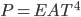

# The ion printer first requires a thin, vaporized jet of the target material. 
## This page describes the element that creates this stream.

### Why the hell do you call it a "bowtie"?

The original prototype of this element bore a close resemblance to a bow-tie:

Bowties are cool, and I love me some whimsical industry-specific jargon (c.f. [salad-bowl](http://projects.astec.ac.uk/ERLPManual/index.php/Photo_Cathode_Heat_Cleaning), Schlooping). "Filament" is ambiguous - there are at least three other filaments in use. I'm sure there's some accepted industry-standard name for this kind of thing, so call it whatever you want.

### Wait, isn't this already a solved problem?

While thin-film PVD boats and baskets exist, they really aren't a good fit for this device for a few reasons.

* Firstly, and perhaps most importantly, they don't produce a thin stream of gas. They produce a cloud of atoms with essentially random direction. This might not seem like a huge deal, but it's what took the majority of the time developing the ion printer. You might think that a nozzle or aperture would work; but your nozzle has to also be heated to above ~3000 K, else all your gaseous aluminum sticks to the nozzle and rapidly prevents operation.
* Secondly, while even more specialized solutions may exist, they're bloody expensive. Even cheap tungsten boats seem to start at ~$100 - far too expensive for a consumer device.

### Required temperature

https://www.iap.tuwien.ac.at/www/surface/vapor_pressure

The vapor pressure of the desired print materials is low at low temperature.

Therefore, to get a bearable print speed of >50g/h, it can be assumed that boiling is required. 

### Why not use induction heating?

I spent a few thousand hours trying high-power induction heating methods (largely based on some papers I've since lost and [1]). Induction heating, however, has a few serious drawbacks compared with simple Joule heating:

* Low effectiveness on non-ferrous metals. Metals like iron love induction welding, due to their high relative permeability; Aluminum doesn't absorb current as well; sure, you can get a chunk of aluminum up to 800c or so with 10kw of power, but we don't have the luxury of such high powers.
* Low effectiveness above the Curie point. Metals generally lose a lot of their magnetic properties above a certain temperature; that temperature is far, far below their boiling point.

It may be possible to build an ion printer that uses induction heating, but there aren't many benefits.

### Why even use a filament? Why not just vaporize the material itself?

First of all, if you just apply a few kilowatts to some aluminum, it will simply melt apart, breaking the connection. This might seem simple to mitigate, but I couldn't find a way to do it. A sharp rising edge in the power domain is therefore required.

I did quite a bit of testing with large capacitors in an attempt to accomplish this, which was mildly successful. You can pretty easily dump a few KJ into some aluminum wire to get gaseous aluminum. Unfortunately, there's one serious issue with this: it's non-directional. Everything in the line-of-sight gets coated in aluminum, which is undesirable for long-term usage; it also becomes extremely difficult to form a beam with a spherical vapor cloud. It *may* be possible to electrostatically pull a cloud of neutral aluminum into a coherent beam, perhaps with an ICP coil surrounding the whole lot, but I gave up on this method.

### Some simple physics background:

To reach the boiling points of metals, extraordinarily high temperatures are required, and so heat loss minimization is paramount. Some ways that the bowtie will lose heat:

#### Convection

The bowtie is in a high vacuum, so thermal convection can be entirely neglected.

#### Radiation

Anything hotter than absolute zero radiates away thermal energy in the form of infrared radiation; the amount of energy loss is given by the [Stefan-Boltzmann Law](http://hyperphysics.phy-astr.gsu.edu/hbase/thermo/stefan.html).

This is proportional to emissivity and heated surface area, and goes as the 4th power of the temperature.

This power loss is quite significant. 

#### Enthalpy

Aluminium:

| Source       | Energy requirement                      |
| ------------ | --------------------------------------- |
| Heating      | 0.9 kJ/kg/K * 2500 degrees = 2250 kJ/kg |
| Fusion       | 398 kJ/kg                               |
| Vaporization | 10.5 MJ / kg                            |
| Total        | 13.15 MJ/kg                             |
| @40g/h       | 144.7 W                                 |

A print speed of 40g/h will require at least 144.7 watts to be input to the bowtie. Values for copper are similar.

### Tungsten filaments

#### Tungsten has a few things going for it:

* Insanely high melting point (3800K or so); essentially anything you could possibly want to vaporize could be done with a tungsten bowtie.
* Low emissivity (0.05 or so); this means that very little of your energy 
* It's already commonly used for thin-film thermal PVD systems
* It's inexpensive and readily available in the form of "Green" TIG electrodes.
* It's relatively inert, and won't react substantially with filament material

#### It's also got some pretty serious issues:

It's very difficult to work with. It's one of the hardest materials around, which makes conventional subtractive manufacturing processes nearly impossible; EDM/[ECM](https://nptel.ac.in/courses/112107077/module3/lecture15/lecture15.pdf) seems to be required. Standard casting techniques don't work; a complex high-pressure sintering process is required. There are many companies around that will wrangle this metal of Cthulhu to your desires, but that takes us far from the protective margins of vertical integration.

You might wonder why we even need to work the tungsten at all. Indeed, just winding some aluminum wire around a 1/16" tungsten rod produces a small bead of molten aluminum, which then evaporates. Unfortunately, this has the same problem as the capacitor discharge system above; it's not a directed stream of gas.

However, there is one process you can easily perform on tungsten: you can bend it. Though its melting point proper is high, it becomes very ductile at comparatively low temperatures; ~1500c - easily attainable with an acetylene torch. 

In retrospect, this seems obvious, but I learned it relatively late in the project.

A layer of yellow tungsten oxide forms when bending, which can be eliminated by using an inert (nitrogen, in my case) or endothermic atmosphere, but this layer quickly evaporates when the finished product is heated in a vacuum.

My final tungsten design was a cylinder wound using 1/16" tungsten rod, with a graphite plug at the bottom. This worked reasonably well. However, the efficiency and rate of vaporization was quite poor; with my high-current transformer, I was only just able to get to the boiling point of aluminum.

### Graphite

Graphite, on the other hand, is easily workable with standard machine tools. However, this comes at a cost:

* Poorly-defined properties. Graphite's electrical and thermal conductivity is dependent on a large number of factors, including grain size, production method, contact pressure, impurities, etc. It's even anisotropic; measuring resistance lengthwise or widthwise can return a different result. 
* More reactive. Graphite is prone to reacting with metals at high temperatures, though it remains to be seen how much of an issue this will be. The bowtie is likely to be an inexpensive consumable for this reason. 

Graphite also sublimates at high temperatures; its vapor pressure is between 10 and 100 Pa at the boiling point of aluminum.

There's kind of an issue here. Making the supports thicker decreases their resistance, allowing the crucial center section to become hotter; but it also increases their thermal conductivity proportionally, wicking heat away from the center section.

#### Ceramics

Thermal conductivity.

#### Zinc crucibles

For initial exploratory research, I attempted to vaporize zinc in my Gen1 and Gen2 test chambers, due to its ease of boiling. This worked okay, and helped me understand more about how how the vapor paths would work.

I attempted a number of zinc crucible designs, including using off-the-shelf heaters, sand resistors, etc, and finally settled on this one:

It's a pretty simple construction: a copper tube, crushed at one end, then covered with a thin layer of high-temperature fire-cement to form an electrically insulating layer. After a few minutes in an oven at ~75c, a dozen or so turns of Kanthal A1 resistance wire were wound around this insulated slug. This, then, was also covered in fire-cement, then baked over the course of an hour at slowly increasing temperatures to prevent cracking. Once in a vacuum, I thermally soaked it at ~600c by applying current to the Kanthal. I then added a few grams of zinc and applied as much current as I could to begin zinc vaporization. A high voltage was applied to the copper tube, allowing the vapor to retain a partial charge.

This has a number of issues.

* The soak procedure is very time consuming, but is required to prevent immediate cracking.
* The crucible would still be spent after every single test due to cracking and porosity.
* It cannot possibly be used for copper or aluminum.

Thermal conductivity

### Temperature control

The rate at which the material is deposited is equal to the power put into the bowtie divided by the enthalpy of vaporization of the metal, minus losses and thermal mass. 

It would be nice to be able to determine the temperature of the bowtie. 

#### Thermocouples

Standard K thermocouple wire can't be used, as it'll melt. Some esoteric W/Rh junctions can handle the heat.

#### Bowtie resistance measurement

The resistance of most materials changes in a well-defined manner as the temperature increases. Ohm's law can be used to calculate this resistance based on the current draw at a certain voltage.

#### Bolometers

As far as I can tell, no off-the-shelf infrared sensor is capable of measuring these insane temperatures.

#### Emission spectroscopy/pyrometry/radiometry

The black-body radiation spectrum is shifted as the temperature increases. By measuring the spectrum at multiple points (two phototransistors with IR-cut and visible-cut filters, say), an accurate reading of the spectrum can probably be made. 

### Simulation

Oh! I can simulate this by using a heat flux boundary condition!

### Exit gas parameters

The gas that exits the bowtie has a certain temperature distribution. 

[1]: http://www.rmcybernetics.com/projects/DIY_Devices/diy-induction-heater.htm

Another reason why a large array of bowties is desirable is that the pressure required in each bowtie is far lower. This eases simulation, as the low Knudsen number avoids turbulent effects and allows simple rarefied-gas monte-carlo methods to be used. 

High pressures would also mandate temperatures well above the boiling point of the print material, which would complicate things from a materials science viewpoint (by accelerating interfacial reactions, increasing vapor pressures), produce messy, ill-defined vapor that could be contaminated with macro-scale droplets (as learned from early zinc testing), increase power consumption (though this may be offset by the greater surface area), and require that all upstream systems be gas-tight.

