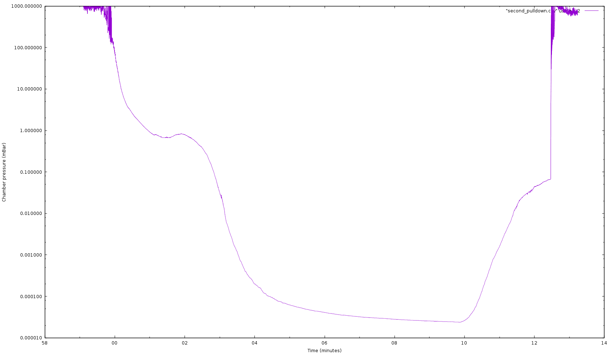
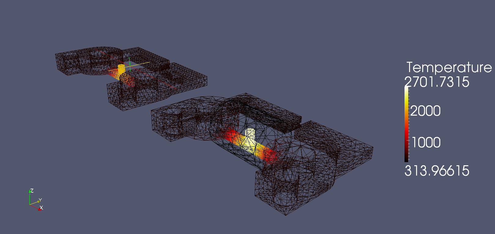
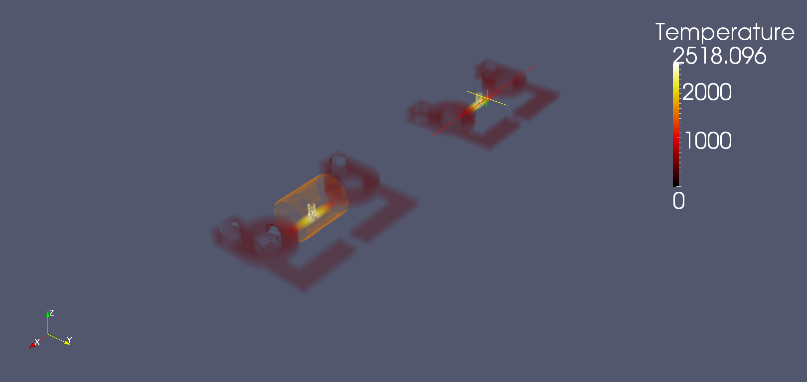
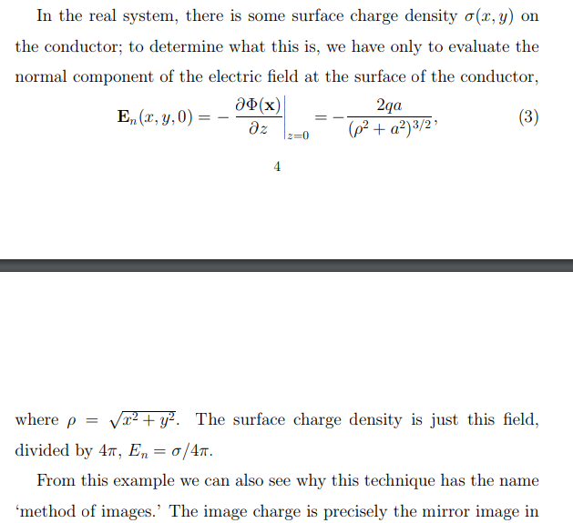
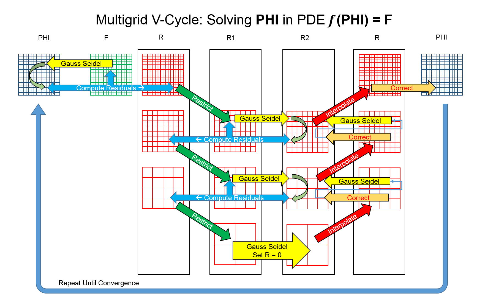

# Mk3

Log starts at gauge.

Need to drill 8.80mm or 11/32 holes in some aluminum and weld with brazing rod.

### Brazing aluminum

Aluminum brazing rod: seems like pre-heating is important. Someone on youtube uses a barbecue to great effect.

Purchased some Benzomatic AL-3 aluminum soldering rods from Canadian Tire. Encountered some difficulty in attaining the required temperature. Melted my jacket in the process.

Tried preheating with an electric stovetop element. The element itself got to nearly 500c, but the aluminum only got to around 300c - below the ~400c required for the AL-3 rods.

Tried oxy-acetalyne, not sufficiently warm. 

Tried a 100,000 btu/hr flamethrower: sufficiently warm.

Many voids were found in the final braze - it was not in any way airtight. This may be due to the fact that it was not clamped properly. Re-brazed several times.

Standard table salt is apparently effective as a flux. AvE recommends using a glass rod to remove dross.

Electrochemical weld cleaning

Looks like I put a bit too much heat on the feedthroughs - porosity

Seemed like one of the crush gaskets didn't fully seal on one of the spark plug feedthroughs - but in fact the brazing was porous.

# Mk3-5

Using a scrap piece of aluminum from an old boat engine mount. Had a few holes, but I could work them into the design.

Milled on 6040.

| Tool size | XY feed   | Z feed | RPM   | Z step | Stepover |
| --------- | --------- | ------ | ----- | ------ | -------- |
| 1/8"      | 7 mm/s    | 1 mm/s | 13000 | 1 mm   | 50%      |
| 0.25"     | 11.6 mm/s | 1 mm/s | 13000 | 1 mm   | 50%      |
|           |           |        |       |        |          |

Vaporized an entire bottle of WD-40 as coolant. This permeated into the MDF spoilboard, gradually reducing the clamping force until the part broke loose. Part was salvageable.

Used an entire pack of 180-grit trying to knock down some of the rack-rash. My friend Arnold tried to flycut  the thing, but there was excessive chatter.

Used an oscillating palm sander with some 320-grit silicon carbide. Took it to a pleasant dull finish.

Cleaned 5 times with water and then isopropyl.

THIS THING looks BAMF.


Spun up a few more times, achieved a base vacuum level of around 0.8 millibar (660 micron) - still not great, but I shut everything down prematurely as heating was excessive.

Set up a liquid cooling system for the turbo.

Purchased some nichrome wire from DashVapes. Needed a driver's license, amusingly.

Quite nervous around this thing right now; the clamping force on the turbo is almost surely insufficient. If it crashes, it will send high-energy shrapnel in all directions, including through my torso. I *like* my torso the way it is, thank you very much.


I raised the input voltage to the turbopump controller to 56v, which worked admirably. The turbo audibly spun up significantly.

Unfortunately, upon re-cycling the chamber, the controller exploded from the excess voltage, presumably spikes due to high startup current. I am unsure as to the cause; the mosfet drivers were clearly blown, but the mosfets themselves were also shorted. The drivers have headroom to 85v, and the mosfets are good to 100v - I can't imagine that switching noise got that high.


Holy crap! The high-side mosfet gate trace and 2 ohm gate resistor blew! That's an incredible failure mode.

Found out why the mosfet gate oxide blew in the first place: the gate was swinging across the entire 50v. Tried increasing the charge pump cap to 0.22 uf , but the driver blew up immediately.

Simplified everything to one channel, same problem. Swapped mosfets, drivers, added an external boostrap diode. Voltage across the diode 


I am an ABSOLUTE NINCOMPOOP.  A complete and total kneebiter.

So I tried to determine what caused the tragic loss of my gate oxide. Lo and behold, it seemed that the mosfet gate was swinging the full 48v input, plus 12v from the charge pump.

This is super strange for several reasons: one, the circuit was functioning normally, where the gate should have been destroyed in microseconds; 
and two, the block diagram of the MIC4604 driver doesn't reveal a failure mode that could possibly cause this issue.

Cue several hours of anti-Hippocratic probing and prodding that James A. Garfield would have blushed at, and wanton swapping of $40 in drivers

until I realised 

it's a *charge pump*, you total f***ing idiot. It's *not ground referenced*.


Floating the board's supply and connecting the scope ground to the drain of the MOSFET revealed a perfect 12v square wave.

<hr>

Spun the pump up again: noise is causing the driver Arduino to reset, which sucks. However, I was able to spin it all the way up; the current visibly dropped from 8a to ~4. The liquid cooling water warmed up quite pleasantly. Capacitors on the driver board warmed up slightly. Only achieved a base vacuum of around 0.7 mBar.

The pump occasionally spins down rapidly when latchup occurs: the energy is being dumped into the mosfets and TVS diode.


Tried using solder to seal up the 

Need to cast some crush gaskets.

Wood seems to be an effective mold for solder. Aluminum coated with aquadag or graphite also works.

caulk also works? Huh.

<https://www.youtube.com/watch?v=92OLGmu3hws>

Tried casting lead-free solder in sand: failed miserably, sand melted.

Made a little aluminum mold for a gasket: failed miserably, surface tension of solder was too high. 

Tried O-rings to seal, failed miserably, couldn't get below 400 mbar.

Ah, but pure 1101 aluminum wire works perfectly!

Mm, not quite - they were prone to cracking. 

Soldered some copper wires into rings - worked slightly better, but still not perfectly.

Ordered in some copper crush washers (#97725A250) from McMaster. These worked well, though a large amount of torque was required to seat them, and I'm not sure how the aluminum threads are holding up. A substantial amount of black residue was deposited onto the surface of the spark plugs from the last attempts. I am unsure of its composition.


Got everything cleaned and polished, washers seated, spark plugs attached - then the second roughing pump coupler exploded. 

Designed in openscad, 3D-printing some new ones now.

Printed, installed. Worked fine, except there was a large amount of vibration - might split it into a spider coupling.

Pumped down. Copper sealing rings worked perfectly. It wasn't worth the time to try to make my own.

Hit 5x10^-4 mBar. 


Two days later, hit 2.37x10^-5 millibar, even with a few things in the chamber. 



Some discussion on the Vacuum Hackers discord led me to believe that the pump was almost definitely going to fly away, what with the minimal clamping force provided. 

Printed out a 122mm bolt circle, disassembled everything, drilled three holes into the table, and re-assembled everything. The pump is now very rigidly affixed via the M6 bolt pattern on the bottom. 

Planning on swapping out the buna-n gaskets for viton. Very expensive, but whatever.

Planning on using a few CER-4 standoffs from digikey for the bowtie. These are made of STEATITE C220, with a maximum temperature of 1700c.

Milling graphite; used MeshCAM to generate the features. Went quite well, most broke but one survived. needed G64P.001 to prevent linuxcnc from rounding corners.

Assembled the bowtie module - I'm not actually sure why I'm doing all this, but it went really well in any case.

<hr>

#### E-beam test 1:

4.7 milliamps of e-beam current was drawn with a white-hot 0.1mm tungsten hairpin and a nickel flag at 20v bias. Initial tests with 100v bias were unsuccessful; however, it is believed that this was due to reversed polarity.  

Pressures were stable at 1x10^-5 mbar. 

Some tungsten was deposited on surfaces on the chamber; it is assumed that this is due to the unregulated temperature of the filament. As expected, the emission peaked at a certain input power and did not increase further with additional current. The current was increased regardless, and the filament vaporized in a satisfactory manner.

An aluminum baffle was used to prevent debris ingress into the pump.

The pump was accidentally dumped to atmosphere while at operating speed; this does not appear to have caused any damage.

It was expected that beam alignment could be performed manually, by viewing the ion trail left by the electron beam; however, the thermionic cathode produced too much light for this to be possible.

<hr>

A precise reading of the bowtie temperature is now required in order to set the vapor pressure. The resistance of the graphite is an excellent indicator, but the temperature forms a gradient between the center and the mounting points. This gradient has been simulated via ElmerFEM, but ultimately depends on the ceramic interface thermal conductivity etc. 

The temperature could also be inferred backwards from the beam current, or by measuring light output. 

A thermistor could be used to determine the mount temperature in-situ for a series of power levels, but the thermal mass of a thermistor is likely greater than that of the mount.

Some thermocouple wire was cut to 

<hr>

The precise secondary electron energy was at this point unknown. A crude momentum analysis showed a beam deflection angle of some 20 degrees - but this effect is significantly affected by secondary electron energy. 

It was decided that a SPARTA simulation would be used to determine the beam deflection; however, DSMC VSS and VHS parameters are required for an accurate picture, and can only be found in 

**(Bird94)** G. A. Bird, Molecular Gas Dynamics and the Direct Simulation of Gas Flows, Clarendon Press, Oxford (1994).

A copy of Bird94 was not available online (save for a few pages on Google Books), and a hard copy would cost more than this entire vacuum system. Substituting 

<hr>

#### E-beam test 2

A tungsten filament was produced by wrapping 5 0.1mm tungsten wires around each other. The filament was visually aligned with the bowtie.

This filament consumed a whopping 44 watts - while emitting the same 4 milliamps of beam current. Certainly a far cry from the 17w/A figure described in the literature.

As with the last test, this filament saturated the high-voltage power supply. A 31v bias was used instead.

The base pressure attained was significantly higher (2x10^-5 millibar) than in the previous test; this was attributed to the increased clutter within the chamber. Some flux had also splattered.

The charge on the bowtie was measured to determine focusing. Very curiously, the charge increased when the e-beam was activated, but dropped rapidly. This may be an artifact of the relative nature of the measurement, or a symptom of a greater electron-deflection problem.

<hr>

#### ElmerFEM simulations of bowtie prototype 1

The .sif files had been overwritten somehow - reverting to a previous commit fixed the problem.

ElmerFEM requires a .step input. This was meshed with Max h. 0.025 and Min h. 0.001. The enthalpy heat flux was set to zero. Convergence was not well behaved.

The simulation potential was set to 20v, and an ideal temperature of approximately 2000 K was attained. The bowtie drew approximately 100w.

#### Bowtie test 1, 2 and 3

The chamber was pumped down and 10 A was applied across the bowtie. The bowtie glowed a dim red,  not nearly sufficient for deposition. The resistance of the entire assembly was only approximately 0.33 ohms, a significant discrepancy from the predicted 4 ohms. Clearly the graphite resistivity value set in the Elmer sim was incorrect.

The "300-1200v" HV e-beam bias power supply was supplied with 12v, and output 2 kilovolts. A replacement NCH6100HV was purchased. 

The bowtie was connected to the 20v-45A supply, and 20a was briefly supplied. Aluminum was readily deposited, and no degradation of the bowtie nozzle was found. The deposited coating was quite easily wiped off the witness microscope slide.

One of the bowtie connection wires melted. 

#### IBSimu simulations of entire column 

A 3 by 3 by 6 mm 3D simulation was created. Unfortunately, an accurate measurement of space charge requires about 10 grid points across the beam - a mesh of 0.00003mm. This is not reasonable to compute in a short period of time. 

However, human factors were encountered - that is, the designer was filled with abject boredom. An automatic solution is required.

#### Beam solver, trial 5

After the modest successes over the previous week, more effort was put into an automatic beam solver.

This was based on the following premise:

1. I am too stupid to design a lens of this sort.
2. I know something about software.
3. Software can design a lens of this sort.

QED.

A mesh of 50x50 pixels over the entire beam would seem to be reasonable. 

- 3d "Slice" solver 
  - analytic function for slices was not found
- 3d Analytic concentric infinitesimal ring space charge solver, with automatic beam envelope
  - poorly implemented in Python, unusably slow
  - horrific write-only blob of vectors and linear algebra
  - There is precedent for this beam slicing technique, likely quite valuable if correctly implemented
- Brief diversion: an attempt to use TRACE-3D and TRANSPORT to fit the beam
  - miserable failure
  - what 
  - what even
- 2d simplified analytic concentric ring space charge solver, predefined beam envelope, rings also used for electrode field
  - Almost usable
  - on the order of a few seconds per iteration in Python
- 2d Laplace + Jacobi relaxation solver for electrode e-field, cylindrical beam scharge using analytic equation from @ Kalvas
  - Simple array operations in Python: 1-2 seconds
  - Numpy convolution: ~0.15 seconds
  - Pretty diagnostics with matplotlib
  - Random search ineffective, genetic algorithm considered with DEAP 
  - An attempt was made at adding charge incrementally to obtain a specified gradient - successful for a single point, but not beyond
- Wonderfully fast C++ Laplace solver
  - 24 ms per iteration!
  - aww yis

The search space of possible lens arrangements spans a triple-digit exponent of combinations, so an exhaustive search is clearly not possible. However, seeding the system with some common extraction and focusing arrangements (Pierce, Wehnelt, Einzel, etc) greatly reduces the complexity of the problem.


#### Low-voltage, high-current electron gun, Peter W. Erdman and Edward C. Zipf 

and

#### Design of Low Voltage Electron Guns, J. AROL SIMPSON AND C. E. KUYATT

This is the breakthrough I've been hoping for. An e-beam gun capable of ~1-3 mA at 100 eV.

Moreover, simulations (and, indeed, basic Child-Langmuir expressions) have shown that a comparatively high extraction voltage is required to form a reasonable beam. I previously dismissed this technique; my malformed intuition 

> There is a general technique which can be used to circumvent these limits on unipotential guns. The technique is to multistage the gun; i.e., utilize a higher voltage to overcome the space charge in front of the cathode and then decelerate to the required final energy. 
>
> This technique seems to have first been arrived at on empirical grounds.
>
> Once the advantages of multiple staging are recognized,
> the problem of low voltage gun design breaks easily into
> two parts: the extraction stage and the deceleration stage.
> These designs can be done almost independently and can
> make use of time-proven electron optical elements. 

Amazing.

I still haven't been able to fully wrap my head around the energy dynamics of these devices. 

Let's draw a diagram.

```
E-beam:

~0.2 eV Emission 														  /\
----------------							100 eV Exit    			  'o  |
				\						--------------              -----   
				  \					  /  								Hapless victim
				  	\			 ___/   									Tree
				  	  \--------/
			~500 eV Extraction	   Focussing, Deceleration

```

That seems quite sensible. If one were to roll a ball down this mount improbable, an observer by the tree would only be struck with 100 eV. 

Intuition still rejects this, however. Consider the following: if the second half of the electron gun vanishes, the thoughtful vacuum scientist will have at hand only a 500 eV beam and a shocked expression. If a small plate is surreptitiously inserted centrally, will it not be heated by 0.003 mA * 500 eV = 1.5 W ?  

But then intuition is but a manifestation of a poorly adapted primate, and can only guide one so far in matters of science. I am missing something critical.

In any case, I then simulated this arrangement with IBSimu. Worked admirably - some minor tweaking required, but nothing serious.


#### Erdman-Zipf gun construction

A 1/4" end mill was used to drill the central features - a slight discrepancy from Erdman and Zipf's design, but simulations did not show any effect.

As the mini-lathe used did not have an adjustable tool post, a parting tool holder was ground down to fit. 

Machining from a 1/2" stock of copper was attempted; however, the lathe in question (or, more likely, the technique of the machinist) was not capable of machining to any reasonable surface. One particularly aggressive parting operation even caused the fuse to blow. 

The copper was exchanged for 360 free-machining brass, and the parts were turned to within ~0.3 mm tolerances. Mill-turning using the CNC would be ideal for rapid prototyping and iteration.

The zinc content of the brass was quite worrying, especially since the extractor will sit ~0.2 mm away from a tungsten wire at some 2000 K. Nickel was therefore electroplated onto the electrodes. The solution drew between 0.05 and 0.1a. 

Discussion on Vacuum Hackers indicated that outgassing would be excessive. This idea was abandoned.

12L14 was found to machine quite well on this lathe; however, lead outgassing may be a concern.

Brief diversion to ceramics: On a whim, tried pressing alumina with crude graphite dies. Not effective. Applying small amount of pure alumina to graphite also not effective. Mixed some gelatine and alumina in some random ratio, and applied to tungsten on a whim. Heated with propane torch. The gel-cast bakeoff was very clear and visible - really amazing. 

The 12L14 die corroded almost immediately. This effect has been referenced previously as one of the main shortcomings of leaded 

After ~6 months and likely several thousand tests, I can say the following with uncharacteristic confidence:

Al2O3 is a BASTARD. It lures you hither with tales of insulating properties, of wonderous high temperatures

There is aluminum dust everywhere

#### The hunt

A search was carried out in an attempt to find an insulating coating or electrodeposition technique that could be used for a few purposes:

- as insulator for electrostatic lens elements, required immediately
- to decrease bowtie emissivity (and, potentially, reactivity) without switching to EDM tungsten

Anodized aluminum could be used - many vacuum tubes have cathodes insulated by aluminum oxide. However, this is slow.

Water glass may also be an option

Things I know how to do:

- electroplate with copper
- electroplate with nickel


- Can nickel be passivated?

- Some nitride? Nickel nitride?

- Silica coating graphite seems to exist

- Iron/steel passivation or pickling could be used

- Anodization of aluminum with mere vinegar has been mentioned once or twice. 

- Graphite can be copper plated.
- Copper can be "calorized" - a layer of alumina is applied, which then reacts to form copper aluminate and a coating of alumina. Promising method. Little can be found in the literature about this.

<http://tallmantechnologies.ca/iron-making.php>

> Calorizing is a pack diffusion process where the copper tuyere is placed in a sealed retort containing aluminum powder. The casting is heated and aluminum is diffused into the surface, creating a copper aluminide inner layer and an aluminum oxide outer layer.
>
> Calorizing creates a protective layer on the copper tuyere that preventing liquid iron drips from penetrating the surface. The calorizing process is performed at the final stage of production after the tuyere is finished machined and hardfacing alloys are applied. Calorizing eliminates the need to use refractory materials on the top surface of the tuyere.

- io9 on twitter (thanks!) informed me of the the field-assisted sintering technique, which greatly reduces alumina sintering temperature requirements. 

US4418097A

> The present invention comprises a process for reducing high temperature oxidation of graphite electrodes by coating the electrodes with a siloxane fluid.

> Dimethylpolysiloxane, having 100 centistokes viscosity, was sprayed on a graphite electrode while the electrode was at ambient temperature. The electrode was then heated to 1400° F. for eight hours. Weight loss was 6.8%.

Oh wait! That's silicone oil - PMDS!

A bootstrap paradox is found here. All of these techniques will be trivial when the ion printer is functional, but it can't be built without one.

#### SiC Graphite / SiO2

A small sample of graphite was accidentally dropped into a test tube containing a small quantity of ECO-702 silicone fluid. This coupon was then heated with a propane torch. The fluid burst into flames, and produced a bluish deposit on the graphite which immediately flaked off. An inert atmosphere may be required.

One face of the graphite was cleaned, then heated cherry-red and dropped into the siloxane. Some momentary bubbling was observed. The sample appeared to change texture somewhat, and emerged perfectly clean. The sample was still conductive.

Promising method, however. 

Silicon Carbide has an emissivity close to that of graphite, so this technique will be useless for decreasing power consumption.

See @ blocher1957carbide for a comprehensive treatment of this treatment.

#### Alumina Cataphoresis

<https://www.thevalvepage.com/valvetek/heater/heater.htm>

> Cataphoresis or electrophoresis is defined as "the migration of coloidal particles under the influence of an electrical potential". Cataphoresis, as applied to heater coatings, is the process by which positively charged alumina particles are deposited on a negatively charged tungsten heater wire. The alumina used in the suspension consists of very fine particles, usually in the one-to-five micron size range. An increased number of ionised groups on the alumina surface results when the particles are surface charged by the addition of small amounts of selected soluble inorganic salts, such as aluminum nitrate.

> After the heater is coated, it is sintered at 1600C for a short time in a hydrogen-atmosphere furnace.

This process was attempted with graphite at 20v, no effect. Experiment was repeated at 500v, no effect. Solution was very dilute - agitation likely required. See @ lazic2004influence for parameters.

#### Bowtie temperature measurement

Precise print speed measurement (that is, atoms deposited per second) is essential to the accuracy of this concept. 

There exist some thermocouples A program called LPUWS was found. <https://lpuws.scot.sk/> The endoscope from the PnP machine was removed and connected to a pocket spectrometer; however, the resolution was inadequate. A source of a reference calibration spectrum is unknown. A laser or LED of a specified wavelength may be effective.

The bowtie temperature would be useful to determine the vapor pressure (and thus atoms emitted) of the deposition species. On second thought, the pressure in the nozzle depends on a choked-flow parameter, since the external pressure is essentially zero. Relying on temperature to determine print speed.

However, there are many options for print speed feedback. Trace light emissions from ionization, e-beam current attenuation, etc.

#### Aluminum anodizing

<http://www.observationsblog.com/sciencetechnologyexperiments/anodizing-and-dying-aluminum-without-battery-acid>

"Hard" or "type 3" anodization appears to be desirable for high-voltage applications. 

See @ mielke1987 for the breakdown voltages of various thicknesses - >2500v appears to be difficult to achieve.

Bath is generally refrigerated.

<https://www.precisioncoating.com/hardcoat-anodizing-type-iii/>

> "Sanford Low Voltage" process
>
> High voltage rectification normally requires > 30 Amps per square foot current density.
>
>  Dielectric barrier usually > 1000 < 2000 Volt DC.
>
> Hard coat applications require up to 75 V at 24–40 asf. 

A suitable boost converter was purchased.

#### 

The Steacie Library at York U has a shelf (QC 702 onward) with plasma physics books. 

"The Physics and Technology of Ion Sources" was particularly helpful.

#### 

It may pay to re-evaluate the reasoning behind the use of wire stock. Intuition says granular jamming will be a concern, but perhaps some sort of ultrasonic vibratory system could be used to prevent sticktion.

#### Emissivity difficulty

It was discovered that the emissivity of tungsten varies significantly with temperature, starting from 0.05 at 250 K to approximately 0.16 at 1500 K. With 2048 bowties, the 

An aluminum reflector could be used - however, thermal heating is a little counterintuitive. For instance, an isolated, completely enclosed object will eventually reach precisely the same temperature as its surroundings. Some simulations are in order to determine what reflector arrangement will be effective.

<http://web.mit.edu/16.unified/www/FALL/thermodynamics/notes/node134.html>

<http://hedhme.com/content_map/?link_id=22144&article_id=530>

<https://nvlpubs.nist.gov/nistpubs/bulletin/14/nbsbulletinv14n1p115_A2b.pdf>

Describes in fascinating detail how the inner surfaces of a tungsten helix filament are significantly hotter than the outer ones.

A bowtie with a reflector was designed and imported into Elmer; however, the elmer mesh generator doesn't currently support multiple bodies.

gmsh was used to mesh the combined part.

`ElmerGrid 14 2`

was used to import the combined mesh (14 is the gmsh format and 2 is elmersolver mesh output) - however, the reflector was not imported. Elmer also crashed. ElmerGrid -autoclean resolved the error.

Apparently only the gmsh "netgen" command can be used with multiple bodies.

The final workflow was as follows:

```
Copy .sif file
ElmerGUI -> Import project (overwrites .sif)
Revert .sif
Export each body to seperate .step files
Import .step files into gmsh, mesh -> 3D, refine (netgen) -> save
ElmerGrid 14 2 bowtie_prototype_1_cut.msh bowtie -autoclean -bulktype 1 1 1
ElmerGrid 14 2 bowtie_prototype_1_reflector.msh reflector -autoclean -bulktype 1 1 2
ElmerGrid 2 2 bowtie_prototype_1_reflector -in bowtie_prototype_1_cut -out finalmesh -unite -merge 1.0e-10
ElmerGUI -> import mesh
Set body numbers using the shell script (and set count in brackets!)
Run
...
Profit!
```

If something in viewfactors.dat breaks, it may be helpful to delete the file. This was required when switching to diffuse gray.




With an 800 K difference, it seems that the reflector is extremely effective. 

It was found that the Diffuse Gray change had disabled radiation loss. Enabling diffuse gray on all surfaces caused an unacceptable slowdown, so only the thin bowtie section was activated. With an "external temperature" field, got "solution trivially zero". Removed external temperature.



The difference between the two at 20v and 110 W is now 2518-2372 K - notably different from the previous non-diffuse-gray tests. The reflector is quite hot. 

At 60 watts, peak temp was 1657 K.

With an emissivity of only 0.16, peak temperature was 1682 K. Clearly, we are in the thermal-conduction-limited regime, where the fixed mounting temperature is the dominant force. This can easily be alleviated.

The input to the bowties can either be powder, wire, liquid, or gas. 

Gas will deposit on the plumbing, so power consumption will be largely the same as liquid.

#### Beam tracking

This is the fun part: feedback.

As previously discussed, the precise space charge of the beam is highly dependent on many physical factors, such as compensation by background gas, trace electrons, etc. Furthermore, each print species will behave completely differently. 

Rather than design a single lens geometry capable of these features, a system that adapts in real-time to the actual beam profile may be a useful approach. This would require accurate particle position data.

- beam self-induced magnetic field
  - Fiber optic / Faraday field sensors
  - Beam optics with built-in Hall geometries
    - microvolts!
- beam space charge e-field sensing
  - ????
- Inductive or capacitive sensing
  - Quickly pulsing beam elements relative to each other may yield a measure of the gas dielectric constant. Calibration will be tricky. Pulses will have to be sufficiently fast as to avoid affecting the particle trajectories.
- Optical sensing
  - Background gas ionization / recombination light detection
  - Light transmittance / polarization /

- Beam loss feedback from lens elements
  - A small current on a lens element will indicate deposition and beam loss.
- Mechanical means
  - Faraday probes, wire scanners, witness plates, etc
- NMR?

Lens element beam loss detection should be quite simple to implement, and won't require calibration.

Beam position detectors on accelerators seem to be of the Cerenkov, silicon drift, or scintillator type, which will be ineffective for this application - see @ akiba2012charged.


@ currell1996new


@ shafer1992beam - another amazing reference

> The purpose of this paper is to review the properties of non-intercepting,
> electromagnetic beam position monitors used in particle accelerators and beamlines, and
> the types of signal processing used to recover beam position information from the
> beam-induced signals.

> There are many other possible methods of measuring beam position, both
> interceptive and non-interceptive. These include synchrotron radiation, interceptive wire
> scanners (both stepping- and flying-wire scanners), residual gas ionization and
> fluorescence, optical transition radiation, beamstrahlung, and laser probes to name a
> few. Discussion of these techniques can be found elsewhere in the literature, and in
> general review papers. 

Got it to a one!

> Small loop couplers 16 (often called B-dot loops, meaning dBIdt) are simply small
> shorted antennas that couple to the azimuthal magnetic field of the passing beam and
> can be quite directional. 

> After the pickup construction and assembly is complete, the electrode assembly is
> normally first "mapped" with an Rf-excited taut wire or antenna stretched through the
> pickup. The electrical response for various wire-displacement values of x and y
> determines the electrical center and the displacement sensitivities, as well as the
> nonlinearities. 13 The pickup is then installed and aligned mechanically with the other
> beamline components. An optional alternative for the final alignment is to place a taut
> wire along the magnetic axis of the beamline magnetic optics after the pickup is
> mechanically mounted, excite the wire with an rf signal, and measure the electrical
> offset (decibels of output signal unbalance) relative to the magnetic, rather than the
> mechanical, axis of the beam optics. 42 The electrical offset and the displacement
> sensitivity are then put into the computer database for correction to the beam position
> data as it is read out. The nonlinearities, as shown in Fig. 12, can be corrected in a
> look-up table at this time.
> In the taut-wire measurement, the signal on the wire is by definition a TEM
> (principal) wave with no longitudinal electric or magnetic component, which travels at
> the velocity of light and emulates highly relativistic particles. The signals associated
> with slow particles, as discussed above and illustrated in Fig. 10, are very difficult to
> generate on wires. As shown above, because the pickup response depends on the
> particle velocity, this effect must be considered in analyzing the wire measurements.

Clever! We can try different geometries and positions to build a regression.

Beam-modulated capacitive sensors seem to be ideal to get us the charged particles. How about the uncharged ones? I guess we'll deal with that later. 

Select lens elements could be split into quadrants and measured differentially, even with a potential applied.

Sorry, "window-frame"? Yeah, bowtie is probably an acceptable transgression.

Modulated beam capacitive coupling - equation 6.4 @ shafer1992beam:
$$
V_c = \frac{WL}{2\pi C} \frac{I_b(t)}{v_b}
$$
(v originally stated as beta_b * speed of light).

Some approximate numbers: if the capacitance is on the order of 10 pF, the plate is 2 mm by 2 mm, the current varies by 0.001 a in 10 us, and the beam velocity is 18 Mm/s (1000 eV, corresponding to maximum focus voltage), the plate voltage will be changed by 

```
0.353 v
```

!!! Perfect!

Note that no voltage is produced at steady-state. This means that no power is transfered from plates to beam. It also means that the bowtie temperature will have to be modulated. This could be accomplished via a sawtooth wave; a slow cooling and commensurate decrease in power, followed by a large pulse of current.

Distinguishing between beam-plate collision and a beam signal proper might be a bit tricky. Oh, no it won't - the collision will be steady-state, whereas the modulation will be in-phase with the beam pulsing.

If the heavy beam alternates around 0.1 milliamp in 1/100th of a second, and speeds past at 40 km/s, 

```
0.0159 v
```


#### Fluid tracking

The resistance of the bowtie will change when it is filled with conductive molten metal. That might be one of the coolest statements I've ever made.

#### Amplifiers

The cheapest 600v MOSFET or IGBT on Digikey seems to be ~\$0.10 at 3000-of pricing. With the minimum 5 plates and 2048 bowties, this would cost over $1000. Clearly, the amplifiers will have to be vertically integrated. 

> Nickel is used mainly because is has high resistivity which makes is easy to weld. 

Ah! I had assumed that there was an electrostatic reason. Surface contamination is a significant concern, as Erdman & Zipf described (haha EZ lens!).

Since there is no "blanking" feature on the ion printer, the beam is always present; therefore, the slew rate of the plates must be quite high to prevent material from being deposited between positions. 

Given a triode with a 500k anode resistance, and a plate capacitance of 300 pF, a time constant of ~200 us can be expected. 

To decrease power consumption, the bowtie could serve double-duty as the amp cathode heater. The reflector shield could be coated with barium oxide paste, serving as an indirectly heated hot cathode.


Simulations will have to be performed to determine the ideal 

#### Electrophoresis test 2

Graphite and 12L14 were used as the cathode with an aluminum anode. Voltages of 40 to 120v were attempted. 0.04 a were drawn. No deposited layer was observed. PVA binder was added to the mixture. No deposited layer was observed.

#### Anodization test 1

Two pure aluminum wires were inserted into a room-temperature bath containing 20g of sodium bisulfate dissolved in 100g of tap water. Stirring was maintained throughout. 40v was applied, and the electrode began drawing 0.3a. The anode effervesced profusely.  The anode was removed after ~5 minutes, when the current had dropped to 0.1a. 

Lungs were found to tickle slightly. The anode had been very effectively anodized, and had taken a dull gray lustre. The coating was reasonably scratch-resistant, requiring a fine point to break the surface. The wire was hardened significantly. The resistance was above ~100 Mohm. Breakdown voltage tests were not run.

Graphite can be used as an electrode for anodizing clear.

I do not believe I will anodize again; the sulfuric acid mists created by the type-3 process are really spicy, and it was a little hard to breathe last night. My sinuses were visibly swollen. My hood is clearly insufficient to protect me.

#### Vacuum induction furnace test 1

A 1kw liquid-cooled induction heater was used to heat a piece of graphite inside an evacuated test tube. Failure.

#### High-current transformer graphite test 1

A transformer constructed of 6 ga wire, known to produce peak currents of >100A, was connected across a small graphite mold. The mold was not heated appreciably.

#### Graphite resistivity

The prototype bowtie was 0.75x0.6x10mm, and had a resistance of 0.33 R. 
$$
RA/L = p
$$
Graphite therefore has a resistivity of approx. 14.9 uOhm-meters, or 67110 S/m. The value used for the Elmer sim was 3500 S/m - this explains the discrepancy. 

The sim value was obtained from @ lutcov1970thermal.

Appending my notes from the .sif file:

> ! Graphite value is a rough approximation to the data provided in
> ! Lutcov, A. ., Volga, V. ., & Dymov, B. . (1970).
> ! Thermal conductivity, electric resistivity and specific heat of dense graphites.
>
> ! Specific heat data is from Thermal Properties of G-348 Graphite
> ! Donald M. McEligot, W. David Swank, David L. Cottle, Francisco I. Valentin
> ! Mr. Swank, you've got a cool name.
>
> !I've confirmed that the volume resistance values returned are sane for Aluminum.
>
> !For comparison, using
> !graphite data directly from McMaster-Carr,
> !(dividing ohms/sq by the thickness of the sheet, which is horrifically inaccurate)
> !I get 0.00001397 ohm-meters
> !or 71582 S/m.
>
> !Screw this.
> !I just put my block of graphite across my bench supply,
> !and obtained a value of 0.66 ohms,
> !1968.5 S/m.
>
> !Using my bench meter in Kelvin-probe mode, I obtained a value of
> !0.221 ohms,
> !5873.9 S/m.

The observed value matches the value from McMaster-Carr to exceptional accuracy. All other values are ridiculous. The new value has been substituted. 

#### Anodization test 2

Diluted the anodize bath significantly. The rest was violently neutralized with sodium bicarbonate. Tests conducted at various voltages still yielded great anodizing power even at ~50x dilution. The anodization far more porous and pitted.

#### "Dirty" chamber 

Some 3" OD x 1/8" wall lexan tubing was found. 
$$

$$

#### Hot Surface Igniters

These are essentially miniature versions of the SiC heating elements used on commercial high-temperature kilns. The SiC ones are quite delicate, but there are Silicon Nitride sandwich versions which are apparently much stronger. The SiNi ones seem to have a lower peak temperature, however. 

Thinking of building a real high-temp furnace with these. Kind of tired of messing about with torches etc. At ~4 A each, we can only run 4 on a standard 1800 W circuit.

Silicon Nitride decomposes at ~1850 C. The SiC elements may be more optimal for this application.

SILICON-CARBIDE/BORON-CONTAINING COATINGS FOR THE OXIDATION PROTECTION OF GRAPHITE - it seems that SiC layers on graphite tend to crack. Addition of boron can solve this issue.

MoSi elements are also available.

However, I have a lot of graphite, and I already know that graphite is easily capable of these temperatures - it's a high TRL heater here. If I make a graphite plate 70x25 mm, with 7 runs of 1.5x2.5mm cross section, I will obtain a resistance of 1.947 R, a cool 25 a at 48V. 

#### FAST/SPS ceramics / Polymer Derived ceramics

Spark Plasma Sintering seems an achievable technique for production purposes.

#### Faster Laplace computation

<https://people.eecs.berkeley.edu/~demmel/cs267-1995/lecture24/lecture24.html>

> On a realistic parallel machine, one would simply assign grid point (i,j) to processors in a block fashion as shown below, and have each processor update the values of U(i,j,m+1) at the grid point it owns. This requires U values on the boundary of the blocks to be communicated to neighboring processors. When n >> p, so that each processor owns a large number n^2/p of grid points, the amount of data communicated, n/p words with each neighbor, will be relatively small.

<https://github.com/NVIDIA/AMGX> is also an option if these methods are insufficient.

> At least a grid dependency study
> must be carried out to verify whether the solution basically remains the same
> when the computational grid is refined.

[http://ftp.feq.ufu.br/Luis_Claudio/Books/E-Books/Food/Food%20process%20modelling/35652_04.pdf](http://ftp.feq.ufu.br/Luis_Claudio/Books/E-Books/Food/Food process modelling/35652_04.pdf)


@ demmel1995

@ nagel2011solving 

See @ yavuzturk2005assessment 4.3, (2) for heat flux and transient thermal modelling.

dirchlet conditions 


#### Beam diagnostics at scale

The cheapest comparator (required for a successive-approximation ADC) at 10000-of pricing is ~\$0.14 / 4 elements, which would cost >300 for a 2048-element printer. 

A single NPN transistor is only $0.03, however, and a standard long-tailed pair only requires two transistors. We're not concerned about linearity or really any aspect of dif

A 16-channel analog switch (the CD74HC4067M96, for instance) is $0.52. If 8 channels are required per beam, this comes to \$520. 

Digital muxes cost 

A grid matrix AND system could be arranged, requiring only two transistors per output. 

Some sort of VCO could also be designed.

#### Hybrid probe

Theoretically calculating precise energy/momentum balance and ionization percentages in electron-beam ionization appears to be almost impossible. Coefficients for heavy atoms like aluminum and iron are scarce, and the underlying theory is highly quantum mechanical. VSS/VHS parameters alone will likely be insufficient. 

Accuracy of ~1 percent is important - even a small amount of misdirected material will destroy both the printed object and the assembly.

For this reason, we are going to harness the most powerful simulator ever: the universe itself.

Previously, I was going to determine the deposited mass using a combination capacitive spring balance and Kelvin cup. However, given the small mass, the capacitance change will likely be infinitesimal. 

Deposition thickness measurement is usually done by determining the change in frequency or Q factor of a quartz resonator. 

I experimented with using a small 3-wire feedback piezo sensor; however, these are constructed from brass and resin insulation, neither of which I would like to have present in the high heat flux immediately surrounding the bowtie. Standard quartz oscillators seem to be constructed from vacuum-safe materials. 

To simplify measurement, 

I was also planning on making the microbalance and Kelvin cup one and the same; however, this would require an electrode mounted to the quartz resonator, making the setup somewhat more complex.

A pair of plates perpendicular to the Kelvin cup entrance can be used to preferentially deflect electrons.

The beam calorimeter can be calibrated by dissipating a known power into an integrated SMD resistor.


The Teensy 

A stepper motor and counterbalance will be used to 


Effects that will have to be calibrated out:

- Radiated heat from the bowtie
- Change in emissivity as material is deposited


Purchased 5 Abracon ACO1847 1 MHz oscillators. One was sacrificed to determine the position of the internal quartz element. It appears to be less than 0.6mm from the top of the casing and 8.13 mm in diameter, with 6 mm safe distance between the mounting supports). Looking at the oscillator upright, with the text readable, the first mounting peg is 8.8 mm from the right side (measuring from the body, not the flange) and 6.58mm from the bottom. 

The second mounting peg is 16.14mm from the right and 2.15mm from the bottom.

The crystal element is 0.208mm thick.

@ mueller1968direct

> This latter situation is the usual
> one, since the total loading of the crystals should be
> limited to 1% of the mass of the crystal.


Things which should be mounted to the measurement head:

- Oscillator
  - Sensing either via oscilloscope or Teensy
- Kelvin cup
  - Calibration resistor
  - Thermistor
  - 
- Bowtie mosfet
- 

<http://www.stabitech.nl/Quartz.htm>

#### Cascoding

HV Cascoding is a powerful technique, though it is not without idiosyncrasies. Amplifying the ~5 KV extraction supply would require 3 or 4 HV mosfets per emitter.

#### SiC furnace construction

An Emerson 767A-372 Carbide hot surface igniter and an Amaco 28035N 9" x 4-1/2" x 2-1/2" firebrick were purchased. 

The firebrick was cut in twain with a wet diamond tile saw, a 27mm slice was rended from one of the halves, and a pocket was made in the remnant.

Holes for the igniter were drilled into the slice using a standard drill bit. The igniter was mounted using 1460c high-temp cement. The cement had dried considerably, and was not able to adhere to the wet-cut surface.

The assembly was left to dry for several hours. 

The igniter body appeared to be made out of steatite C220, not alumina; therefore, a ~7mm firebrick gap was added to insulate the low-temperature side of the igniter. This was probably not necessary; Steatite has a maximum temp of 1700 C, likely higher than the furnace will ever attain.

Firebrick cuts very easily; mounting on the CNC may have been possible.

#### Firing

Fired up the new crucible. It performs beyond my wildest dreams. Measured the internal temperature with a small thermocouple stripped of insulation. It hit 500c at a mere ~50v (of 140), 700c at ~80v. The temp was maintained at 400c for ~30 minutes to bake off any residual moisture; some slight hissing was heard. 

The outside is still cold to the touch.

120v rapidly drove the kiln past 1000c.

#### Alumina + Kaolin test 2, new furnace

A digital control system was set up to drive the new kiln; however, the only SSR available was apparently burned out.

A 70% Alumina / 30% Kaolin / 19% water solution was made. This was far too liquid.

Impatience caused the temperature to rise to ~200c far too quickly. Distressing popping noises were heard.

The kiln was brought to 1300c for ~5 minutes. This required ~130v. 

The part had broken, but was composed of the most wonderful hard alumina. A few more minutes at temperature would probably be in order. Some residue was deposited onto the surface of the SiC element.

#### Furnace PID

A new SSR was purchased, and a little rubbish PID algorithm was written to control the kiln. 1,1,4 with integral bounds of -300 and 300 was effective - oscillations of +-20C, no problemo. The element draws a consistent 3.7A throughout the the temperature range.

Thermocouple melted.

Various tests were performed with different mixture viscosities.

Alumina-dipped graphite was very effective; it seemed to bond well to the surface of the graphite. The graphite degraded significantly, however; it had lost almost all structural integrity after two sintering tests.

I was planning on making a spectroscope pyrometer; however, I realized that this wouldn't give me any measurements at low temperatures - required for furnace bakeout. 

Tried measuring how tungsten wire degrades in atmosphere; used a lighter to heat a 0.1mmx20mm piece red hot while measuring its resistance with the bench meter. Resistance went from 2.630r to ~3.35r when hot, but returned to 2.54 after one cycle, then 2.4 after the next, etc. Not a reliable thermistor.

Err, the above effect may have been a contact resistance problem. 

Tried 100r divider with a length of nichrome in the furnace. Reading unchanged over temperature range. 

Used proper kiln thermocouple from other kiln. Worked as expected - small temperature offset at maximum temperatures.

#### Delrin alumina casting

A one-sided mold was cut from 1/4" delrin, and clamped to a flat piece of delrin. A 70/30 alumina mix was made. 

This was left to dry for ~30 minutes, and then opened. The alumina had not yet dried.

#### Aluminum graphite coating

An aluminum coupon was dipped into 70/30 alumina, forming a thin insulating layer. A blowtorch was used to sinter. The aluminum melted slightly.

I don't have any steel. Sucks.

The problem no longer seems to be related to the alumina sintering; with kaolin, this is easily effected. 

#### Delrin alumina casting with PVA binder

Following the advice of @ chabert2008cross, a solution was made containing a small amount of PVA binder. This contained 1.5g kaolin, 3.5g alumina, and 0.2g PVA wood glue (solids percentage ~0.4-0.7). Less than 1.5g of water was added until the mixture was very stiff and clay-like. This was added to a syringe and injected with some difficulty into a delrin mold until clay was emitted from the sprues. The mold was immediately disassembled, and it was found that the clay had fully permeated through the channels in the mold.


Interesting: photolithography works on clay <https://ceramicartsnetwork.org/daily/ceramic-supplies/ceramic-colorants/photo-lithography-on-clay-a-surprisingly-simple-way-to-print-images-on-clay/>


#### Green machining 

oh it's a green machine

very green

penny lane - 


The previous mixture could not be released from the mold; it was too brittle, and snapped immediately. The ejector pins functioned admirably. Some shrinkage was observed. 

One of the scrap pieces was taped gently to a piece of delrin on the CNC bed. This was then milled at 24krpm, 65 mm/min, and ~0.7mm stepdown. This worked admirably.

> synergistic interaction among locust bean, carrageenan, and
> xanthan gum

bahahaha

I'm missing the DHF cross-linker that was mentioned in the study.

> Thegreen components were fired at between 1350 and 1450C for 2
> h after a 30-min hold at 3501C for PVA burnout


Perhaps using mold release would have been helpful.


#### Green cookie-cutting

Another mixture was created with 1.5g kaolin, 3.5g alumina, 0.2g PVA wood glue. Sufficient water was added until a putty-like texture was attained. This was spread out on a delrin sheet, and a delrin "cookie cutter" mold was pressed onto it with great force. The mold was then removed. The part stayed cleanly attached to the delrin sheet - occasionally, some distortion would be encountered; mold release may solve that issue. This was left to dry for ~3 hours, then transferred to the kiln. The green was strong enough to be handled. 

The kiln was inadvertently preheated to 100c, then brought to ~350c over the course of 5 minutes. This temperature was maintained for 20 minutes, and then the temperature spiked to 1300c.

This process was conservative for this part, however; even the highest temperature ramp rate from cold yielded no ill effects.

The part was extremely hard and strong, though it shattered when sprue was removed; crack in the green propagated.

The temperature reading of 1100 was far below the previously observed temperature of 1300-1400; this was almost certainly an offset due to the new high-thermal-mass thermocouple.

silicon carbide; it's also very pretty!


Heat stress-testing with propane torch caused the part to both crack locally, and become very weak globally.


#### More ways of measuring liquid

The bowtie plates can be vibrated to determine their contents, or - perhaps an easier method; their thermal mass can be measured!

#### Stepper motor 

> \1. RATED VOLTAGE :                                  3.3 V DC
>
> 2 .COIL RESISTANCE :                                 20 Ω±10%
>
> \3. NO. OF PHASES :                                     2 PHASES
>
> \4. STEP ANGLE :                                         18°/ STEP
>
> \5. MAX. STARTING FREQUENCY :               800 PPS min. (AT 3.3 V DC)
>
> \6. MAX. SLEWING FREQUENCY :                2000 PPS min. (AT 3.3 V DC)
>
> 7.PULL IN  TORQUE :                                   1.5 gf-cm max. (AT 500 PPS  3.3 V DC)
>
> 8.PULL  OUT TORQUE :                                2.0 gf-cm min. (AT 500 PPS,  3.3 V DC)
>
> INSULATION CLASS :                                CLASS E FOR COILS
>
> INSULATION STRENGTH :                       100 V AC FOR ONE SECOND (3mA MAX)
>
> INSULATION RESISTANCE :                    1.0 MΩ (DC 100 V)  
>
> OPERATING TEMPERATURE RANGE :   -10 ~+60 ℃

Let's say mine can do 1 gf-cm.

#### SiC element bubbling

The SiC element in my kiln produced some massive bubbles! An explanation for these can be found in @raj2015.

#### 90% alumina

90% alumina for 40min at 140v works well.

#### Ceramic ingot 

Merely molding ceramics into a rough shape is not sufficient; bubbles and porosity are apparent.

A large delrin die was made to press into a suitable ingot; this worked reasonably well, though there were some imperfections on the bottom of the ingot.

If the mold or press does not work, the material can be recovered; adding some clay functioned perfectly.

#### Momentum balance

We're trying to find the momentum balance of collisional ionization. The device uses a quartz microbalance, and is balanced precisely.

It's a balanced balance-balance.

#### Green machining 2

Tried machining some 90/10 alumina. First attempt was at some 1000mm/min, reasonable surface finish on some areas but fine details just cracked.

Second attempt was at 100 mm/min, same deal.

Acetone dissolves polystyrene, but not PVA. Might be an interesting mold technique.

Unfortunately, acetone also seems to dissolve the green rapidly - possibly due to water contamination in the acetone.

Ordered some nice machinable wax that's supposed to burn off cleanly; some variation of wax burnoff while drying the green may work. The tricky bit is getting within that hysteresis between part contraction and cracking, part too wet and weak to support itself stably, etc.

#### Nitinol vacuum actuator

The gear and stepper system was causing some consternation; first, the torque is extremely low, only ~1g. I was reminded of SMA muscle wire, which is often used for this exact application.

A torsion spring or counterweight is required to tension the wire.

#### Grid beam position monitor


#### Capacitance simulation

<https://physics.stackexchange.com/questions/24072/calculating-capacitance-of-arbitrary-plate-shape-and-arrangement>

> You make a grid, place your shapes on the grid, and solve Laplace's equation with a zero potential at infinity, and some potential on the grid. This will give you an electric field intensity at every point (the gradient of the potential), and you sum up the implied charge. The ratio Q/V is the capacitance.
>
> This is mathematically optimal, and the only improvement is to use non-grid approximations, like expansion in harmonics at large distances, and superior higher-order methods in the interior of the grid. For Laplace's equation on modern computers, there is no issue--- even the worst algorithm will give you an answer to 1% accuracy on an arbitrary shape within a reasonable time.

Okay, so I think I've got it.

First, we figure out the capacitance of the electrodes in the simulation. Next, for each time step, we determine the charge added to the plate via this method, compute the current through the shunt resistor and the new potential, and deposit that potential onto the plates.

The only question now is: what precisely did Ron mean by "sum up the implied charge"? Time to hit the Gauss. 

#### "open boundaries"

I was planning on making the Laplace simulator ignore the edges of the boundary, rather than making them zero in the five-point star. However, this is nonsense.

Replacing the boundary condition bools with an element ID might be helpful.


#### Mesh refinement

A conservative simulation might require a 5x5x5 cm world, including regions with 0.05 mm resolution. A dumb uniform bool mesh of that size would take up almost 1Gb in memory, which is clearly unacceptable.

We don't need an adaptive mesh, but a certain level of refinement is essential.

This took a bit of head-scratching, but I think this is feasible with only a few minor changes to the mesh data structure; while reads and writes will take a few more cycles, this cost should be outweighed by the smaller number of mesh points.

Additionally, implementing a multigrid solver should be trivial.




Gotcha!


Thinly sliced/halbach ion optics


#### FPGA beam driver

An FPGA with 200 I/O can be had for ~$10, in case some high-speed logic is required. Per-I/O prices of FPGAs vs microcontrollers are surprisingly similar.

#### Ultrasonic bowtie excitation

Bunching of the beam for diagnostics can be facilitated by mechanical vibration of the bowtie nozzle.

#### Diffusion pump

vapor superheat post-boiling - more efficient pumpdown with lower power consumption?

Activated alumina beads for backstreaming absorption

#### Jacobi relaxation in C++

Trying to figure out the best data structure for Jacobi.

A quick Nyion test yielded 1780 ms per iteration for a single-core 200x200x200 float mesh relax, using 1d C++ vectors with a 3d lookup function. 66.9 MB of memory was consumed. 

This indicates an abysmal 222.5 ns per 7-point star sum - under 5 MHz! Ouch! I know, premature optimization and all that, but this is kind of a fundamental design issue; everything centers around this. 

The Jacobi function will take thousands of cycles to converge, and will be called every time charge should  be deposited onto the PiC grid; that is, every time a particle moves into another grid; so it's really quite critical. 

What's our goal? The rule of thumb is that 10 space-charge points are required to accurately model a beam. The nozzle is 0.4mm in diameter, so a 0.00004m mesh is required around there. The current generation extractor is 9mm in diameter, so 225 mesh points across the x.  200x200x200 is probably a reasonable estimate.

Then, we'll need at least 1000 J or G-S cycles for convergence (with some multigrid action, surely), times 0.2 meters / 0.0001 = 2000 iterations as the space charge fills in. That's around 2 M J cycles - three weeks or so at 1.8 s each.

Some beam envelope tricks could probably pare this down to 10-20, but I don't wanna be clever.

So, is 5 Mhz all we're going to get? Assuming 100% cache misses, DDR4-1600 can hit 12800 MB/s. Divide by 4 because we're working with floats, divide by 8 for the stencil, then by 10 because this is silly best-case nonsense = 40 Mhz. 

There's some room for improvement, but probably not the several orders of magnitude that are required.


For the hell of it, I swapped out the 1d C++ vectors for a simple 3d array on the global heap. This required only 100 ms / cycle!

Okay, so I guess we're still CPU limited - those ~10 index lookups were probably killer.


Time for some testing!

```
relax_laplace(){ 
 auto t1 = std::chrono::high_resolution_clock::now();
  potentials[1][1][1] = 10;
  for(int i = 0; i < 10; i++){
    for(int x = 1; x < mesh_geometry[X]-1; x++){
      for(int y = 1; y < mesh_geometry[Y]-1; y++){
        for(int z = 1; z < mesh_geometry[Z]-1; z++){
            potentials[x][y][z] = (potentials[x-1][y][z] +
                                                     potentials[x+1][y][z] +
                                                     potentials[x][y-1][z] +
                                                     potentials[x][y+1][z] +
                                                     potentials[x][y][z-1] +
                                                     potentials[x][y][z+1])/6.0;
        }
      }
    }
  }
  auto t2 = std::chrono::high_resolution_clock::now();
  std::cout << "each cycle took " << (std::chrono::duration_cast<std::chrono::milliseconds>(t2-t1).count())/10.0 << " milliseconds" << "\n";
  return potentials[0][0][0];
}

time_lookup(){
    t1 = std::chrono::high_resolution_clock::now();
      for(volatile int i = 0; i < 100; i++){
        volatile int test = potentials[i][i][i];
        asm(""); //prevent this loop from being optimized out
      }
      t2 = std::chrono::high_resolution_clock::now();

      std::cout << "idx took " << (std::chrono::duration_cast<std::chrono::nanoseconds>(t2-t1).count())/100 << " us" << "\n";
}

int i_idx_arg(int x, int y, int z, int x_len, int y_len, int z_len){
  return (x_len*y_len*z) + (x_len*y) + x;
}
int i_idx_geom(int x, int y, int z, int mesh_geometry[3]){
  return (mesh_geometry[X]*mesh_geometry[Y]*z) + (mesh_geometry[X]*y) + x ;
}


1d vector-style
std::vector<float> potentials((200*200*200),0);


std::vector<std::vector<std::vector<float>>> potentials(200, std::vector<std::vector<float>>(200, std::vector<float>(200)));


1d C-style
volatile float potentials[200*200*200];

1d std::array
std::array<float, (200*200*200)> potentials;


```

​	

| 200x200x200 array, -O3 for all                               | CPU Time, +/-10ms |
| :----------------------------------------------------------- | ----------------- |
| 1d std::vector + i_idx_geom();                               | 1700 ms           |
| 3d std::vector                                               | 440 ms            |
| 3d global C-style array on heap but without BC flag          | 100.4 ms          |
| i_idx_geom();                                                | 110 ns            |
| i_idx_arg();                                                 | 60 ns             |
| Single lookup with 3d C-style array (potentials\[0\]\[0\]\[0\]) | -- ns??           |
| 3d std::array [nb: defaults to stack, segfault]              | 903.8 ms          |
| 1d std::vector + i_idx_geom();                               | 438.6 ms          |
| 1d std::vector + stupid inline math (potentials[(x_len\*y_len\*z) + (x_len\*y) + x]) | 285.4 ms          |
| 1d std::vector + less stupid inline math (potentials[(xy_len\*z) + (x_len\*y) + x]) | 279.3 ms          |
| 1d C-style array on heap + less stupid inline math, no BC flag | 127.7 ms          |
| 1d std::array + less stupid inline math                      | 426.0 ms          |
| 1d boost::array + less stupid inline math                    | 293.0 ms          |
| 1d std::vector to 1d C-style arrays, then back               | 175.2 ms          |
| 1d std::vector to 3 cache-aligned C-style arrays on heap, BCs re-added after relax cycle to skip slow flag (MPI easy, spectral radius comp easy), then back to vector | 108.4 ms!         |

Note: values do not include allocation/construction/initialization time. 

Juicy! This is probably of sufficient utility that I should publish it separately.


Next, we'll need a provision for storing multiple grids within multiple timesteps. I think the 1d std::vector is the best option; despite being 2 times slower, it's much more versatile.


For some reason, adding the boundary condition check makes the system 4 times slower. Curious! This doesn't happen if I check against the same potentials[] vector. Some strange cache effect? 

Changing to unsigned char had no appreciable effect.

Ah, but converting std::vector to a dynamic c-style array, performing the computation, then deleting the original array is very fast.

#### Multigrid

Tried performing multigrid (that is, seeding a fine mesh with values from a coarse mesh) "in-place" in the same array, with a greater first pass step; however, this caused a number of issues.

Also, I seem to have completely forgotten about the data structure. 

#### HV Safety

A mechanical pressure interlock could be used to short the HV supplies until a suitable vacuum has been reached. A mechanical flag could also prevent the chamber from being opened until the supplies are shorted.

#### Data structure 2d: electric boogaloo

A ragged 1d array of 1d arrays. The size of each sub-mesh in world-space is fixed; the resolution is determined by the size of the 1d sub-arrays. Meshes are initialized with zero size; those parts which are active have a size.

Do we need 3-level refinement? Let's see. Let's take a worst-case scenario, where the mesh is the same size as the printer chassis; 0.5x0.5x0.5m. Splitting this into 3mm cubes would take only 170 mesh points; perfectly reasonable. Each cube would then have 216 cells.

In this case, a 2d vector has a 42% overhead over simple 2d arrays. I think that's acceptable.


The following assumptions will be made:

- The root mesh need not be square, but all submeshes are. This lets us use the submesh array length to determine each submesh resolution; this will cost 1 cube root every ~216 stencils, but saves us a bunch of array lookups.
- Submeshes can have arbitrary resolution.
- Radiative transfer will only occur within meshes with equal world spacing.


On second thought, scratch all that. Having a variable submesh resolution means indexing directly into the mesh will be impossible. This wouldn't be a huge deal, except applying the laplace stencil across submesh boundaries will be difficult and slow, I think. That is, negative indices would have to be caught, the previous submesh indexed into, and the previous submesh index computed.

This is bustin' my noodle! Let's hardcode the submesh res for now.


#### Magnetohydrodynamic metal pump 

Magnetic liquid-metal pumps are quite common in nuclear reactors. This would be perfect for the 

<https://www.mikeash.com/pyblog/fluid-simulation-for-dummies.html>

A third alumina layer can be used between two graphite layers, with a labyrinth seal between each layer. Also solves the stiffness problem.

Mold could be made such that the graphite part is put inside and an even coating of alumina is added around all surfaces.

alumina mixed with silicone oil?

The space shuttle leading-edge RCC heatshield tiles had a similar silicon carbide conversion coating for oxidation protection. 


If a liquid ring roughing pump is used, it'd be cool to have the workings visible.

Could a magnetohydrodynamic pump be used with a liquid ring? Interesting...

No, liquid-ring pumps are not likely to be effective for this purpose; the base vacuum is not sufficient for diffusion pump startup.


#### More laplace

Got mesh refinement and multigrid working, both are very effective. Convergence is still a bit slow on the ol' laplace.

Tried 9-point, SOR 1.2 to 1.7, still doesn't converge quickly.

Tried a very slow multigrid progression. This works really well for meshes with <10% BCs. Convergence on a 200x200x200 mesh to 0.01 takes about 3 minutes. 100x100x100 takes 15 seconds.


#### FPGA-accelerated laplace

3 minutes to converge is a bit much. I could parallelize this, but have to learn verilog for school, and happen to have a DE0-Nano FPGA dev board with 32 MB of sdram, which will fit a 200x200x200 array perfectly. GPUs aren't ideal for these sorts of problems. 

Transferring data to the fpga at reasonable speed presents some difficulty; the built-in USB blaster can apparently hit ~10 Mbps, but the bindings that exist only allow ~10kbps. UART implementation is non-trivial because of clock domains etc. An RPI might work: socket -> wide gpio bus; direct port maniuplation in C++ can hit a few dozen Mhz. Ordered an FT232R high-speed parallel FIFO.


the "Kaczmarz method" is apparently guaranteed to converge.

I think I can convert to integer operations by multiplying by 1000 or so; this should speed everything up. A 24-bit signed int should suffice.


"Go Fish: the FPGA accelerated poisson solver"

Computer crashed a few times, needed sudo mv /var/lib/mysql/tc.log /var/lib/mysql/tc_bkp.log.


bunch of stuff happened off-camera

So the new laplace relax algorithm can do a solid 80M stencils per second, and converges in about 50 seconds to a 200x200x200 array with 6 steps of multigrid and all integer ops. There's still a possible ~3v error or so at delta 0.01 convergence; it'd be great to get that down.

> The Conjugate Gradient Method is the most prominent iterative method for solving sparse systems of linear equations.
> Unfortunately, many textbook treatments of the topic are written with neither illustrations nor intuition, and their
> victims can be found to this day babbling senselessly in the corners of dusty libraries. 

CG/ method might be useful.


The "DE10-NANO CYCLONE V SE SOC KIT" by terasic has a cool 1 GB of RAM. Only dev boards with SODIMM slots seem to have larger memories.

If we halve our mesh resolution to 


<hr>

```

Trials of HPC, act ii

User: "Computer! I desire a 100 TB float array."
KERNEL: [ moves to acquiesce, and falls bodily to the floor in the process ]
User: "No, no, ignore that!"
User: "Get up!"
KERNEL: [ sobs gently without moving ]

[ REAPER enters ]
[ REAPER is dressed in bobby's outfit with SCYTHE slung across arm ]

REAPER: " 'roit! What's all this about?!"

[ REAPER sees LINUX lying in a heap on the floor ]

REAPER: "ah!"
REAPER: "..."
REAPER: "ah!"
REAPER: "..."

[ REAPER begins to swing SCYTHE ineffectually and at random ]
[ REAPER knocks over flowerpot, which smashes to bits on the ground ]
[ REAPER gives KERNEL a gash across the leg ]

REAPER [ out of breath ]: "is-" [ pant ]
REAPER: "is that better?"


EarlyOOM: don't leave home without it

```


```

"Jacobi's just averaging? Let's try it out!"

Numerical methods are a gateway drug.

"Ah, what a wonderful gradient! Why, it almost looks physically correct!", you muse. "It'd be prettier in 3d, though."

Next, you're loading up objdump to eek out the that last 12% you know is lost in the implementation. You acridly reassure yourself that you're *not* the root of all evil, that Knuth would be proud. Nevertheless, you avert your screen from the gazes of those peasants around. They wouldn't understand.


You're cache-aligning, but your methods are hit-or-miss.

Soon your life is downwards everywhere. Everything relaxes but you. You stand at the street corner, watching for non-zero second derivatives. Sunlight warms your pallid skin - nothing but a radiation condition with a conductivity term. The tepid breeze sends shivers down your spine nonetheless - the convection term and its ungainly unknowns have always strained your nerves. Your most valued possession, clutched in a paper bag; an FPGA PCIe board.

Your eyes begin to blur. *this must be multigrid!*, you say.

Prof. Shewchuk's words echo vaguely within your mind. *"Of course, a procedure that always converges to zero isn’t going to help you attract friends."* If only you could find the solution.


A truck stops abruptly - too abruptly. Your eyes snap and crackle. You raise a tire-iron.

```

<hr>

It would be much better to use <https://www.mcs.anl.gov/petsc/documentation/index.html> PETSC. However, I'm really tired of dependencies right now; I grow weary of thousand-page user manuals and opaque data structures. 

Trying to implement CG, which apparently converges in ~ sqrt that of gauss-seidel if properly preconditioned.

Eh, perhaps it's not worth it. A better multigrid implementation may be better use of my time.

Ah, no - there's just something wrong with the solver. Here's a single active point:


That's not right.	


Multigrid solvers typically use a V-cycle. 


For poisson, the optimal SOR coefficient is known and is around 1.96 for these problems. However, the solver becomes hopelessly unstable.

Oh, fascinating! The absolute value and units chosen greatly affect the convergence rate! <https://scicomp.stackexchange.com/questions/14809/why-should-i-renormalize-physical-variables/14810#14810>

 Switched everything to doubles, not a huge difference.

Interesting: letting coarse multigrid iterations converge too far can be detrimental

Aha! I had previously left the boundaries in the coarse residual grid; however, this was incorrect. Also, I was using a totally incorrect multigrid procedure. Here's the right one:



(By ansariddle - Own work, CC BY-SA 4.0, https://commons.wikimedia.org/w/index.php?curid=52309844)

umfpack has some nasty memory limits though.

The effect of value scaling is called "condition number".


<hr>

Okay, so I've been picking at little bugs all over Nyion, and I've realized that there's something fundamentally wrong with the way I develop software. Everything seems to rapidly devolve into a blob of linear code that can only be tested through blind trial and error; TDD falls by the wayside, etc.

The same thing happened in my last major codebase.

I don't want to adopt any pseudoscientific dogmas like agile et al. I wholly abhor absolutes in engineering, as I think they lead to myriad problems ranging from overconfidence, blind rules-following without the requisite meta-analysis required for real science, etc. 

MISRA C is an excellent example. 

> In view of the apparent widening influence of the MISRA C standard, this paper attempts to assess whether important deficiencies in the original standard have been addressed satisfactorily. Unfortunately, they have not and the important real to false positive ratio is not much better in MISRA C 2004 than it was in MISRA C 1998 and it is unacceptably low in both.

> In its present form, the only people to benefit from the MISRA C 2004 update would appear to be tool vendors and it is to be hoped that steps will be taken both to simplify the wording and to reduce the false positive ratio in future revisions by taking a little more notice of published experimental data and being less tempted to invent rules on the basis that they seem a good idea.


> From the data obtained, we can make the following key observations. First, there are 9 out of 72 rules for which violations were observed that perform significantly better (α = 0.05) than a random predictor at locating fault-related lines. The true positive rates for these rules range from 24-100%. Second, we observed a negative correlation between MISRA rule violations and observed faults. In addition, 29 out of 72 rules had a zero true positive rate. Taken together with Adams' observation that all modifications have a non-zero probability of introducing a fault, this makes it possible that adherence to the MISRA standard as a whole would have made the software less reliable.


However, clearly something's amiss, so I'mma look into it.

<hr>

Gallium has a low vapor pressure. If gallium's propensity to attack aluminum could be prevented, it could be magnetohydro- pumped through a diffusion pump. 

This is nonsense. Vane pumps are high-TRL and simple. It'll be fine. 

<hr>

In keeping with the serviceability/prototyping bringup combination, it may be helpful to be able to isolate sectors of the board electronically; this would avoid having to unit test each component before assembly. For instance, each power supply could have an output switch.

<hr>

One could be forgiven for questioning why I'm rolling my own solver (and visualization, for that matter). There are many reasons: first, I want to be able to tack on new features at will (abstracting to the complex plane for EM sim, for instance). 

Secondly, I'm quite tired of using third-party libraries, of dependency hell, of indecipherable error codes emerging from deep within twisted codebases, and sparse tomes of documentation. I want to know everything about the solver, how it works, under which conditions it will fail, etc. 

This is nonsense, of course, but I hope it's forgivable nonsense.

<hr>

<https://en.wikipedia.org/wiki/Ultra-high-temperature_ceramics>

Whole bunch of materials like HfB2 etc developed by Manlabs that may be useful. 

Zirconia is a bit  on the expensive side, also not resistant to thermal shock, but has a ridiculously high melting temp. 

SiC powder is easy to obtain. Sinter temp ~1600-2000. Might work; however, still degrades on contact with aluminum. Perhaps SiC and alumina can be cofired?

Liquid silicon can be used to coat RCC.

Graphite bowtie life will probably be negligible due to aluminum carbide formation. 


<hr>
Dropped LG G3 - 

"Literate" coding looks pretty interesting (<https://github.com/zyedidia/Literate>)

<http://akkartik.name/post/readable-bad>

<http://akkartik.name/post/2009-01-24-19-46-26_002-soc>


<hr>

Previously, I have shirked bounds-checking on arrays for performance reasons. However, given that stencil operations are largely memory-limited, I wonder if this is still true.

