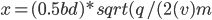

This is where the magic happens.

You're probably going to want to read [^1]by Goebel and Katz et al. This ion printer shares many concepts with ion drives.

The ion printer requires the input vapor to be charged; this way, the path of the particles can be directed with electrostatic (and, to a lesser degree, magnetic) fields.

### Partial Ionization

During the first two years of this project, I experimented with partial ionization of the vapor.

If you have a large number of atoms in a clump (say, a dust particle, a particle of powder, or, in this case, a droplet of metal), you can work with static charge; that is, before you spray out these particles, you can apply a terrifically high voltage to them, and some very small fraction of the atoms in the particle will be ionized. 

Powder coating is an example of this process. A fine powder is sprayed out of a nozzle that's charged to 50-100 kilovolts; it is then attracted to the desired location (a car body panel, say) by electrostatic force.

Electrospray ionization is a slightly more complex case of the above.

This has a few advantages compared to complete ionization:

* Much lower ionization power consumption. Mere watts would suffice, allowing for a higher print speeds.
* Simpler charging system. The crucible can be charged to a few kilovolts, and the evaporated particles will retain some partial charge. 

However:

* The size of droplets emitted from the boiling metal is highly variable, as you can see in this video of early zinc testing. 

[picture of droplets here]

This introduces some complexity in the temperature control of the crucible; instead of simply pumping in energy and obtaining a completely dissociated gas, the vapor particle size must be precisely controlled - otherwise, the differing charge and mass will behave poorly when deflected with the plates.

and finally,

* The deflection and acceleration voltages must be much, much higher. Because the charge/mass ratio is much lower, the deflection fields must be orders of magnitude more intense - adding complexity to the already tricky deflection amplifiers.

### Full first ionization

https://www.politesi.polimi.it/bitstream/10589/81162/3/thesis.pdf

Our power budget becomes significant here. Our target print speed of 2.232×10^20 atoms per second times the first ionization energy of Aluminium (5.985 eV) yields 214.6 watts. That is an absolute theoretical minimum.

For reference, copper is similar, at 7.72eV; however, the atomic mass of copper is significantly higher, so reaching the desired 40g/h will require far fewer atoms.

#### Inductively Coupled Plasma

This technique is commonly used in the plasma generators of NASA et al's ion drives.

Low-frequency, high-density, inductively coupled plasma sources: Operation and
applications
https://aip.scitation.org/doi/pdf/10.1063/1.1343887?class=pdf

https://dspace.flinders.edu.au/xmlui/bitstream/2328/26556/1/Xu%20Low-frequency.pdf

This allows us to ignore much of the Pashen's Law "striking" difficulty with DC discharge plasmas; with a high enough RF power, complete ionization can be essentially assured.

One drawback here is the immense oscillating magnetic field generated. The ion printer will already be sensitive to the earth's magnetic field; any applied field will deflect the path of the ionized gas away from the desired location. This is proportional to the acceleration voltage:

)})

Where `x` is the deflection on the build plate, `d` is the ion path length, `v` is the particle velocity, `b` is the magnetic field intensity, `q` the particle charge, and `m` is the particle mass.

The local magnetic field can be sensed with hall effect sensors and compensated for in software, or a Helmholtz coil could be built around the whole unit.

From a back-of-the envelope calculation, assuming 150a coil current and 48v acceleration voltage, we'll have to contend with somewhere around a 2 gauss field all the way to the build platform - assuming a 0.1m ion path length, this'll deflect the particles by ~0.1mm. This could be sensed and compensated for in software, as the phase and coil current will be precisely known.

#### DC Discharge Plasma

[^1]: Fundamentals of Electric Propulsion [Internal](../../references/03409552.pdf) [External](https://descanso.jpl.nasa.gov/SciTechBook/series1/Goebel__cmprsd_opt.pdf)