# Log introduction

#### 1545020962 >

Based on last night's progress on the ion beam focus theory, I'm doing some beam simulations with IBSimu to see exactly what kind of magnetic field I'm going to need. 

http://ibsimu.sourceforge.net/examples/analytic_bfield.html

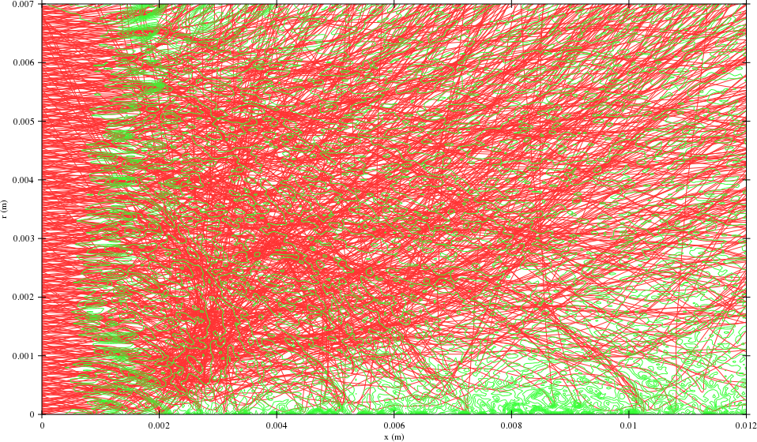

If you do things just wrong, you get this lovely output. Friggin' Jackson Pollock #4, that's what that is.

Some great info from[^5]

[^5]: Doni, Michele. "Optimization of the ion extraction from an inductively coupled plasma (ICP) by IBSimu modeling." (2013). [Internal](../../references/1545067618.pdf) [External](https://www.politesi.polimi.it/bitstream/10589/81162/3/thesis.pdf)

IBSimu doesn't seem to say anywhere what the bfield units are. I'm assuming they're tesla, since we're running SI and not CGS? To verify, I'm going to check the radius:
$$
r=\frac{mv\sin(\omega)}{qB}
$$
Main beam velocity:
$$
9990.616\text{ m/s}=\sqrt{\frac{2(15eV)}{29\text{ amu}}}
$$

$$
\text{if } B=1\text{ Tesla } r = \text{0.0030 m (3 mm)}
$$

Inconclusive. I can't tell if the path curvature is due to space-charge effects or due to the magnetic field.

https://sourceforge.net/p/ibsimu/mailman/message/28479056/ says SI units are used.

Ah, here we go. Units are definitely Tesla.

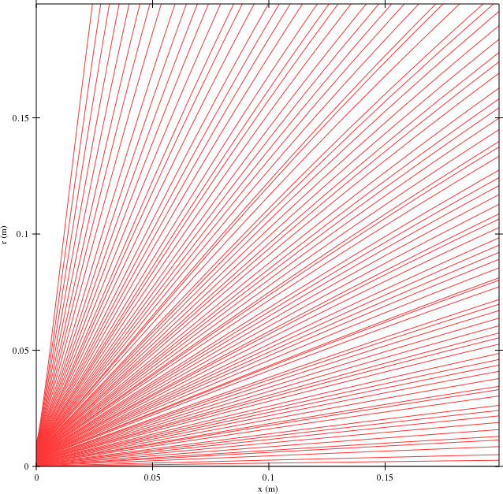

Here's what we get with no magnetic field, 15eV, 1eV normal and transverse.

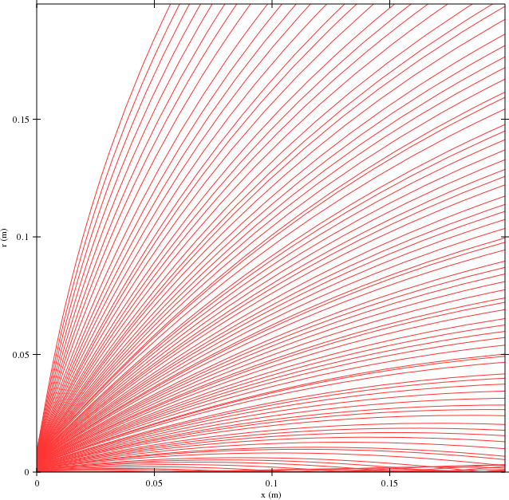

1T field in +Z.

Putting a field in +Y crashes IBSimu.

A KJ magnetics RXC88 magnet has a peak 7T field:

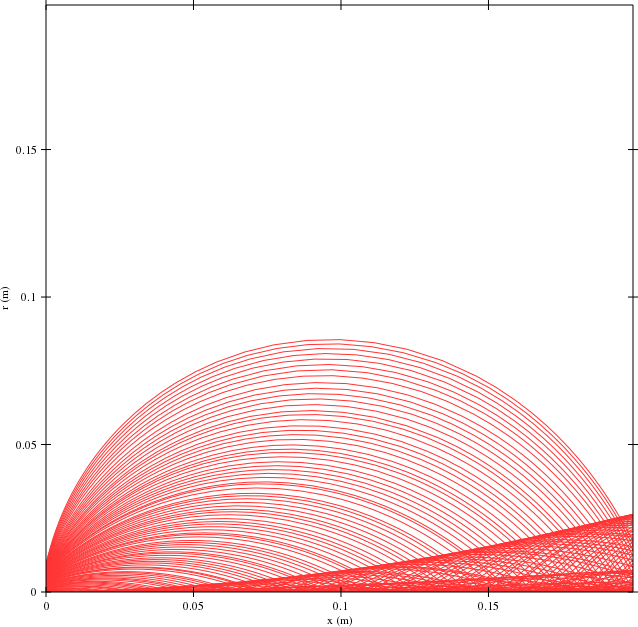

Acceleration power:

$$
15eV \times 2.232×10^{20}\text{ particles/sec} = 536.4\text{W}
$$

Whew. That's a bunch. 

$5.985eV$ will be emitted upon recombination - almost assuredly in the form of a photon with a wavelength of 207nm. That's intense. Probably can't put a window on this thing, though glass and polycarbonate both block almost all  far UV. Have to see if the OD is high enough for safety.

Electrostatic focusing seems to be completely ineffective at these high current densities.

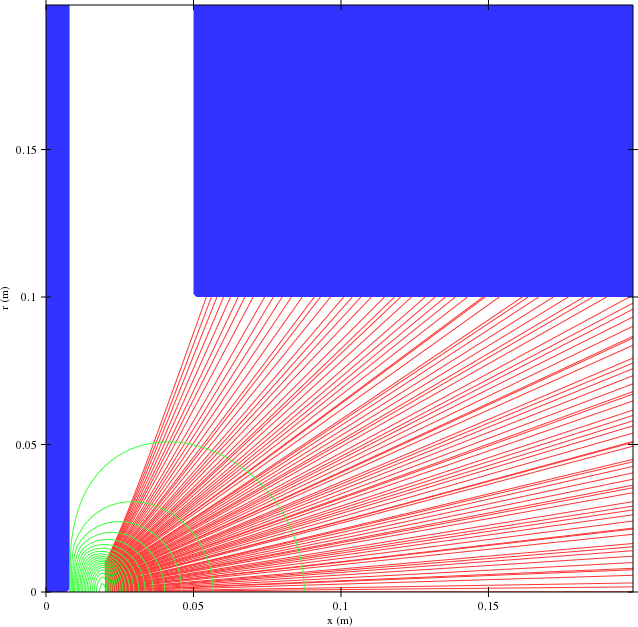

The LHC's beam current is only around 0.54A. Our beam current will be roughly 66.2 times higher!

Oh, if your cylindrical BC is wrong you'll get bad data. Doesn't affect the above.

We've got around 7 cm of chamber radius as our maximum focus constraint.

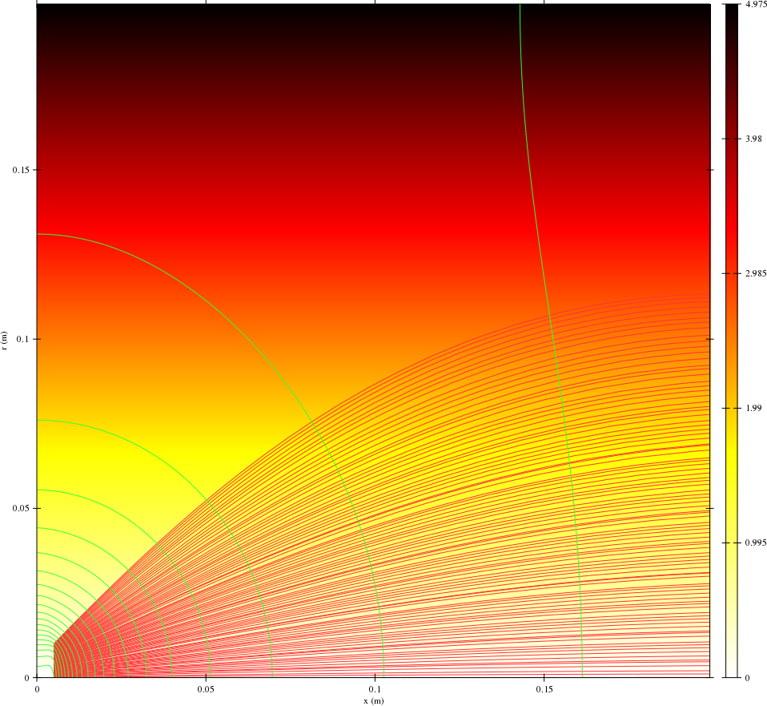

A 5T gradient just about does it.

Remembered that accelerators use quadrupole and sextupole magnets for focusing. Researching why. 

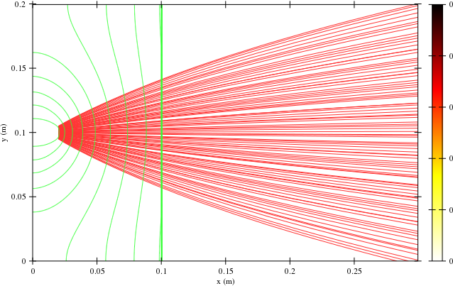

Man, that is killer. A ~3t field for 0.2+ m. That's going to be tricky to pull off without superconductors. How's the focusing after that?

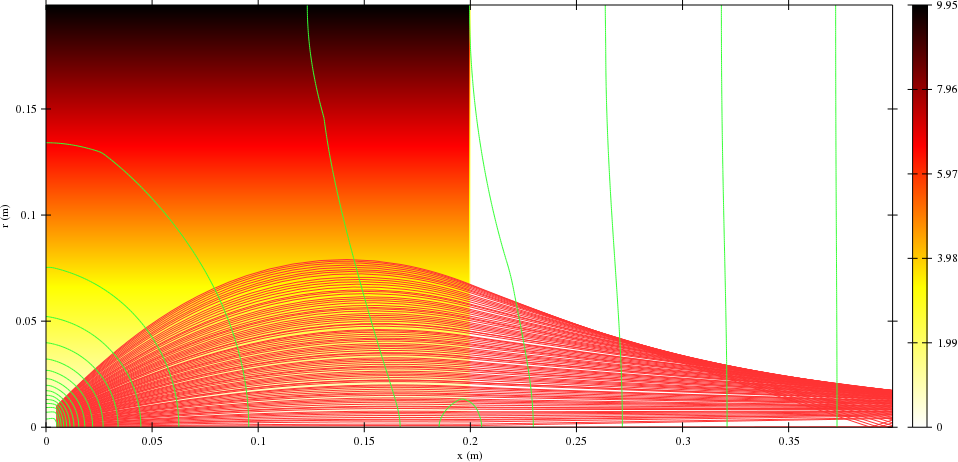

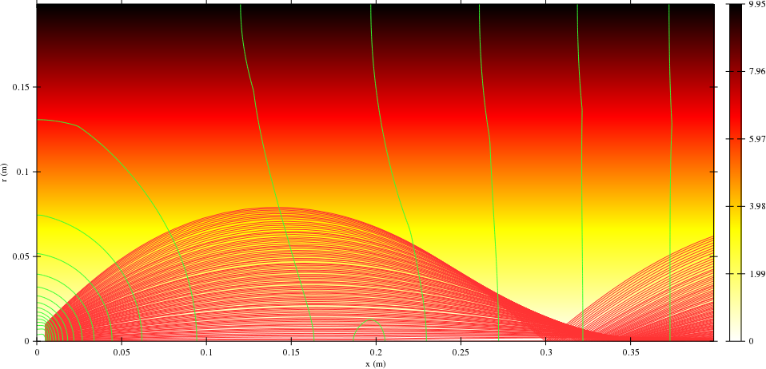

Yup, that all makes sense, looks good. Pretty stable at 35.75a of beam current and 15eV. Good stuff.

The exact same test at 30eV or 5eV accel. produces identical plots - as expected via analytical methods.

Nulling out the space charge effects doesn't seem to have a large impact on the trajectories. Very strange.

Same for the epot.  

Same even for the bfield. Huh.

Without:

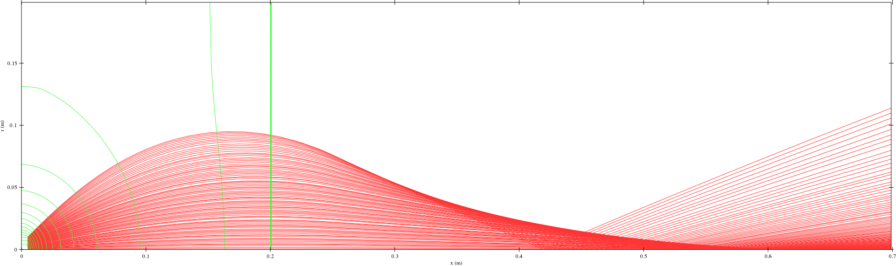

With:

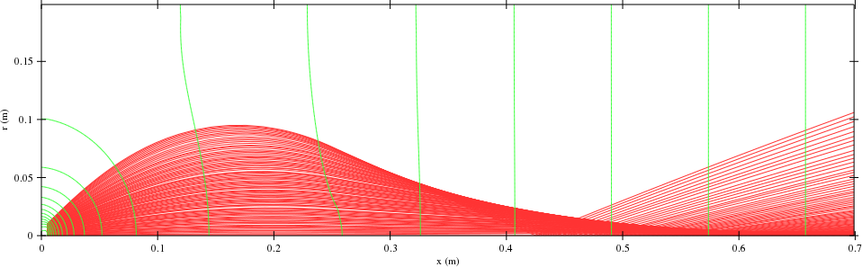

Okay, so there is a slight difference. I guess the scharge effects just aren't big enough yet.

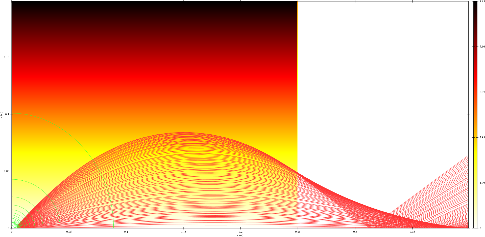

Narrowing the input makes the output wider? Le what? Hmm, might be an artifact of the different magnetic field.

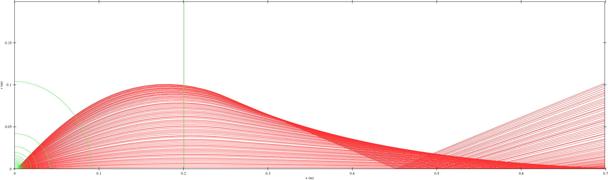

Looks roughly the same. Let's try a lower field with a longer distance to convergence.

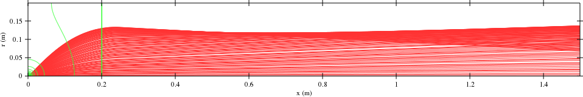

Yeah, our paths are definitely straight now.

Using a crude gaussian/gaussian distribution for the magnetic field now. Strange "crossover" effect which remains even if the magnet is moved further away.

20T may be slightly too strong.

Yeah, still happening. I'm sure future readers have written me off as an idiot. Oh hey, is the magnetic field being mirrored across the x axis? I'm not sure. 

Let's first get a slightly more accurate magnetic field curtesy FEMM.

Ooh, https://www.particleincell.com/starfish/ looks really nice. Later.

### 1545147474 >

Some ideas for ease of servicing:

Each control board can have an analog mux that takes ~16 voltages and pipes them into the main controller for self-test functionality.

There could be a little multimeter probe going to an ADC so that the user doesn't need an oscilloscope to troubleshoot the system.

A hall probe can be attached to the X/Y/Z? gantry and used to compensate for the magnetic field.

What kind of build platform are we going to use?

 Rulon or Delrin AF could be used for the linear motor slides.

> The use of *FIELD_MIRROR* in case of symmetric cases, where beam is traversing next to the geometry boundary, is necessary to get physical results.

Ah.

Tried out 3d: A little bit too slow. IBSimu is only using one thread for some reason.

How about 2d?

I remembered that the UMFPACK lib wasn't installed when I configured this install of IBSimu. Installing and reconfiguring now - perhaps that'll speed things up a bit.

I love this processor. -j16 is so ungodly fast.

Had to compile SuiteSparse with 

`export CXXFLAGS="$CXXFLAGS -fPIC"` 

Nope, actually it's 

`SET(CMAKE_POSITION_INDEPENDENT_CODE ON)`

in some SuiteSparse cmake file. But that file doesn't exist anymore.

Several hours later...

I'd already installed umfpack5 via apt, but it apparently missed the pkg-config .pc file. 

Ended up having to run `sudo dpkg -L libumfpack5`then write my own package description in a .pc and append it to the `PKG_CONFIG_PATH`.

Good stuff.

Anyway, cylindrical geometry is now unreasonably fast - 5 or 10 seconds.

Scratch that! Had the same solver enabled. The importance of controls and an impartial observer! That was some reprehensible science.

Okay, no, *that* was unreasonably fast. Reconfigured and reinstalled everything and now UMFPACK is definitely up and running.

This crude 2D sim shows clearly where those spurious trajectories were coming from -  there's no collision at the boundaries.

Ah, and that's due to the PDB mirror values. Cool!

Here we go! A double-gaussian field with recombination.

Gradually tightening focus. I'm going to automate this process now.

I'm a little rusty in C++, apparently. Tried using fmt:: to procedurally generate filenames. 

I thought there was an easy way to batch-convert svgs to PNGs with linux, but apparently not - all suggestions require inkscape, which'll surely be quite slow. Switching to PNG export.

<video src="../../files/ionprinter/simulation/IBSimu/simulations/magnetic_focusing_1/images/out.mp4"></video>

BEAUTIFUL

### Quick notes

Brass water jacket on diffusion pump - inside and outside soldered
Better yet, TIG welded output
flapper on diffusion pump for quick cycling without cooldown
diffusion pump cooling loop on oil?

Nail polish barium carbonate coating

plasma de-ionizes due to *black body radiation*? Wait, what? How does that work? That can't be. Perhaps it cools to below the ionization temperature, but it can't possibly spontaneously form an electron.

Pyrolytic graphite as mu-metal alternative

dumet glass-to-wire seal

Fresnel zone plate

ion curtain can use a grid

